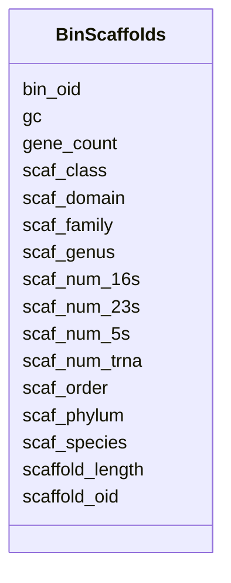

# Class: BinScaffolds 


URI: [img_mysql_mbin:BinScaffolds](https://w3id.org/jgi/img_mysql_mbin/BinScaffolds)





<!-- no inheritance hierarchy -->


## Slots

| Name | Cardinality and Range | Description | Inheritance |
| ---  | --- | --- | --- |
| [bin_oid](bin_oid.md) | 0..1 <br/> [String](String.md) |  | direct |
| [scaffold_oid](scaffold_oid.md) | 0..1 <br/> [String](String.md) |  | direct |
| [scaffold_length](scaffold_length.md) | 0..1 <br/> [Integer](Integer.md) |  | direct |
| [gc](gc.md) | 0..1 <br/> [Float](Float.md) |  | direct |
| [gene_count](gene_count.md) | 0..1 <br/> [Integer](Integer.md) |  | direct |
| [scaf_domain](scaf_domain.md) | 0..1 <br/> [String](String.md) |  | direct |
| [scaf_phylum](scaf_phylum.md) | 0..1 <br/> [String](String.md) |  | direct |
| [scaf_class](scaf_class.md) | 0..1 <br/> [String](String.md) |  | direct |
| [scaf_order](scaf_order.md) | 0..1 <br/> [String](String.md) |  | direct |
| [scaf_family](scaf_family.md) | 0..1 <br/> [String](String.md) |  | direct |
| [scaf_genus](scaf_genus.md) | 0..1 <br/> [String](String.md) |  | direct |
| [scaf_species](scaf_species.md) | 0..1 <br/> [String](String.md) |  | direct |
| [scaf_num_16s](scaf_num_16s.md) | 0..1 <br/> [Integer](Integer.md) |  | direct |
| [scaf_num_5s](scaf_num_5s.md) | 0..1 <br/> [Integer](Integer.md) |  | direct |
| [scaf_num_23s](scaf_num_23s.md) | 0..1 <br/> [Integer](Integer.md) |  | direct |
| [scaf_num_trna](scaf_num_trna.md) | 0..1 <br/> [Integer](Integer.md) |  | direct |


## Identifier and Mapping Information


### Schema Source


* from schema: https://w3id.org/jgi/img_mysql_mbin


## Mappings

| Mapping Type | Mapped Value |
| ---  | ---  |
| self | img_mysql_mbin:BinScaffolds |
| native | img_mysql_mbin:BinScaffolds |


## LinkML Source

<!-- TODO: investigate https://stackoverflow.com/questions/37606292/how-to-create-tabbed-code-blocks-in-mkdocs-or-sphinx -->

### Direct

<details>
```yaml
name: bin_scaffolds
from_schema: https://w3id.org/jgi/img_mysql_mbin
attributes:
  bin_oid:
    name: bin_oid
    from_schema: https://w3id.org/jgi/img_mysql_mbin
    domain_of:
    - bin
    - bin_coverage
    - bin_scaffolds
    - semi_bin
    - semi_bin_coverage
    - semi_bin_scaffolds
    - semi_lq
    range: string
    required: false
  scaffold_oid:
    name: scaffold_oid
    from_schema: https://w3id.org/jgi/img_mysql_mbin
    rank: 1000
    domain_of:
    - bin_scaffolds
    - ebin_scaffolds
    - semi_bin_scaffolds
    - semi_ebin_scaffolds
    range: string
    required: false
  scaffold_length:
    name: scaffold_length
    from_schema: https://w3id.org/jgi/img_mysql_mbin
    rank: 1000
    domain_of:
    - bin_scaffolds
    - ebin_scaffolds
    - semi_bin_scaffolds
    - semi_ebin_scaffolds
    range: integer
    required: false
  gc:
    name: gc
    from_schema: https://w3id.org/jgi/img_mysql_mbin
    rank: 1000
    domain_of:
    - bin_scaffolds
    - semi_bin_scaffolds
    range: float
    required: false
  gene_count:
    name: gene_count
    from_schema: https://w3id.org/jgi/img_mysql_mbin
    domain_of:
    - bin
    - bin_scaffolds
    - semi_bin
    - semi_bin_scaffolds
    range: integer
    required: false
  scaf_domain:
    name: scaf_domain
    from_schema: https://w3id.org/jgi/img_mysql_mbin
    rank: 1000
    domain_of:
    - bin_scaffolds
    - semi_bin_scaffolds
    range: string
    required: false
  scaf_phylum:
    name: scaf_phylum
    from_schema: https://w3id.org/jgi/img_mysql_mbin
    rank: 1000
    domain_of:
    - bin_scaffolds
    - semi_bin_scaffolds
    range: string
    required: false
  scaf_class:
    name: scaf_class
    from_schema: https://w3id.org/jgi/img_mysql_mbin
    rank: 1000
    domain_of:
    - bin_scaffolds
    - semi_bin_scaffolds
    range: string
    required: false
  scaf_order:
    name: scaf_order
    from_schema: https://w3id.org/jgi/img_mysql_mbin
    rank: 1000
    domain_of:
    - bin_scaffolds
    - semi_bin_scaffolds
    range: string
    required: false
  scaf_family:
    name: scaf_family
    from_schema: https://w3id.org/jgi/img_mysql_mbin
    rank: 1000
    domain_of:
    - bin_scaffolds
    - semi_bin_scaffolds
    range: string
    required: false
  scaf_genus:
    name: scaf_genus
    from_schema: https://w3id.org/jgi/img_mysql_mbin
    rank: 1000
    domain_of:
    - bin_scaffolds
    - semi_bin_scaffolds
    range: string
    required: false
  scaf_species:
    name: scaf_species
    from_schema: https://w3id.org/jgi/img_mysql_mbin
    rank: 1000
    domain_of:
    - bin_scaffolds
    - semi_bin_scaffolds
    range: string
    required: false
  scaf_num_16s:
    name: scaf_num_16s
    from_schema: https://w3id.org/jgi/img_mysql_mbin
    rank: 1000
    domain_of:
    - bin_scaffolds
    - semi_bin_scaffolds
    range: integer
    required: false
  scaf_num_5s:
    name: scaf_num_5s
    from_schema: https://w3id.org/jgi/img_mysql_mbin
    rank: 1000
    domain_of:
    - bin_scaffolds
    - semi_bin_scaffolds
    range: integer
    required: false
  scaf_num_23s:
    name: scaf_num_23s
    from_schema: https://w3id.org/jgi/img_mysql_mbin
    rank: 1000
    domain_of:
    - bin_scaffolds
    - semi_bin_scaffolds
    range: integer
    required: false
  scaf_num_trna:
    name: scaf_num_trna
    from_schema: https://w3id.org/jgi/img_mysql_mbin
    rank: 1000
    domain_of:
    - bin_scaffolds
    - semi_bin_scaffolds
    range: integer
    required: false

```
</details>

### Induced

<details>
```yaml
name: bin_scaffolds
from_schema: https://w3id.org/jgi/img_mysql_mbin
attributes:
  bin_oid:
    name: bin_oid
    from_schema: https://w3id.org/jgi/img_mysql_mbin
    alias: bin_oid
    owner: bin_scaffolds
    domain_of:
    - bin
    - bin_coverage
    - bin_scaffolds
    - semi_bin
    - semi_bin_coverage
    - semi_bin_scaffolds
    - semi_lq
    range: string
    required: false
  scaffold_oid:
    name: scaffold_oid
    from_schema: https://w3id.org/jgi/img_mysql_mbin
    rank: 1000
    alias: scaffold_oid
    owner: bin_scaffolds
    domain_of:
    - bin_scaffolds
    - ebin_scaffolds
    - semi_bin_scaffolds
    - semi_ebin_scaffolds
    range: string
    required: false
  scaffold_length:
    name: scaffold_length
    from_schema: https://w3id.org/jgi/img_mysql_mbin
    rank: 1000
    alias: scaffold_length
    owner: bin_scaffolds
    domain_of:
    - bin_scaffolds
    - ebin_scaffolds
    - semi_bin_scaffolds
    - semi_ebin_scaffolds
    range: integer
    required: false
  gc:
    name: gc
    from_schema: https://w3id.org/jgi/img_mysql_mbin
    rank: 1000
    alias: gc
    owner: bin_scaffolds
    domain_of:
    - bin_scaffolds
    - semi_bin_scaffolds
    range: float
    required: false
  gene_count:
    name: gene_count
    from_schema: https://w3id.org/jgi/img_mysql_mbin
    alias: gene_count
    owner: bin_scaffolds
    domain_of:
    - bin
    - bin_scaffolds
    - semi_bin
    - semi_bin_scaffolds
    range: integer
    required: false
  scaf_domain:
    name: scaf_domain
    from_schema: https://w3id.org/jgi/img_mysql_mbin
    rank: 1000
    alias: scaf_domain
    owner: bin_scaffolds
    domain_of:
    - bin_scaffolds
    - semi_bin_scaffolds
    range: string
    required: false
  scaf_phylum:
    name: scaf_phylum
    from_schema: https://w3id.org/jgi/img_mysql_mbin
    rank: 1000
    alias: scaf_phylum
    owner: bin_scaffolds
    domain_of:
    - bin_scaffolds
    - semi_bin_scaffolds
    range: string
    required: false
  scaf_class:
    name: scaf_class
    from_schema: https://w3id.org/jgi/img_mysql_mbin
    rank: 1000
    alias: scaf_class
    owner: bin_scaffolds
    domain_of:
    - bin_scaffolds
    - semi_bin_scaffolds
    range: string
    required: false
  scaf_order:
    name: scaf_order
    from_schema: https://w3id.org/jgi/img_mysql_mbin
    rank: 1000
    alias: scaf_order
    owner: bin_scaffolds
    domain_of:
    - bin_scaffolds
    - semi_bin_scaffolds
    range: string
    required: false
  scaf_family:
    name: scaf_family
    from_schema: https://w3id.org/jgi/img_mysql_mbin
    rank: 1000
    alias: scaf_family
    owner: bin_scaffolds
    domain_of:
    - bin_scaffolds
    - semi_bin_scaffolds
    range: string
    required: false
  scaf_genus:
    name: scaf_genus
    from_schema: https://w3id.org/jgi/img_mysql_mbin
    rank: 1000
    alias: scaf_genus
    owner: bin_scaffolds
    domain_of:
    - bin_scaffolds
    - semi_bin_scaffolds
    range: string
    required: false
  scaf_species:
    name: scaf_species
    from_schema: https://w3id.org/jgi/img_mysql_mbin
    rank: 1000
    alias: scaf_species
    owner: bin_scaffolds
    domain_of:
    - bin_scaffolds
    - semi_bin_scaffolds
    range: string
    required: false
  scaf_num_16s:
    name: scaf_num_16s
    from_schema: https://w3id.org/jgi/img_mysql_mbin
    rank: 1000
    alias: scaf_num_16s
    owner: bin_scaffolds
    domain_of:
    - bin_scaffolds
    - semi_bin_scaffolds
    range: integer
    required: false
  scaf_num_5s:
    name: scaf_num_5s
    from_schema: https://w3id.org/jgi/img_mysql_mbin
    rank: 1000
    alias: scaf_num_5s
    owner: bin_scaffolds
    domain_of:
    - bin_scaffolds
    - semi_bin_scaffolds
    range: integer
    required: false
  scaf_num_23s:
    name: scaf_num_23s
    from_schema: https://w3id.org/jgi/img_mysql_mbin
    rank: 1000
    alias: scaf_num_23s
    owner: bin_scaffolds
    domain_of:
    - bin_scaffolds
    - semi_bin_scaffolds
    range: integer
    required: false
  scaf_num_trna:
    name: scaf_num_trna
    from_schema: https://w3id.org/jgi/img_mysql_mbin
    rank: 1000
    alias: scaf_num_trna
    owner: bin_scaffolds
    domain_of:
    - bin_scaffolds
    - semi_bin_scaffolds
    range: integer
    required: false

```
</details>