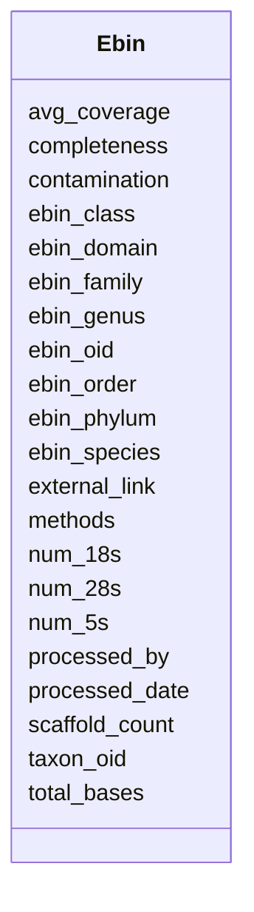

# Class: Ebin 


URI: [img_mysql_mbin:Ebin](https://w3id.org/jgi/img_mysql_mbin/Ebin)





<!-- no inheritance hierarchy -->


## Slots

| Name | Cardinality and Range | Description | Inheritance |
| ---  | --- | --- | --- |
| [ebin_oid](ebin_oid.md) | 0..1 <br/> [String](String.md) |  | direct |
| [taxon_oid](taxon_oid.md) | 0..1 <br/> [Integer](Integer.md) |  | direct |
| [completeness](completeness.md) | 0..1 <br/> [Float](Float.md) |  | direct |
| [contamination](contamination.md) | 0..1 <br/> [Float](Float.md) |  | direct |
| [methods](methods.md) | 0..1 <br/> [String](String.md) |  | direct |
| [processed_by](processed_by.md) | 0..1 <br/> [Integer](Integer.md) |  | direct |
| [processed_date](processed_date.md) | 0..1 <br/> [Datetime](Datetime.md) |  | direct |
| [total_bases](total_bases.md) | 0..1 <br/> [Integer](Integer.md) |  | direct |
| [ebin_domain](ebin_domain.md) | 0..1 <br/> [String](String.md) |  | direct |
| [ebin_phylum](ebin_phylum.md) | 0..1 <br/> [String](String.md) |  | direct |
| [ebin_class](ebin_class.md) | 0..1 <br/> [String](String.md) |  | direct |
| [ebin_order](ebin_order.md) | 0..1 <br/> [String](String.md) |  | direct |
| [ebin_family](ebin_family.md) | 0..1 <br/> [String](String.md) |  | direct |
| [ebin_genus](ebin_genus.md) | 0..1 <br/> [String](String.md) |  | direct |
| [ebin_species](ebin_species.md) | 0..1 <br/> [String](String.md) |  | direct |
| [external_link](external_link.md) | 0..1 <br/> [String](String.md) |  | direct |
| [scaffold_count](scaffold_count.md) | 0..1 <br/> [Integer](Integer.md) |  | direct |
| [num_5s](num_5s.md) | 0..1 <br/> [Integer](Integer.md) |  | direct |
| [num_18s](num_18s.md) | 0..1 <br/> [Integer](Integer.md) |  | direct |
| [num_28s](num_28s.md) | 0..1 <br/> [Integer](Integer.md) |  | direct |
| [avg_coverage](avg_coverage.md) | 0..1 <br/> [Float](Float.md) |  | direct |


## Identifier and Mapping Information


### Schema Source


* from schema: https://w3id.org/jgi/img_mysql_mbin


## Mappings

| Mapping Type | Mapped Value |
| ---  | ---  |
| self | img_mysql_mbin:Ebin |
| native | img_mysql_mbin:Ebin |


## LinkML Source

<!-- TODO: investigate https://stackoverflow.com/questions/37606292/how-to-create-tabbed-code-blocks-in-mkdocs-or-sphinx -->

### Direct

<details>
```yaml
name: ebin
from_schema: https://w3id.org/jgi/img_mysql_mbin
attributes:
  ebin_oid:
    name: ebin_oid
    from_schema: https://w3id.org/jgi/img_mysql_mbin
    rank: 1000
    domain_of:
    - ebin
    - ebin_ext_links
    - ebin_scaffolds
    - semi_ebin
    - semi_ebin_scaffolds
    range: string
    required: false
  taxon_oid:
    name: taxon_oid
    from_schema: https://w3id.org/jgi/img_mysql_mbin
    domain_of:
    - bin
    - ebin
    - ebin_not_loaded_metagenomes
    - img_umag_bin_tarballs_02062024
    - not_loaded_metagenomes
    - semi_bin
    - semi_bin_not_loaded
    - semi_ebin
    - semi_ebin_not_loaded
    - semi_lq
    range: integer
    required: false
  completeness:
    name: completeness
    from_schema: https://w3id.org/jgi/img_mysql_mbin
    domain_of:
    - bin
    - ebin
    - semi_bin
    - semi_ebin
    range: float
    required: false
  contamination:
    name: contamination
    from_schema: https://w3id.org/jgi/img_mysql_mbin
    domain_of:
    - bin
    - ebin
    - semi_bin
    - semi_ebin
    range: float
    required: false
  methods:
    name: methods
    from_schema: https://w3id.org/jgi/img_mysql_mbin
    rank: 1000
    domain_of:
    - ebin
    - ebin_not_loaded_metagenomes
    - semi_ebin
    - semi_ebin_not_loaded
    range: string
    required: false
  processed_by:
    name: processed_by
    from_schema: https://w3id.org/jgi/img_mysql_mbin
    rank: 1000
    domain_of:
    - ebin
    - ebin_not_loaded_metagenomes
    - semi_ebin
    - semi_ebin_not_loaded
    range: integer
    required: false
  processed_date:
    name: processed_date
    from_schema: https://w3id.org/jgi/img_mysql_mbin
    rank: 1000
    domain_of:
    - ebin
    - ebin_not_loaded_metagenomes
    - not_loaded_metagenomes
    - semi_bin_not_loaded
    - semi_ebin
    - semi_ebin_not_loaded
    range: datetime
    required: false
  total_bases:
    name: total_bases
    from_schema: https://w3id.org/jgi/img_mysql_mbin
    rank: 1000
    domain_of:
    - ebin
    - semi_ebin
    range: integer
    required: false
  ebin_domain:
    name: ebin_domain
    from_schema: https://w3id.org/jgi/img_mysql_mbin
    rank: 1000
    domain_of:
    - ebin
    - semi_ebin
    range: string
    required: false
  ebin_phylum:
    name: ebin_phylum
    from_schema: https://w3id.org/jgi/img_mysql_mbin
    rank: 1000
    domain_of:
    - ebin
    - semi_ebin
    range: string
    required: false
  ebin_class:
    name: ebin_class
    from_schema: https://w3id.org/jgi/img_mysql_mbin
    rank: 1000
    domain_of:
    - ebin
    - semi_ebin
    range: string
    required: false
  ebin_order:
    name: ebin_order
    from_schema: https://w3id.org/jgi/img_mysql_mbin
    rank: 1000
    domain_of:
    - ebin
    - semi_ebin
    range: string
    required: false
  ebin_family:
    name: ebin_family
    from_schema: https://w3id.org/jgi/img_mysql_mbin
    rank: 1000
    domain_of:
    - ebin
    - semi_ebin
    range: string
    required: false
  ebin_genus:
    name: ebin_genus
    from_schema: https://w3id.org/jgi/img_mysql_mbin
    rank: 1000
    domain_of:
    - ebin
    - semi_ebin
    range: string
    required: false
  ebin_species:
    name: ebin_species
    from_schema: https://w3id.org/jgi/img_mysql_mbin
    rank: 1000
    domain_of:
    - ebin
    - semi_ebin
    range: string
    required: false
  external_link:
    name: external_link
    from_schema: https://w3id.org/jgi/img_mysql_mbin
    rank: 1000
    domain_of:
    - ebin
    - semi_ebin
    range: string
    required: false
  scaffold_count:
    name: scaffold_count
    from_schema: https://w3id.org/jgi/img_mysql_mbin
    domain_of:
    - bin
    - ebin
    - semi_bin
    - semi_ebin
    range: integer
    required: false
  num_5s:
    name: num_5s
    from_schema: https://w3id.org/jgi/img_mysql_mbin
    domain_of:
    - bin
    - ebin
    - ebin_scaffolds
    - semi_bin
    - semi_ebin
    - semi_ebin_scaffolds
    range: integer
    required: false
  num_18s:
    name: num_18s
    from_schema: https://w3id.org/jgi/img_mysql_mbin
    rank: 1000
    domain_of:
    - ebin
    - ebin_scaffolds
    - semi_ebin
    - semi_ebin_scaffolds
    range: integer
    required: false
  num_28s:
    name: num_28s
    from_schema: https://w3id.org/jgi/img_mysql_mbin
    rank: 1000
    domain_of:
    - ebin
    - ebin_scaffolds
    - semi_ebin
    - semi_ebin_scaffolds
    range: integer
    required: false
  avg_coverage:
    name: avg_coverage
    from_schema: https://w3id.org/jgi/img_mysql_mbin
    domain_of:
    - bin
    - bin_coverage
    - ebin
    - semi_bin
    - semi_bin_coverage
    - semi_ebin
    range: float
    required: false

```
</details>

### Induced

<details>
```yaml
name: ebin
from_schema: https://w3id.org/jgi/img_mysql_mbin
attributes:
  ebin_oid:
    name: ebin_oid
    from_schema: https://w3id.org/jgi/img_mysql_mbin
    rank: 1000
    alias: ebin_oid
    owner: ebin
    domain_of:
    - ebin
    - ebin_ext_links
    - ebin_scaffolds
    - semi_ebin
    - semi_ebin_scaffolds
    range: string
    required: false
  taxon_oid:
    name: taxon_oid
    from_schema: https://w3id.org/jgi/img_mysql_mbin
    alias: taxon_oid
    owner: ebin
    domain_of:
    - bin
    - ebin
    - ebin_not_loaded_metagenomes
    - img_umag_bin_tarballs_02062024
    - not_loaded_metagenomes
    - semi_bin
    - semi_bin_not_loaded
    - semi_ebin
    - semi_ebin_not_loaded
    - semi_lq
    range: integer
    required: false
  completeness:
    name: completeness
    from_schema: https://w3id.org/jgi/img_mysql_mbin
    alias: completeness
    owner: ebin
    domain_of:
    - bin
    - ebin
    - semi_bin
    - semi_ebin
    range: float
    required: false
  contamination:
    name: contamination
    from_schema: https://w3id.org/jgi/img_mysql_mbin
    alias: contamination
    owner: ebin
    domain_of:
    - bin
    - ebin
    - semi_bin
    - semi_ebin
    range: float
    required: false
  methods:
    name: methods
    from_schema: https://w3id.org/jgi/img_mysql_mbin
    rank: 1000
    alias: methods
    owner: ebin
    domain_of:
    - ebin
    - ebin_not_loaded_metagenomes
    - semi_ebin
    - semi_ebin_not_loaded
    range: string
    required: false
  processed_by:
    name: processed_by
    from_schema: https://w3id.org/jgi/img_mysql_mbin
    rank: 1000
    alias: processed_by
    owner: ebin
    domain_of:
    - ebin
    - ebin_not_loaded_metagenomes
    - semi_ebin
    - semi_ebin_not_loaded
    range: integer
    required: false
  processed_date:
    name: processed_date
    from_schema: https://w3id.org/jgi/img_mysql_mbin
    rank: 1000
    alias: processed_date
    owner: ebin
    domain_of:
    - ebin
    - ebin_not_loaded_metagenomes
    - not_loaded_metagenomes
    - semi_bin_not_loaded
    - semi_ebin
    - semi_ebin_not_loaded
    range: datetime
    required: false
  total_bases:
    name: total_bases
    from_schema: https://w3id.org/jgi/img_mysql_mbin
    rank: 1000
    alias: total_bases
    owner: ebin
    domain_of:
    - ebin
    - semi_ebin
    range: integer
    required: false
  ebin_domain:
    name: ebin_domain
    from_schema: https://w3id.org/jgi/img_mysql_mbin
    rank: 1000
    alias: ebin_domain
    owner: ebin
    domain_of:
    - ebin
    - semi_ebin
    range: string
    required: false
  ebin_phylum:
    name: ebin_phylum
    from_schema: https://w3id.org/jgi/img_mysql_mbin
    rank: 1000
    alias: ebin_phylum
    owner: ebin
    domain_of:
    - ebin
    - semi_ebin
    range: string
    required: false
  ebin_class:
    name: ebin_class
    from_schema: https://w3id.org/jgi/img_mysql_mbin
    rank: 1000
    alias: ebin_class
    owner: ebin
    domain_of:
    - ebin
    - semi_ebin
    range: string
    required: false
  ebin_order:
    name: ebin_order
    from_schema: https://w3id.org/jgi/img_mysql_mbin
    rank: 1000
    alias: ebin_order
    owner: ebin
    domain_of:
    - ebin
    - semi_ebin
    range: string
    required: false
  ebin_family:
    name: ebin_family
    from_schema: https://w3id.org/jgi/img_mysql_mbin
    rank: 1000
    alias: ebin_family
    owner: ebin
    domain_of:
    - ebin
    - semi_ebin
    range: string
    required: false
  ebin_genus:
    name: ebin_genus
    from_schema: https://w3id.org/jgi/img_mysql_mbin
    rank: 1000
    alias: ebin_genus
    owner: ebin
    domain_of:
    - ebin
    - semi_ebin
    range: string
    required: false
  ebin_species:
    name: ebin_species
    from_schema: https://w3id.org/jgi/img_mysql_mbin
    rank: 1000
    alias: ebin_species
    owner: ebin
    domain_of:
    - ebin
    - semi_ebin
    range: string
    required: false
  external_link:
    name: external_link
    from_schema: https://w3id.org/jgi/img_mysql_mbin
    rank: 1000
    alias: external_link
    owner: ebin
    domain_of:
    - ebin
    - semi_ebin
    range: string
    required: false
  scaffold_count:
    name: scaffold_count
    from_schema: https://w3id.org/jgi/img_mysql_mbin
    alias: scaffold_count
    owner: ebin
    domain_of:
    - bin
    - ebin
    - semi_bin
    - semi_ebin
    range: integer
    required: false
  num_5s:
    name: num_5s
    from_schema: https://w3id.org/jgi/img_mysql_mbin
    alias: num_5s
    owner: ebin
    domain_of:
    - bin
    - ebin
    - ebin_scaffolds
    - semi_bin
    - semi_ebin
    - semi_ebin_scaffolds
    range: integer
    required: false
  num_18s:
    name: num_18s
    from_schema: https://w3id.org/jgi/img_mysql_mbin
    rank: 1000
    alias: num_18s
    owner: ebin
    domain_of:
    - ebin
    - ebin_scaffolds
    - semi_ebin
    - semi_ebin_scaffolds
    range: integer
    required: false
  num_28s:
    name: num_28s
    from_schema: https://w3id.org/jgi/img_mysql_mbin
    rank: 1000
    alias: num_28s
    owner: ebin
    domain_of:
    - ebin
    - ebin_scaffolds
    - semi_ebin
    - semi_ebin_scaffolds
    range: integer
    required: false
  avg_coverage:
    name: avg_coverage
    from_schema: https://w3id.org/jgi/img_mysql_mbin
    alias: avg_coverage
    owner: ebin
    domain_of:
    - bin
    - bin_coverage
    - ebin
    - semi_bin
    - semi_bin_coverage
    - semi_ebin
    range: float
    required: false

```
</details>