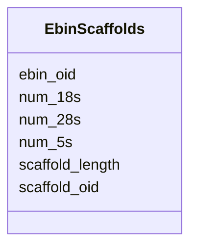

# Class: EbinScaffolds 


URI: [img_mysql_mbin:EbinScaffolds](https://w3id.org/jgi/img_mysql_mbin/EbinScaffolds)





<!-- no inheritance hierarchy -->


## Slots

| Name | Cardinality and Range | Description | Inheritance |
| ---  | --- | --- | --- |
| [ebin_oid](ebin_oid.md) | 0..1 <br/> [String](String.md) |  | direct |
| [scaffold_oid](scaffold_oid.md) | 0..1 <br/> [String](String.md) |  | direct |
| [scaffold_length](scaffold_length.md) | 0..1 <br/> [Integer](Integer.md) |  | direct |
| [num_5s](num_5s.md) | 0..1 <br/> [Integer](Integer.md) |  | direct |
| [num_18s](num_18s.md) | 0..1 <br/> [Integer](Integer.md) |  | direct |
| [num_28s](num_28s.md) | 0..1 <br/> [Integer](Integer.md) |  | direct |


## Identifier and Mapping Information


### Schema Source


* from schema: https://w3id.org/jgi/img_mysql_mbin


## Mappings

| Mapping Type | Mapped Value |
| ---  | ---  |
| self | img_mysql_mbin:EbinScaffolds |
| native | img_mysql_mbin:EbinScaffolds |


## LinkML Source

<!-- TODO: investigate https://stackoverflow.com/questions/37606292/how-to-create-tabbed-code-blocks-in-mkdocs-or-sphinx -->

### Direct

<details>
```yaml
name: ebin_scaffolds
from_schema: https://w3id.org/jgi/img_mysql_mbin
attributes:
  ebin_oid:
    name: ebin_oid
    from_schema: https://w3id.org/jgi/img_mysql_mbin
    domain_of:
    - ebin
    - ebin_ext_links
    - ebin_scaffolds
    - semi_ebin
    - semi_ebin_scaffolds
    range: string
    required: false
  scaffold_oid:
    name: scaffold_oid
    from_schema: https://w3id.org/jgi/img_mysql_mbin
    domain_of:
    - bin_scaffolds
    - ebin_scaffolds
    - semi_bin_scaffolds
    - semi_ebin_scaffolds
    range: string
    required: false
  scaffold_length:
    name: scaffold_length
    from_schema: https://w3id.org/jgi/img_mysql_mbin
    domain_of:
    - bin_scaffolds
    - ebin_scaffolds
    - semi_bin_scaffolds
    - semi_ebin_scaffolds
    range: integer
    required: false
  num_5s:
    name: num_5s
    from_schema: https://w3id.org/jgi/img_mysql_mbin
    domain_of:
    - bin
    - ebin
    - ebin_scaffolds
    - semi_bin
    - semi_ebin
    - semi_ebin_scaffolds
    range: integer
    required: false
  num_18s:
    name: num_18s
    from_schema: https://w3id.org/jgi/img_mysql_mbin
    domain_of:
    - ebin
    - ebin_scaffolds
    - semi_ebin
    - semi_ebin_scaffolds
    range: integer
    required: false
  num_28s:
    name: num_28s
    from_schema: https://w3id.org/jgi/img_mysql_mbin
    domain_of:
    - ebin
    - ebin_scaffolds
    - semi_ebin
    - semi_ebin_scaffolds
    range: integer
    required: false

```
</details>

### Induced

<details>
```yaml
name: ebin_scaffolds
from_schema: https://w3id.org/jgi/img_mysql_mbin
attributes:
  ebin_oid:
    name: ebin_oid
    from_schema: https://w3id.org/jgi/img_mysql_mbin
    alias: ebin_oid
    owner: ebin_scaffolds
    domain_of:
    - ebin
    - ebin_ext_links
    - ebin_scaffolds
    - semi_ebin
    - semi_ebin_scaffolds
    range: string
    required: false
  scaffold_oid:
    name: scaffold_oid
    from_schema: https://w3id.org/jgi/img_mysql_mbin
    alias: scaffold_oid
    owner: ebin_scaffolds
    domain_of:
    - bin_scaffolds
    - ebin_scaffolds
    - semi_bin_scaffolds
    - semi_ebin_scaffolds
    range: string
    required: false
  scaffold_length:
    name: scaffold_length
    from_schema: https://w3id.org/jgi/img_mysql_mbin
    alias: scaffold_length
    owner: ebin_scaffolds
    domain_of:
    - bin_scaffolds
    - ebin_scaffolds
    - semi_bin_scaffolds
    - semi_ebin_scaffolds
    range: integer
    required: false
  num_5s:
    name: num_5s
    from_schema: https://w3id.org/jgi/img_mysql_mbin
    alias: num_5s
    owner: ebin_scaffolds
    domain_of:
    - bin
    - ebin
    - ebin_scaffolds
    - semi_bin
    - semi_ebin
    - semi_ebin_scaffolds
    range: integer
    required: false
  num_18s:
    name: num_18s
    from_schema: https://w3id.org/jgi/img_mysql_mbin
    alias: num_18s
    owner: ebin_scaffolds
    domain_of:
    - ebin
    - ebin_scaffolds
    - semi_ebin
    - semi_ebin_scaffolds
    range: integer
    required: false
  num_28s:
    name: num_28s
    from_schema: https://w3id.org/jgi/img_mysql_mbin
    alias: num_28s
    owner: ebin_scaffolds
    domain_of:
    - ebin
    - ebin_scaffolds
    - semi_ebin
    - semi_ebin_scaffolds
    range: integer
    required: false

```
</details>