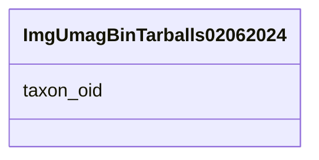

# Class: ImgUmagBinTarballs02062024 


URI: [img_mysql_mbin:ImgUmagBinTarballs02062024](https://w3id.org/jgi/img_mysql_mbin/ImgUmagBinTarballs02062024)





<!-- no inheritance hierarchy -->


## Slots

| Name | Cardinality and Range | Description | Inheritance |
| ---  | --- | --- | --- |
| [taxon_oid](taxon_oid.md) | 0..1 <br/> [Integer](Integer.md) |  | direct |


## Identifier and Mapping Information


### Schema Source


* from schema: https://w3id.org/jgi/img_mysql_mbin


## Mappings

| Mapping Type | Mapped Value |
| ---  | ---  |
| self | img_mysql_mbin:ImgUmagBinTarballs02062024 |
| native | img_mysql_mbin:ImgUmagBinTarballs02062024 |


## LinkML Source

<!-- TODO: investigate https://stackoverflow.com/questions/37606292/how-to-create-tabbed-code-blocks-in-mkdocs-or-sphinx -->

### Direct

<details>
```yaml
name: img_umag_bin_tarballs_02062024
from_schema: https://w3id.org/jgi/img_mysql_mbin
attributes:
  taxon_oid:
    name: taxon_oid
    from_schema: https://w3id.org/jgi/img_mysql_mbin
    domain_of:
    - bin
    - ebin
    - ebin_not_loaded_metagenomes
    - img_umag_bin_tarballs_02062024
    - not_loaded_metagenomes
    - semi_bin
    - semi_bin_not_loaded
    - semi_ebin
    - semi_ebin_not_loaded
    - semi_lq
    range: integer
    required: false

```
</details>

### Induced

<details>
```yaml
name: img_umag_bin_tarballs_02062024
from_schema: https://w3id.org/jgi/img_mysql_mbin
attributes:
  taxon_oid:
    name: taxon_oid
    from_schema: https://w3id.org/jgi/img_mysql_mbin
    alias: taxon_oid
    owner: img_umag_bin_tarballs_02062024
    domain_of:
    - bin
    - ebin
    - ebin_not_loaded_metagenomes
    - img_umag_bin_tarballs_02062024
    - not_loaded_metagenomes
    - semi_bin
    - semi_bin_not_loaded
    - semi_ebin
    - semi_ebin_not_loaded
    - semi_lq
    range: integer
    required: false

```
</details>