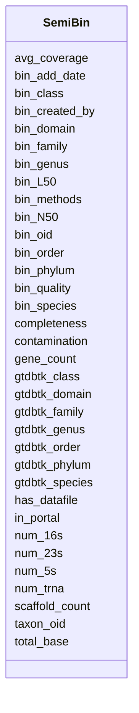

# Class: SemiBin 


URI: [img_mysql_mbin:SemiBin](https://w3id.org/jgi/img_mysql_mbin/SemiBin)





<!-- no inheritance hierarchy -->


## Slots

| Name | Cardinality and Range | Description | Inheritance |
| ---  | --- | --- | --- |
| [bin_oid](bin_oid.md) | 0..1 <br/> [String](String.md) |  | direct |
| [taxon_oid](taxon_oid.md) | 0..1 <br/> [Integer](Integer.md) |  | direct |
| [bin_domain](bin_domain.md) | 0..1 <br/> [String](String.md) |  | direct |
| [bin_phylum](bin_phylum.md) | 0..1 <br/> [String](String.md) |  | direct |
| [bin_class](bin_class.md) | 0..1 <br/> [String](String.md) |  | direct |
| [bin_order](bin_order.md) | 0..1 <br/> [String](String.md) |  | direct |
| [bin_family](bin_family.md) | 0..1 <br/> [String](String.md) |  | direct |
| [bin_genus](bin_genus.md) | 0..1 <br/> [String](String.md) |  | direct |
| [bin_species](bin_species.md) | 0..1 <br/> [String](String.md) |  | direct |
| [completeness](completeness.md) | 0..1 <br/> [Float](Float.md) |  | direct |
| [contamination](contamination.md) | 0..1 <br/> [Float](Float.md) |  | direct |
| [total_base](total_base.md) | 0..1 <br/> [Integer](Integer.md) |  | direct |
| [gene_count](gene_count.md) | 0..1 <br/> [Integer](Integer.md) |  | direct |
| [bin_quality](bin_quality.md) | 0..1 <br/> [String](String.md) |  | direct |
| [gtdbtk_domain](gtdbtk_domain.md) | 0..1 <br/> [String](String.md) |  | direct |
| [gtdbtk_phylum](gtdbtk_phylum.md) | 0..1 <br/> [String](String.md) |  | direct |
| [gtdbtk_class](gtdbtk_class.md) | 0..1 <br/> [String](String.md) |  | direct |
| [gtdbtk_order](gtdbtk_order.md) | 0..1 <br/> [String](String.md) |  | direct |
| [gtdbtk_family](gtdbtk_family.md) | 0..1 <br/> [String](String.md) |  | direct |
| [gtdbtk_genus](gtdbtk_genus.md) | 0..1 <br/> [String](String.md) |  | direct |
| [gtdbtk_species](gtdbtk_species.md) | 0..1 <br/> [String](String.md) |  | direct |
| [bin_add_date](bin_add_date.md) | 0..1 <br/> [Datetime](Datetime.md) |  | direct |
| [bin_methods](bin_methods.md) | 0..1 <br/> [String](String.md) |  | direct |
| [bin_created_by](bin_created_by.md) | 0..1 <br/> [Integer](Integer.md) |  | direct |
| [num_16s](num_16s.md) | 0..1 <br/> [Integer](Integer.md) |  | direct |
| [num_5s](num_5s.md) | 0..1 <br/> [Integer](Integer.md) |  | direct |
| [num_23s](num_23s.md) | 0..1 <br/> [Integer](Integer.md) |  | direct |
| [num_trna](num_trna.md) | 0..1 <br/> [Integer](Integer.md) |  | direct |
| [scaffold_count](scaffold_count.md) | 0..1 <br/> [Integer](Integer.md) |  | direct |
| [avg_coverage](avg_coverage.md) | 0..1 <br/> [Float](Float.md) |  | direct |
| [bin_N50](bin_N50.md) | 0..1 <br/> [String](String.md) |  | direct |
| [bin_L50](bin_L50.md) | 0..1 <br/> [String](String.md) |  | direct |
| [in_portal](in_portal.md) | 0..1 <br/> [String](String.md) |  | direct |
| [has_datafile](has_datafile.md) | 0..1 <br/> [String](String.md) |  | direct |


## Identifier and Mapping Information


### Schema Source


* from schema: https://w3id.org/jgi/img_mysql_mbin


## Mappings

| Mapping Type | Mapped Value |
| ---  | ---  |
| self | img_mysql_mbin:SemiBin |
| native | img_mysql_mbin:SemiBin |


## LinkML Source

<!-- TODO: investigate https://stackoverflow.com/questions/37606292/how-to-create-tabbed-code-blocks-in-mkdocs-or-sphinx -->

### Direct

<details>
```yaml
name: semi_bin
from_schema: https://w3id.org/jgi/img_mysql_mbin
attributes:
  bin_oid:
    name: bin_oid
    from_schema: https://w3id.org/jgi/img_mysql_mbin
    domain_of:
    - bin
    - bin_coverage
    - bin_scaffolds
    - semi_bin
    - semi_bin_coverage
    - semi_bin_scaffolds
    - semi_lq
    range: string
    required: false
  taxon_oid:
    name: taxon_oid
    from_schema: https://w3id.org/jgi/img_mysql_mbin
    domain_of:
    - bin
    - ebin
    - ebin_not_loaded_metagenomes
    - img_umag_bin_tarballs_02062024
    - not_loaded_metagenomes
    - semi_bin
    - semi_bin_not_loaded
    - semi_ebin
    - semi_ebin_not_loaded
    - semi_lq
    range: integer
    required: false
  bin_domain:
    name: bin_domain
    from_schema: https://w3id.org/jgi/img_mysql_mbin
    domain_of:
    - bin
    - semi_bin
    range: string
    required: false
  bin_phylum:
    name: bin_phylum
    from_schema: https://w3id.org/jgi/img_mysql_mbin
    domain_of:
    - bin
    - semi_bin
    range: string
    required: false
  bin_class:
    name: bin_class
    from_schema: https://w3id.org/jgi/img_mysql_mbin
    domain_of:
    - bin
    - semi_bin
    range: string
    required: false
  bin_order:
    name: bin_order
    from_schema: https://w3id.org/jgi/img_mysql_mbin
    domain_of:
    - bin
    - semi_bin
    range: string
    required: false
  bin_family:
    name: bin_family
    from_schema: https://w3id.org/jgi/img_mysql_mbin
    domain_of:
    - bin
    - semi_bin
    range: string
    required: false
  bin_genus:
    name: bin_genus
    from_schema: https://w3id.org/jgi/img_mysql_mbin
    domain_of:
    - bin
    - semi_bin
    range: string
    required: false
  bin_species:
    name: bin_species
    from_schema: https://w3id.org/jgi/img_mysql_mbin
    domain_of:
    - bin
    - semi_bin
    range: string
    required: false
  completeness:
    name: completeness
    from_schema: https://w3id.org/jgi/img_mysql_mbin
    domain_of:
    - bin
    - ebin
    - semi_bin
    - semi_ebin
    range: float
    required: false
  contamination:
    name: contamination
    from_schema: https://w3id.org/jgi/img_mysql_mbin
    domain_of:
    - bin
    - ebin
    - semi_bin
    - semi_ebin
    range: float
    required: false
  total_base:
    name: total_base
    from_schema: https://w3id.org/jgi/img_mysql_mbin
    domain_of:
    - bin
    - semi_bin
    range: integer
    required: false
  gene_count:
    name: gene_count
    from_schema: https://w3id.org/jgi/img_mysql_mbin
    domain_of:
    - bin
    - bin_scaffolds
    - semi_bin
    - semi_bin_scaffolds
    range: integer
    required: false
  bin_quality:
    name: bin_quality
    from_schema: https://w3id.org/jgi/img_mysql_mbin
    domain_of:
    - bin
    - semi_bin
    range: string
    required: false
  gtdbtk_domain:
    name: gtdbtk_domain
    from_schema: https://w3id.org/jgi/img_mysql_mbin
    domain_of:
    - bin
    - semi_bin
    range: string
    required: false
  gtdbtk_phylum:
    name: gtdbtk_phylum
    from_schema: https://w3id.org/jgi/img_mysql_mbin
    domain_of:
    - bin
    - semi_bin
    range: string
    required: false
  gtdbtk_class:
    name: gtdbtk_class
    from_schema: https://w3id.org/jgi/img_mysql_mbin
    domain_of:
    - bin
    - semi_bin
    range: string
    required: false
  gtdbtk_order:
    name: gtdbtk_order
    from_schema: https://w3id.org/jgi/img_mysql_mbin
    domain_of:
    - bin
    - semi_bin
    range: string
    required: false
  gtdbtk_family:
    name: gtdbtk_family
    from_schema: https://w3id.org/jgi/img_mysql_mbin
    domain_of:
    - bin
    - semi_bin
    range: string
    required: false
  gtdbtk_genus:
    name: gtdbtk_genus
    from_schema: https://w3id.org/jgi/img_mysql_mbin
    domain_of:
    - bin
    - semi_bin
    range: string
    required: false
  gtdbtk_species:
    name: gtdbtk_species
    from_schema: https://w3id.org/jgi/img_mysql_mbin
    domain_of:
    - bin
    - semi_bin
    range: string
    required: false
  bin_add_date:
    name: bin_add_date
    from_schema: https://w3id.org/jgi/img_mysql_mbin
    domain_of:
    - bin
    - semi_bin
    range: datetime
    required: false
  bin_methods:
    name: bin_methods
    from_schema: https://w3id.org/jgi/img_mysql_mbin
    domain_of:
    - bin
    - not_loaded_metagenomes
    - semi_bin
    - semi_bin_not_loaded
    range: string
    required: false
  bin_created_by:
    name: bin_created_by
    from_schema: https://w3id.org/jgi/img_mysql_mbin
    domain_of:
    - bin
    - not_loaded_metagenomes
    - semi_bin
    - semi_bin_not_loaded
    range: integer
    required: false
  num_16s:
    name: num_16s
    from_schema: https://w3id.org/jgi/img_mysql_mbin
    domain_of:
    - bin
    - semi_bin
    range: integer
    required: false
  num_5s:
    name: num_5s
    from_schema: https://w3id.org/jgi/img_mysql_mbin
    domain_of:
    - bin
    - ebin
    - ebin_scaffolds
    - semi_bin
    - semi_ebin
    - semi_ebin_scaffolds
    range: integer
    required: false
  num_23s:
    name: num_23s
    from_schema: https://w3id.org/jgi/img_mysql_mbin
    domain_of:
    - bin
    - semi_bin
    range: integer
    required: false
  num_trna:
    name: num_trna
    from_schema: https://w3id.org/jgi/img_mysql_mbin
    domain_of:
    - bin
    - semi_bin
    range: integer
    required: false
  scaffold_count:
    name: scaffold_count
    from_schema: https://w3id.org/jgi/img_mysql_mbin
    domain_of:
    - bin
    - ebin
    - semi_bin
    - semi_ebin
    range: integer
    required: false
  avg_coverage:
    name: avg_coverage
    from_schema: https://w3id.org/jgi/img_mysql_mbin
    domain_of:
    - bin
    - bin_coverage
    - ebin
    - semi_bin
    - semi_bin_coverage
    - semi_ebin
    range: float
    required: false
  bin_N50:
    name: bin_N50
    from_schema: https://w3id.org/jgi/img_mysql_mbin
    rank: 1000
    domain_of:
    - semi_bin
    range: string
    required: false
  bin_L50:
    name: bin_L50
    from_schema: https://w3id.org/jgi/img_mysql_mbin
    rank: 1000
    domain_of:
    - semi_bin
    range: string
    required: false
  in_portal:
    name: in_portal
    from_schema: https://w3id.org/jgi/img_mysql_mbin
    rank: 1000
    domain_of:
    - semi_bin
    - semi_ebin
    range: string
    required: false
  has_datafile:
    name: has_datafile
    from_schema: https://w3id.org/jgi/img_mysql_mbin
    rank: 1000
    domain_of:
    - semi_bin
    - semi_ebin
    range: string
    required: false

```
</details>

### Induced

<details>
```yaml
name: semi_bin
from_schema: https://w3id.org/jgi/img_mysql_mbin
attributes:
  bin_oid:
    name: bin_oid
    from_schema: https://w3id.org/jgi/img_mysql_mbin
    alias: bin_oid
    owner: semi_bin
    domain_of:
    - bin
    - bin_coverage
    - bin_scaffolds
    - semi_bin
    - semi_bin_coverage
    - semi_bin_scaffolds
    - semi_lq
    range: string
    required: false
  taxon_oid:
    name: taxon_oid
    from_schema: https://w3id.org/jgi/img_mysql_mbin
    alias: taxon_oid
    owner: semi_bin
    domain_of:
    - bin
    - ebin
    - ebin_not_loaded_metagenomes
    - img_umag_bin_tarballs_02062024
    - not_loaded_metagenomes
    - semi_bin
    - semi_bin_not_loaded
    - semi_ebin
    - semi_ebin_not_loaded
    - semi_lq
    range: integer
    required: false
  bin_domain:
    name: bin_domain
    from_schema: https://w3id.org/jgi/img_mysql_mbin
    alias: bin_domain
    owner: semi_bin
    domain_of:
    - bin
    - semi_bin
    range: string
    required: false
  bin_phylum:
    name: bin_phylum
    from_schema: https://w3id.org/jgi/img_mysql_mbin
    alias: bin_phylum
    owner: semi_bin
    domain_of:
    - bin
    - semi_bin
    range: string
    required: false
  bin_class:
    name: bin_class
    from_schema: https://w3id.org/jgi/img_mysql_mbin
    alias: bin_class
    owner: semi_bin
    domain_of:
    - bin
    - semi_bin
    range: string
    required: false
  bin_order:
    name: bin_order
    from_schema: https://w3id.org/jgi/img_mysql_mbin
    alias: bin_order
    owner: semi_bin
    domain_of:
    - bin
    - semi_bin
    range: string
    required: false
  bin_family:
    name: bin_family
    from_schema: https://w3id.org/jgi/img_mysql_mbin
    alias: bin_family
    owner: semi_bin
    domain_of:
    - bin
    - semi_bin
    range: string
    required: false
  bin_genus:
    name: bin_genus
    from_schema: https://w3id.org/jgi/img_mysql_mbin
    alias: bin_genus
    owner: semi_bin
    domain_of:
    - bin
    - semi_bin
    range: string
    required: false
  bin_species:
    name: bin_species
    from_schema: https://w3id.org/jgi/img_mysql_mbin
    alias: bin_species
    owner: semi_bin
    domain_of:
    - bin
    - semi_bin
    range: string
    required: false
  completeness:
    name: completeness
    from_schema: https://w3id.org/jgi/img_mysql_mbin
    alias: completeness
    owner: semi_bin
    domain_of:
    - bin
    - ebin
    - semi_bin
    - semi_ebin
    range: float
    required: false
  contamination:
    name: contamination
    from_schema: https://w3id.org/jgi/img_mysql_mbin
    alias: contamination
    owner: semi_bin
    domain_of:
    - bin
    - ebin
    - semi_bin
    - semi_ebin
    range: float
    required: false
  total_base:
    name: total_base
    from_schema: https://w3id.org/jgi/img_mysql_mbin
    alias: total_base
    owner: semi_bin
    domain_of:
    - bin
    - semi_bin
    range: integer
    required: false
  gene_count:
    name: gene_count
    from_schema: https://w3id.org/jgi/img_mysql_mbin
    alias: gene_count
    owner: semi_bin
    domain_of:
    - bin
    - bin_scaffolds
    - semi_bin
    - semi_bin_scaffolds
    range: integer
    required: false
  bin_quality:
    name: bin_quality
    from_schema: https://w3id.org/jgi/img_mysql_mbin
    alias: bin_quality
    owner: semi_bin
    domain_of:
    - bin
    - semi_bin
    range: string
    required: false
  gtdbtk_domain:
    name: gtdbtk_domain
    from_schema: https://w3id.org/jgi/img_mysql_mbin
    alias: gtdbtk_domain
    owner: semi_bin
    domain_of:
    - bin
    - semi_bin
    range: string
    required: false
  gtdbtk_phylum:
    name: gtdbtk_phylum
    from_schema: https://w3id.org/jgi/img_mysql_mbin
    alias: gtdbtk_phylum
    owner: semi_bin
    domain_of:
    - bin
    - semi_bin
    range: string
    required: false
  gtdbtk_class:
    name: gtdbtk_class
    from_schema: https://w3id.org/jgi/img_mysql_mbin
    alias: gtdbtk_class
    owner: semi_bin
    domain_of:
    - bin
    - semi_bin
    range: string
    required: false
  gtdbtk_order:
    name: gtdbtk_order
    from_schema: https://w3id.org/jgi/img_mysql_mbin
    alias: gtdbtk_order
    owner: semi_bin
    domain_of:
    - bin
    - semi_bin
    range: string
    required: false
  gtdbtk_family:
    name: gtdbtk_family
    from_schema: https://w3id.org/jgi/img_mysql_mbin
    alias: gtdbtk_family
    owner: semi_bin
    domain_of:
    - bin
    - semi_bin
    range: string
    required: false
  gtdbtk_genus:
    name: gtdbtk_genus
    from_schema: https://w3id.org/jgi/img_mysql_mbin
    alias: gtdbtk_genus
    owner: semi_bin
    domain_of:
    - bin
    - semi_bin
    range: string
    required: false
  gtdbtk_species:
    name: gtdbtk_species
    from_schema: https://w3id.org/jgi/img_mysql_mbin
    alias: gtdbtk_species
    owner: semi_bin
    domain_of:
    - bin
    - semi_bin
    range: string
    required: false
  bin_add_date:
    name: bin_add_date
    from_schema: https://w3id.org/jgi/img_mysql_mbin
    alias: bin_add_date
    owner: semi_bin
    domain_of:
    - bin
    - semi_bin
    range: datetime
    required: false
  bin_methods:
    name: bin_methods
    from_schema: https://w3id.org/jgi/img_mysql_mbin
    alias: bin_methods
    owner: semi_bin
    domain_of:
    - bin
    - not_loaded_metagenomes
    - semi_bin
    - semi_bin_not_loaded
    range: string
    required: false
  bin_created_by:
    name: bin_created_by
    from_schema: https://w3id.org/jgi/img_mysql_mbin
    alias: bin_created_by
    owner: semi_bin
    domain_of:
    - bin
    - not_loaded_metagenomes
    - semi_bin
    - semi_bin_not_loaded
    range: integer
    required: false
  num_16s:
    name: num_16s
    from_schema: https://w3id.org/jgi/img_mysql_mbin
    alias: num_16s
    owner: semi_bin
    domain_of:
    - bin
    - semi_bin
    range: integer
    required: false
  num_5s:
    name: num_5s
    from_schema: https://w3id.org/jgi/img_mysql_mbin
    alias: num_5s
    owner: semi_bin
    domain_of:
    - bin
    - ebin
    - ebin_scaffolds
    - semi_bin
    - semi_ebin
    - semi_ebin_scaffolds
    range: integer
    required: false
  num_23s:
    name: num_23s
    from_schema: https://w3id.org/jgi/img_mysql_mbin
    alias: num_23s
    owner: semi_bin
    domain_of:
    - bin
    - semi_bin
    range: integer
    required: false
  num_trna:
    name: num_trna
    from_schema: https://w3id.org/jgi/img_mysql_mbin
    alias: num_trna
    owner: semi_bin
    domain_of:
    - bin
    - semi_bin
    range: integer
    required: false
  scaffold_count:
    name: scaffold_count
    from_schema: https://w3id.org/jgi/img_mysql_mbin
    alias: scaffold_count
    owner: semi_bin
    domain_of:
    - bin
    - ebin
    - semi_bin
    - semi_ebin
    range: integer
    required: false
  avg_coverage:
    name: avg_coverage
    from_schema: https://w3id.org/jgi/img_mysql_mbin
    alias: avg_coverage
    owner: semi_bin
    domain_of:
    - bin
    - bin_coverage
    - ebin
    - semi_bin
    - semi_bin_coverage
    - semi_ebin
    range: float
    required: false
  bin_N50:
    name: bin_N50
    from_schema: https://w3id.org/jgi/img_mysql_mbin
    rank: 1000
    alias: bin_N50
    owner: semi_bin
    domain_of:
    - semi_bin
    range: string
    required: false
  bin_L50:
    name: bin_L50
    from_schema: https://w3id.org/jgi/img_mysql_mbin
    rank: 1000
    alias: bin_L50
    owner: semi_bin
    domain_of:
    - semi_bin
    range: string
    required: false
  in_portal:
    name: in_portal
    from_schema: https://w3id.org/jgi/img_mysql_mbin
    rank: 1000
    alias: in_portal
    owner: semi_bin
    domain_of:
    - semi_bin
    - semi_ebin
    range: string
    required: false
  has_datafile:
    name: has_datafile
    from_schema: https://w3id.org/jgi/img_mysql_mbin
    rank: 1000
    alias: has_datafile
    owner: semi_bin
    domain_of:
    - semi_bin
    - semi_ebin
    range: string
    required: false

```
</details>