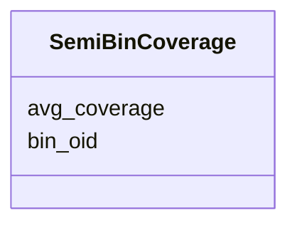

# Class: SemiBinCoverage 


URI: [img_mysql_mbin:SemiBinCoverage](https://w3id.org/jgi/img_mysql_mbin/SemiBinCoverage)





<!-- no inheritance hierarchy -->


## Slots

| Name | Cardinality and Range | Description | Inheritance |
| ---  | --- | --- | --- |
| [bin_oid](bin_oid.md) | 0..1 <br/> [String](String.md) |  | direct |
| [avg_coverage](avg_coverage.md) | 0..1 <br/> [Float](Float.md) |  | direct |


## Identifier and Mapping Information


### Schema Source


* from schema: https://w3id.org/jgi/img_mysql_mbin


## Mappings

| Mapping Type | Mapped Value |
| ---  | ---  |
| self | img_mysql_mbin:SemiBinCoverage |
| native | img_mysql_mbin:SemiBinCoverage |


## LinkML Source

<!-- TODO: investigate https://stackoverflow.com/questions/37606292/how-to-create-tabbed-code-blocks-in-mkdocs-or-sphinx -->

### Direct

<details>
```yaml
name: semi_bin_coverage
from_schema: https://w3id.org/jgi/img_mysql_mbin
attributes:
  bin_oid:
    name: bin_oid
    from_schema: https://w3id.org/jgi/img_mysql_mbin
    domain_of:
    - bin
    - bin_coverage
    - bin_scaffolds
    - semi_bin
    - semi_bin_coverage
    - semi_bin_scaffolds
    - semi_lq
    range: string
    required: false
  avg_coverage:
    name: avg_coverage
    from_schema: https://w3id.org/jgi/img_mysql_mbin
    domain_of:
    - bin
    - bin_coverage
    - ebin
    - semi_bin
    - semi_bin_coverage
    - semi_ebin
    range: float
    required: false

```
</details>

### Induced

<details>
```yaml
name: semi_bin_coverage
from_schema: https://w3id.org/jgi/img_mysql_mbin
attributes:
  bin_oid:
    name: bin_oid
    from_schema: https://w3id.org/jgi/img_mysql_mbin
    alias: bin_oid
    owner: semi_bin_coverage
    domain_of:
    - bin
    - bin_coverage
    - bin_scaffolds
    - semi_bin
    - semi_bin_coverage
    - semi_bin_scaffolds
    - semi_lq
    range: string
    required: false
  avg_coverage:
    name: avg_coverage
    from_schema: https://w3id.org/jgi/img_mysql_mbin
    alias: avg_coverage
    owner: semi_bin_coverage
    domain_of:
    - bin
    - bin_coverage
    - ebin
    - semi_bin
    - semi_bin_coverage
    - semi_ebin
    range: float
    required: false

```
</details>