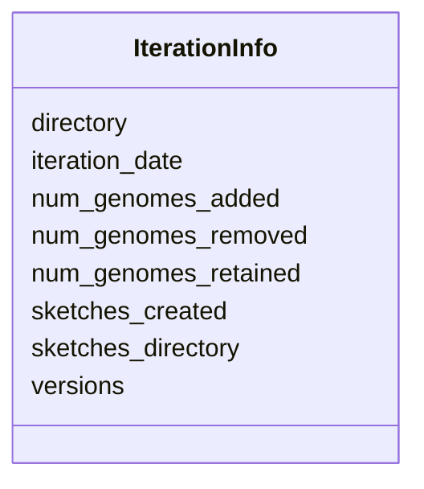

# Class: IterationInfo 


URI: [img_mysql_misi:IterationInfo](https://w3id.org/jgi/img_mysql_misi/IterationInfo)





<!-- no inheritance hierarchy -->


## Slots

| Name | Cardinality and Range | Description | Inheritance |
| ---  | --- | --- | --- |
| [iteration_date](iteration_date.md) | 0..1 <br/> [Date](Date.md) |  | direct |
| [directory](directory.md) | 0..1 <br/> [String](String.md) |  | direct |
| [versions](versions.md) | 0..1 <br/> [String](String.md) |  | direct |
| [sketches_created](sketches_created.md) | 0..1 <br/> [String](String.md) |  | direct |
| [sketches_directory](sketches_directory.md) | 0..1 <br/> [String](String.md) |  | direct |
| [num_genomes_added](num_genomes_added.md) | 0..1 <br/> [Integer](Integer.md) |  | direct |
| [num_genomes_removed](num_genomes_removed.md) | 0..1 <br/> [Integer](Integer.md) |  | direct |
| [num_genomes_retained](num_genomes_retained.md) | 0..1 <br/> [Integer](Integer.md) |  | direct |


## Identifier and Mapping Information


### Schema Source


* from schema: https://w3id.org/jgi/img_mysql_misi


## Mappings

| Mapping Type | Mapped Value |
| ---  | ---  |
| self | img_mysql_misi:IterationInfo |
| native | img_mysql_misi:IterationInfo |


## LinkML Source

<!-- TODO: investigate https://stackoverflow.com/questions/37606292/how-to-create-tabbed-code-blocks-in-mkdocs-or-sphinx -->

### Direct

<details>
```yaml
name: iteration_info
from_schema: https://w3id.org/jgi/img_mysql_misi
attributes:
  iteration_date:
    name: iteration_date
    from_schema: https://w3id.org/jgi/img_mysql_misi
    rank: 1000
    domain_of:
    - iteration_info
    - taxon_info
    range: date
    required: false
  directory:
    name: directory
    from_schema: https://w3id.org/jgi/img_mysql_misi
    rank: 1000
    domain_of:
    - iteration_info
    range: string
    required: false
  versions:
    name: versions
    from_schema: https://w3id.org/jgi/img_mysql_misi
    rank: 1000
    domain_of:
    - iteration_info
    range: string
    required: false
  sketches_created:
    name: sketches_created
    from_schema: https://w3id.org/jgi/img_mysql_misi
    rank: 1000
    domain_of:
    - iteration_info
    range: string
    required: false
  sketches_directory:
    name: sketches_directory
    from_schema: https://w3id.org/jgi/img_mysql_misi
    rank: 1000
    domain_of:
    - iteration_info
    range: string
    required: false
  num_genomes_added:
    name: num_genomes_added
    from_schema: https://w3id.org/jgi/img_mysql_misi
    rank: 1000
    domain_of:
    - iteration_info
    range: integer
    required: false
  num_genomes_removed:
    name: num_genomes_removed
    from_schema: https://w3id.org/jgi/img_mysql_misi
    rank: 1000
    domain_of:
    - iteration_info
    range: integer
    required: false
  num_genomes_retained:
    name: num_genomes_retained
    from_schema: https://w3id.org/jgi/img_mysql_misi
    rank: 1000
    domain_of:
    - iteration_info
    range: integer
    required: false

```
</details>

### Induced

<details>
```yaml
name: iteration_info
from_schema: https://w3id.org/jgi/img_mysql_misi
attributes:
  iteration_date:
    name: iteration_date
    from_schema: https://w3id.org/jgi/img_mysql_misi
    rank: 1000
    alias: iteration_date
    owner: iteration_info
    domain_of:
    - iteration_info
    - taxon_info
    range: date
    required: false
  directory:
    name: directory
    from_schema: https://w3id.org/jgi/img_mysql_misi
    rank: 1000
    alias: directory
    owner: iteration_info
    domain_of:
    - iteration_info
    range: string
    required: false
  versions:
    name: versions
    from_schema: https://w3id.org/jgi/img_mysql_misi
    rank: 1000
    alias: versions
    owner: iteration_info
    domain_of:
    - iteration_info
    range: string
    required: false
  sketches_created:
    name: sketches_created
    from_schema: https://w3id.org/jgi/img_mysql_misi
    rank: 1000
    alias: sketches_created
    owner: iteration_info
    domain_of:
    - iteration_info
    range: string
    required: false
  sketches_directory:
    name: sketches_directory
    from_schema: https://w3id.org/jgi/img_mysql_misi
    rank: 1000
    alias: sketches_directory
    owner: iteration_info
    domain_of:
    - iteration_info
    range: string
    required: false
  num_genomes_added:
    name: num_genomes_added
    from_schema: https://w3id.org/jgi/img_mysql_misi
    rank: 1000
    alias: num_genomes_added
    owner: iteration_info
    domain_of:
    - iteration_info
    range: integer
    required: false
  num_genomes_removed:
    name: num_genomes_removed
    from_schema: https://w3id.org/jgi/img_mysql_misi
    rank: 1000
    alias: num_genomes_removed
    owner: iteration_info
    domain_of:
    - iteration_info
    range: integer
    required: false
  num_genomes_retained:
    name: num_genomes_retained
    from_schema: https://w3id.org/jgi/img_mysql_misi
    rank: 1000
    alias: num_genomes_retained
    owner: iteration_info
    domain_of:
    - iteration_info
    range: integer
    required: false

```
</details>