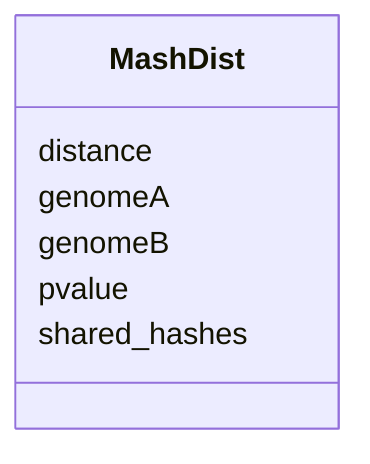

# Class: MashDist 


URI: [img_mysql_misi:MashDist](https://w3id.org/jgi/img_mysql_misi/MashDist)





<!-- no inheritance hierarchy -->


## Slots

| Name | Cardinality and Range | Description | Inheritance |
| ---  | --- | --- | --- |
| [genomeA](genomeA.md) | 0..1 <br/> [String](String.md) |  | direct |
| [genomeB](genomeB.md) | 0..1 <br/> [String](String.md) |  | direct |
| [distance](distance.md) | 0..1 <br/> [Float](Float.md) |  | direct |
| [pvalue](pvalue.md) | 0..1 <br/> [Float](Float.md) |  | direct |
| [shared_hashes](shared_hashes.md) | 0..1 <br/> [String](String.md) |  | direct |


## Identifier and Mapping Information


### Schema Source


* from schema: https://w3id.org/jgi/img_mysql_misi


## Mappings

| Mapping Type | Mapped Value |
| ---  | ---  |
| self | img_mysql_misi:MashDist |
| native | img_mysql_misi:MashDist |


## LinkML Source

<!-- TODO: investigate https://stackoverflow.com/questions/37606292/how-to-create-tabbed-code-blocks-in-mkdocs-or-sphinx -->

### Direct

<details>
```yaml
name: mash_dist
from_schema: https://w3id.org/jgi/img_mysql_misi
attributes:
  genomeA:
    name: genomeA
    from_schema: https://w3id.org/jgi/img_mysql_misi
    rank: 1000
    domain_of:
    - mash_dist
    - misi_ani
    range: string
    required: false
  genomeB:
    name: genomeB
    from_schema: https://w3id.org/jgi/img_mysql_misi
    rank: 1000
    domain_of:
    - mash_dist
    - misi_ani
    range: string
    required: false
  distance:
    name: distance
    from_schema: https://w3id.org/jgi/img_mysql_misi
    rank: 1000
    domain_of:
    - mash_dist
    range: float
    required: false
  pvalue:
    name: pvalue
    from_schema: https://w3id.org/jgi/img_mysql_misi
    rank: 1000
    domain_of:
    - mash_dist
    range: float
    required: false
  shared_hashes:
    name: shared_hashes
    from_schema: https://w3id.org/jgi/img_mysql_misi
    rank: 1000
    domain_of:
    - mash_dist
    range: string
    required: false

```
</details>

### Induced

<details>
```yaml
name: mash_dist
from_schema: https://w3id.org/jgi/img_mysql_misi
attributes:
  genomeA:
    name: genomeA
    from_schema: https://w3id.org/jgi/img_mysql_misi
    rank: 1000
    alias: genomeA
    owner: mash_dist
    domain_of:
    - mash_dist
    - misi_ani
    range: string
    required: false
  genomeB:
    name: genomeB
    from_schema: https://w3id.org/jgi/img_mysql_misi
    rank: 1000
    alias: genomeB
    owner: mash_dist
    domain_of:
    - mash_dist
    - misi_ani
    range: string
    required: false
  distance:
    name: distance
    from_schema: https://w3id.org/jgi/img_mysql_misi
    rank: 1000
    alias: distance
    owner: mash_dist
    domain_of:
    - mash_dist
    range: float
    required: false
  pvalue:
    name: pvalue
    from_schema: https://w3id.org/jgi/img_mysql_misi
    rank: 1000
    alias: pvalue
    owner: mash_dist
    domain_of:
    - mash_dist
    range: float
    required: false
  shared_hashes:
    name: shared_hashes
    from_schema: https://w3id.org/jgi/img_mysql_misi
    rank: 1000
    alias: shared_hashes
    owner: mash_dist
    domain_of:
    - mash_dist
    range: string
    required: false

```
</details>