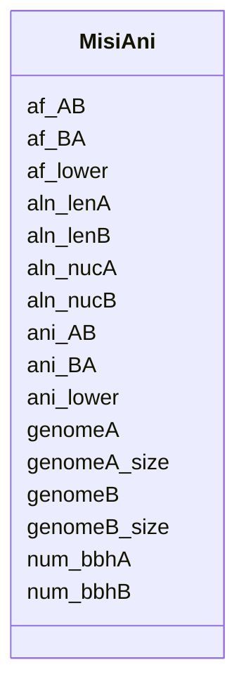

# Class: MisiAni 


URI: [img_mysql_misi:MisiAni](https://w3id.org/jgi/img_mysql_misi/MisiAni)





<!-- no inheritance hierarchy -->


## Slots

| Name | Cardinality and Range | Description | Inheritance |
| ---  | --- | --- | --- |
| [genomeA](genomeA.md) | 0..1 <br/> [String](String.md) |  | direct |
| [genomeB](genomeB.md) | 0..1 <br/> [String](String.md) |  | direct |
| [genomeA_size](genomeA_size.md) | 0..1 <br/> [Integer](Integer.md) |  | direct |
| [genomeB_size](genomeB_size.md) | 0..1 <br/> [Integer](Integer.md) |  | direct |
| [num_bbhA](num_bbhA.md) | 0..1 <br/> [Integer](Integer.md) |  | direct |
| [num_bbhB](num_bbhB.md) | 0..1 <br/> [Integer](Integer.md) |  | direct |
| [aln_lenA](aln_lenA.md) | 0..1 <br/> [Float](Float.md) |  | direct |
| [aln_lenB](aln_lenB.md) | 0..1 <br/> [Float](Float.md) |  | direct |
| [aln_nucA](aln_nucA.md) | 0..1 <br/> [Float](Float.md) |  | direct |
| [aln_nucB](aln_nucB.md) | 0..1 <br/> [Float](Float.md) |  | direct |
| [ani_AB](ani_AB.md) | 0..1 <br/> [Float](Float.md) |  | direct |
| [ani_BA](ani_BA.md) | 0..1 <br/> [Float](Float.md) |  | direct |
| [af_AB](af_AB.md) | 0..1 <br/> [Float](Float.md) |  | direct |
| [af_BA](af_BA.md) | 0..1 <br/> [Float](Float.md) |  | direct |
| [ani_lower](ani_lower.md) | 0..1 <br/> [Float](Float.md) |  | direct |
| [af_lower](af_lower.md) | 0..1 <br/> [Float](Float.md) |  | direct |


## Identifier and Mapping Information


### Schema Source


* from schema: https://w3id.org/jgi/img_mysql_misi


## Mappings

| Mapping Type | Mapped Value |
| ---  | ---  |
| self | img_mysql_misi:MisiAni |
| native | img_mysql_misi:MisiAni |


## LinkML Source

<!-- TODO: investigate https://stackoverflow.com/questions/37606292/how-to-create-tabbed-code-blocks-in-mkdocs-or-sphinx -->

### Direct

<details>
```yaml
name: misi_ani
from_schema: https://w3id.org/jgi/img_mysql_misi
attributes:
  genomeA:
    name: genomeA
    from_schema: https://w3id.org/jgi/img_mysql_misi
    domain_of:
    - mash_dist
    - misi_ani
    range: string
    required: false
  genomeB:
    name: genomeB
    from_schema: https://w3id.org/jgi/img_mysql_misi
    domain_of:
    - mash_dist
    - misi_ani
    range: string
    required: false
  genomeA_size:
    name: genomeA_size
    from_schema: https://w3id.org/jgi/img_mysql_misi
    rank: 1000
    domain_of:
    - misi_ani
    range: integer
    required: false
  genomeB_size:
    name: genomeB_size
    from_schema: https://w3id.org/jgi/img_mysql_misi
    rank: 1000
    domain_of:
    - misi_ani
    range: integer
    required: false
  num_bbhA:
    name: num_bbhA
    from_schema: https://w3id.org/jgi/img_mysql_misi
    rank: 1000
    domain_of:
    - misi_ani
    range: integer
    required: false
  num_bbhB:
    name: num_bbhB
    from_schema: https://w3id.org/jgi/img_mysql_misi
    rank: 1000
    domain_of:
    - misi_ani
    range: integer
    required: false
  aln_lenA:
    name: aln_lenA
    from_schema: https://w3id.org/jgi/img_mysql_misi
    rank: 1000
    domain_of:
    - misi_ani
    range: float
    required: false
  aln_lenB:
    name: aln_lenB
    from_schema: https://w3id.org/jgi/img_mysql_misi
    rank: 1000
    domain_of:
    - misi_ani
    range: float
    required: false
  aln_nucA:
    name: aln_nucA
    from_schema: https://w3id.org/jgi/img_mysql_misi
    rank: 1000
    domain_of:
    - misi_ani
    range: float
    required: false
  aln_nucB:
    name: aln_nucB
    from_schema: https://w3id.org/jgi/img_mysql_misi
    rank: 1000
    domain_of:
    - misi_ani
    range: float
    required: false
  ani_AB:
    name: ani_AB
    from_schema: https://w3id.org/jgi/img_mysql_misi
    rank: 1000
    domain_of:
    - misi_ani
    range: float
    required: false
  ani_BA:
    name: ani_BA
    from_schema: https://w3id.org/jgi/img_mysql_misi
    rank: 1000
    domain_of:
    - misi_ani
    range: float
    required: false
  af_AB:
    name: af_AB
    from_schema: https://w3id.org/jgi/img_mysql_misi
    rank: 1000
    domain_of:
    - misi_ani
    range: float
    required: false
  af_BA:
    name: af_BA
    from_schema: https://w3id.org/jgi/img_mysql_misi
    rank: 1000
    domain_of:
    - misi_ani
    range: float
    required: false
  ani_lower:
    name: ani_lower
    from_schema: https://w3id.org/jgi/img_mysql_misi
    rank: 1000
    domain_of:
    - misi_ani
    range: float
    required: false
  af_lower:
    name: af_lower
    from_schema: https://w3id.org/jgi/img_mysql_misi
    rank: 1000
    domain_of:
    - misi_ani
    range: float
    required: false

```
</details>

### Induced

<details>
```yaml
name: misi_ani
from_schema: https://w3id.org/jgi/img_mysql_misi
attributes:
  genomeA:
    name: genomeA
    from_schema: https://w3id.org/jgi/img_mysql_misi
    alias: genomeA
    owner: misi_ani
    domain_of:
    - mash_dist
    - misi_ani
    range: string
    required: false
  genomeB:
    name: genomeB
    from_schema: https://w3id.org/jgi/img_mysql_misi
    alias: genomeB
    owner: misi_ani
    domain_of:
    - mash_dist
    - misi_ani
    range: string
    required: false
  genomeA_size:
    name: genomeA_size
    from_schema: https://w3id.org/jgi/img_mysql_misi
    rank: 1000
    alias: genomeA_size
    owner: misi_ani
    domain_of:
    - misi_ani
    range: integer
    required: false
  genomeB_size:
    name: genomeB_size
    from_schema: https://w3id.org/jgi/img_mysql_misi
    rank: 1000
    alias: genomeB_size
    owner: misi_ani
    domain_of:
    - misi_ani
    range: integer
    required: false
  num_bbhA:
    name: num_bbhA
    from_schema: https://w3id.org/jgi/img_mysql_misi
    rank: 1000
    alias: num_bbhA
    owner: misi_ani
    domain_of:
    - misi_ani
    range: integer
    required: false
  num_bbhB:
    name: num_bbhB
    from_schema: https://w3id.org/jgi/img_mysql_misi
    rank: 1000
    alias: num_bbhB
    owner: misi_ani
    domain_of:
    - misi_ani
    range: integer
    required: false
  aln_lenA:
    name: aln_lenA
    from_schema: https://w3id.org/jgi/img_mysql_misi
    rank: 1000
    alias: aln_lenA
    owner: misi_ani
    domain_of:
    - misi_ani
    range: float
    required: false
  aln_lenB:
    name: aln_lenB
    from_schema: https://w3id.org/jgi/img_mysql_misi
    rank: 1000
    alias: aln_lenB
    owner: misi_ani
    domain_of:
    - misi_ani
    range: float
    required: false
  aln_nucA:
    name: aln_nucA
    from_schema: https://w3id.org/jgi/img_mysql_misi
    rank: 1000
    alias: aln_nucA
    owner: misi_ani
    domain_of:
    - misi_ani
    range: float
    required: false
  aln_nucB:
    name: aln_nucB
    from_schema: https://w3id.org/jgi/img_mysql_misi
    rank: 1000
    alias: aln_nucB
    owner: misi_ani
    domain_of:
    - misi_ani
    range: float
    required: false
  ani_AB:
    name: ani_AB
    from_schema: https://w3id.org/jgi/img_mysql_misi
    rank: 1000
    alias: ani_AB
    owner: misi_ani
    domain_of:
    - misi_ani
    range: float
    required: false
  ani_BA:
    name: ani_BA
    from_schema: https://w3id.org/jgi/img_mysql_misi
    rank: 1000
    alias: ani_BA
    owner: misi_ani
    domain_of:
    - misi_ani
    range: float
    required: false
  af_AB:
    name: af_AB
    from_schema: https://w3id.org/jgi/img_mysql_misi
    rank: 1000
    alias: af_AB
    owner: misi_ani
    domain_of:
    - misi_ani
    range: float
    required: false
  af_BA:
    name: af_BA
    from_schema: https://w3id.org/jgi/img_mysql_misi
    rank: 1000
    alias: af_BA
    owner: misi_ani
    domain_of:
    - misi_ani
    range: float
    required: false
  ani_lower:
    name: ani_lower
    from_schema: https://w3id.org/jgi/img_mysql_misi
    rank: 1000
    alias: ani_lower
    owner: misi_ani
    domain_of:
    - misi_ani
    range: float
    required: false
  af_lower:
    name: af_lower
    from_schema: https://w3id.org/jgi/img_mysql_misi
    rank: 1000
    alias: af_lower
    owner: misi_ani
    domain_of:
    - misi_ani
    range: float
    required: false

```
</details>