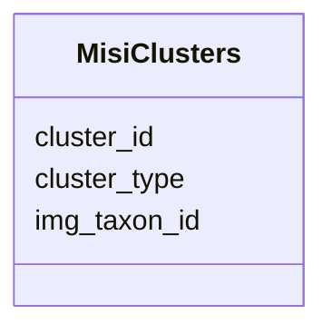

# Class: MisiClusters 


URI: [img_mysql_misi:MisiClusters](https://w3id.org/jgi/img_mysql_misi/MisiClusters)





<!-- no inheritance hierarchy -->


## Slots

| Name | Cardinality and Range | Description | Inheritance |
| ---  | --- | --- | --- |
| [cluster_id](cluster_id.md) | 0..1 <br/> [Integer](Integer.md) |  | direct |
| [cluster_type](cluster_type.md) | 0..1 <br/> [String](String.md) |  | direct |
| [img_taxon_id](img_taxon_id.md) | 0..1 <br/> [String](String.md) |  | direct |


## Identifier and Mapping Information


### Schema Source


* from schema: https://w3id.org/jgi/img_mysql_misi


## Mappings

| Mapping Type | Mapped Value |
| ---  | ---  |
| self | img_mysql_misi:MisiClusters |
| native | img_mysql_misi:MisiClusters |


## LinkML Source

<!-- TODO: investigate https://stackoverflow.com/questions/37606292/how-to-create-tabbed-code-blocks-in-mkdocs-or-sphinx -->

### Direct

<details>
```yaml
name: misi_clusters
from_schema: https://w3id.org/jgi/img_mysql_misi
attributes:
  cluster_id:
    name: cluster_id
    from_schema: https://w3id.org/jgi/img_mysql_misi
    rank: 1000
    domain_of:
    - misi_clusters
    range: integer
    required: false
  cluster_type:
    name: cluster_type
    from_schema: https://w3id.org/jgi/img_mysql_misi
    rank: 1000
    domain_of:
    - misi_clusters
    range: string
    required: false
  img_taxon_id:
    name: img_taxon_id
    from_schema: https://w3id.org/jgi/img_mysql_misi
    rank: 1000
    domain_of:
    - misi_clusters
    - taxon_info
    range: string
    required: false

```
</details>

### Induced

<details>
```yaml
name: misi_clusters
from_schema: https://w3id.org/jgi/img_mysql_misi
attributes:
  cluster_id:
    name: cluster_id
    from_schema: https://w3id.org/jgi/img_mysql_misi
    rank: 1000
    alias: cluster_id
    owner: misi_clusters
    domain_of:
    - misi_clusters
    range: integer
    required: false
  cluster_type:
    name: cluster_type
    from_schema: https://w3id.org/jgi/img_mysql_misi
    rank: 1000
    alias: cluster_type
    owner: misi_clusters
    domain_of:
    - misi_clusters
    range: string
    required: false
  img_taxon_id:
    name: img_taxon_id
    from_schema: https://w3id.org/jgi/img_mysql_misi
    rank: 1000
    alias: img_taxon_id
    owner: misi_clusters
    domain_of:
    - misi_clusters
    - taxon_info
    range: string
    required: false

```
</details>