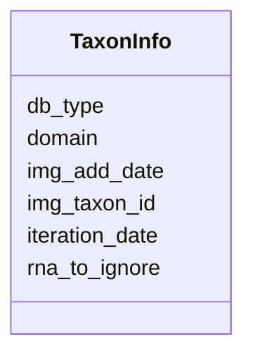

# Class: TaxonInfo 


URI: [img_mysql_misi:TaxonInfo](https://w3id.org/jgi/img_mysql_misi/TaxonInfo)





<!-- no inheritance hierarchy -->


## Slots

| Name | Cardinality and Range | Description | Inheritance |
| ---  | --- | --- | --- |
| [img_taxon_id](img_taxon_id.md) | 0..1 <br/> [String](String.md) |  | direct |
| [img_add_date](img_add_date.md) | 0..1 <br/> [Datetime](Datetime.md) |  | direct |
| [domain](domain.md) | 0..1 <br/> [String](String.md) |  | direct |
| [rna_to_ignore](rna_to_ignore.md) | 0..1 <br/> [String](String.md) |  | direct |
| [iteration_date](iteration_date.md) | 0..1 <br/> [Date](Date.md) |  | direct |
| [db_type](db_type.md) | 0..1 <br/> [String](String.md) |  | direct |


## Identifier and Mapping Information


### Schema Source


* from schema: https://w3id.org/jgi/img_mysql_misi


## Mappings

| Mapping Type | Mapped Value |
| ---  | ---  |
| self | img_mysql_misi:TaxonInfo |
| native | img_mysql_misi:TaxonInfo |


## LinkML Source

<!-- TODO: investigate https://stackoverflow.com/questions/37606292/how-to-create-tabbed-code-blocks-in-mkdocs-or-sphinx -->

### Direct

<details>
```yaml
name: taxon_info
from_schema: https://w3id.org/jgi/img_mysql_misi
attributes:
  img_taxon_id:
    name: img_taxon_id
    from_schema: https://w3id.org/jgi/img_mysql_misi
    domain_of:
    - misi_clusters
    - taxon_info
    range: string
    required: false
  img_add_date:
    name: img_add_date
    from_schema: https://w3id.org/jgi/img_mysql_misi
    rank: 1000
    domain_of:
    - taxon_info
    range: datetime
    required: false
  domain:
    name: domain
    from_schema: https://w3id.org/jgi/img_mysql_misi
    rank: 1000
    domain_of:
    - taxon_info
    range: string
    required: false
  rna_to_ignore:
    name: rna_to_ignore
    from_schema: https://w3id.org/jgi/img_mysql_misi
    rank: 1000
    domain_of:
    - taxon_info
    range: string
    required: false
  iteration_date:
    name: iteration_date
    from_schema: https://w3id.org/jgi/img_mysql_misi
    domain_of:
    - iteration_info
    - taxon_info
    range: date
    required: false
  db_type:
    name: db_type
    from_schema: https://w3id.org/jgi/img_mysql_misi
    rank: 1000
    domain_of:
    - taxon_info
    range: string
    required: false

```
</details>

### Induced

<details>
```yaml
name: taxon_info
from_schema: https://w3id.org/jgi/img_mysql_misi
attributes:
  img_taxon_id:
    name: img_taxon_id
    from_schema: https://w3id.org/jgi/img_mysql_misi
    alias: img_taxon_id
    owner: taxon_info
    domain_of:
    - misi_clusters
    - taxon_info
    range: string
    required: false
  img_add_date:
    name: img_add_date
    from_schema: https://w3id.org/jgi/img_mysql_misi
    rank: 1000
    alias: img_add_date
    owner: taxon_info
    domain_of:
    - taxon_info
    range: datetime
    required: false
  domain:
    name: domain
    from_schema: https://w3id.org/jgi/img_mysql_misi
    rank: 1000
    alias: domain
    owner: taxon_info
    domain_of:
    - taxon_info
    range: string
    required: false
  rna_to_ignore:
    name: rna_to_ignore
    from_schema: https://w3id.org/jgi/img_mysql_misi
    rank: 1000
    alias: rna_to_ignore
    owner: taxon_info
    domain_of:
    - taxon_info
    range: string
    required: false
  iteration_date:
    name: iteration_date
    from_schema: https://w3id.org/jgi/img_mysql_misi
    alias: iteration_date
    owner: taxon_info
    domain_of:
    - iteration_info
    - taxon_info
    range: date
    required: false
  db_type:
    name: db_type
    from_schema: https://w3id.org/jgi/img_mysql_misi
    rank: 1000
    alias: db_type
    owner: taxon_info
    domain_of:
    - taxon_info
    range: string
    required: false

```
</details>