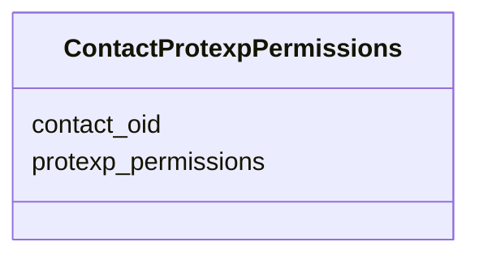

# Class: ContactProtexpPermissions 


URI: [img_proteome:ContactProtexpPermissions](https://w3id.org/jgi/img_proteome/ContactProtexpPermissions)





<!-- no inheritance hierarchy -->


## Slots

| Name | Cardinality and Range | Description | Inheritance |
| ---  | --- | --- | --- |
| [contact_oid](contact_oid.md) | 0..1 <br/> [Integer](Integer.md) |  | direct |
| [protexp_permissions](protexp_permissions.md) | 0..1 <br/> [Integer](Integer.md) |  | direct |


## Identifier and Mapping Information


### Schema Source


* from schema: https://w3id.org/jgi/img_proteome


## Mappings

| Mapping Type | Mapped Value |
| ---  | ---  |
| self | img_proteome:ContactProtexpPermissions |
| native | img_proteome:ContactProtexpPermissions |


## LinkML Source

<!-- TODO: investigate https://stackoverflow.com/questions/37606292/how-to-create-tabbed-code-blocks-in-mkdocs-or-sphinx -->

### Direct

<details>
```yaml
name: contact_protexp_permissions
from_schema: https://w3id.org/jgi/img_proteome
attributes:
  contact_oid:
    name: contact_oid
    from_schema: https://w3id.org/jgi/img_proteome
    rank: 1000
    domain_of:
    - contact_protexp_permissions
    range: integer
    required: false
  protexp_permissions:
    name: protexp_permissions
    from_schema: https://w3id.org/jgi/img_proteome
    rank: 1000
    domain_of:
    - contact_protexp_permissions
    range: integer
    required: false

```
</details>

### Induced

<details>
```yaml
name: contact_protexp_permissions
from_schema: https://w3id.org/jgi/img_proteome
attributes:
  contact_oid:
    name: contact_oid
    from_schema: https://w3id.org/jgi/img_proteome
    rank: 1000
    alias: contact_oid
    owner: contact_protexp_permissions
    domain_of:
    - contact_protexp_permissions
    range: integer
    required: false
  protexp_permissions:
    name: protexp_permissions
    from_schema: https://w3id.org/jgi/img_proteome
    rank: 1000
    alias: protexp_permissions
    owner: contact_protexp_permissions
    domain_of:
    - contact_protexp_permissions
    range: integer
    required: false

```
</details>