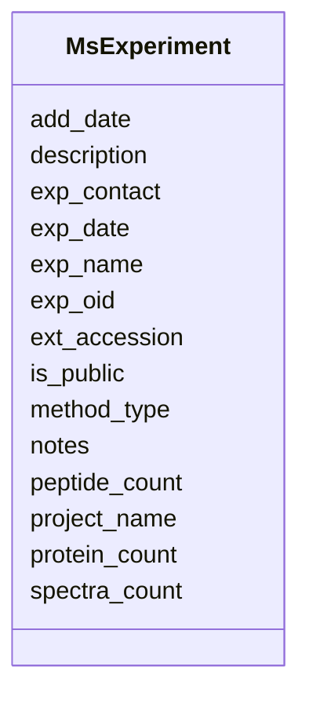

# Class: MsExperiment 


URI: [img_proteome:MsExperiment](https://w3id.org/jgi/img_proteome/MsExperiment)





<!-- no inheritance hierarchy -->


## Slots

| Name | Cardinality and Range | Description | Inheritance |
| ---  | --- | --- | --- |
| [exp_oid](exp_oid.md) | 0..1 <br/> [Integer](Integer.md) |  | direct |
| [project_name](project_name.md) | 0..1 <br/> [String](String.md) |  | direct |
| [exp_name](exp_name.md) | 0..1 <br/> [String](String.md) |  | direct |
| [description](description.md) | 0..1 <br/> [String](String.md) |  | direct |
| [ext_accession](ext_accession.md) | 0..1 <br/> [String](String.md) |  | direct |
| [exp_date](exp_date.md) | 0..1 <br/> [String](String.md) |  | direct |
| [exp_contact](exp_contact.md) | 0..1 <br/> [String](String.md) |  | direct |
| [method_type](method_type.md) | 0..1 <br/> [String](String.md) |  | direct |
| [protein_count](protein_count.md) | 0..1 <br/> [Integer](Integer.md) |  | direct |
| [peptide_count](peptide_count.md) | 0..1 <br/> [Integer](Integer.md) |  | direct |
| [spectra_count](spectra_count.md) | 0..1 <br/> [Integer](Integer.md) |  | direct |
| [add_date](add_date.md) | 0..1 <br/> [Datetime](Datetime.md) |  | direct |
| [notes](notes.md) | 0..1 <br/> [String](String.md) |  | direct |
| [is_public](is_public.md) | 0..1 <br/> [String](String.md) |  | direct |


## Usages

| used by | used in | type | used |
| ---  | --- | --- | --- |
| [MsExperimentExtLinks](MsExperimentExtLinks.md) | [exp_oid](exp_oid.md) | range | [MsExperiment](MsExperiment.md) |
| [MsExperimentSop](MsExperimentSop.md) | [exp_oid](exp_oid.md) | range | [MsExperiment](MsExperiment.md) |
| [MsPeptide](MsPeptide.md) | [experiment](experiment.md) | range | [MsExperiment](MsExperiment.md) |
| [MsProtein](MsProtein.md) | [experiment](experiment.md) | range | [MsExperiment](MsExperiment.md) |
| [MsSample](MsSample.md) | [experiment](experiment.md) | range | [MsExperiment](MsExperiment.md) |


## Identifier and Mapping Information


### Schema Source


* from schema: https://w3id.org/jgi/img_proteome


## Mappings

| Mapping Type | Mapped Value |
| ---  | ---  |
| self | img_proteome:MsExperiment |
| native | img_proteome:MsExperiment |


## LinkML Source

<!-- TODO: investigate https://stackoverflow.com/questions/37606292/how-to-create-tabbed-code-blocks-in-mkdocs-or-sphinx -->

### Direct

<details>
```yaml
name: ms_experiment
from_schema: https://w3id.org/jgi/img_proteome
attributes:
  exp_oid:
    name: exp_oid
    from_schema: https://w3id.org/jgi/img_proteome
    rank: 1000
    domain_of:
    - ms_experiment
    - ms_experiment_ext_links
    - ms_experiment_publications
    - ms_experiment_sop
    range: integer
    required: false
  project_name:
    name: project_name
    from_schema: https://w3id.org/jgi/img_proteome
    rank: 1000
    domain_of:
    - ms_experiment
    range: string
    required: false
  exp_name:
    name: exp_name
    from_schema: https://w3id.org/jgi/img_proteome
    rank: 1000
    domain_of:
    - ms_experiment
    range: string
    required: false
  description:
    name: description
    from_schema: https://w3id.org/jgi/img_proteome
    rank: 1000
    domain_of:
    - ms_experiment
    - ms_protein
    - ms_protein_old
    - ms_sample
    range: string
    required: false
  ext_accession:
    name: ext_accession
    from_schema: https://w3id.org/jgi/img_proteome
    rank: 1000
    domain_of:
    - ms_experiment
    range: string
    required: false
  exp_date:
    name: exp_date
    from_schema: https://w3id.org/jgi/img_proteome
    rank: 1000
    domain_of:
    - ms_experiment
    range: string
    required: false
  exp_contact:
    name: exp_contact
    from_schema: https://w3id.org/jgi/img_proteome
    rank: 1000
    domain_of:
    - ms_experiment
    range: string
    required: false
  method_type:
    name: method_type
    from_schema: https://w3id.org/jgi/img_proteome
    rank: 1000
    domain_of:
    - ms_experiment
    range: string
    required: false
  protein_count:
    name: protein_count
    from_schema: https://w3id.org/jgi/img_proteome
    rank: 1000
    domain_of:
    - ms_experiment
    range: integer
    required: false
  peptide_count:
    name: peptide_count
    from_schema: https://w3id.org/jgi/img_proteome
    rank: 1000
    domain_of:
    - ms_experiment
    range: integer
    required: false
  spectra_count:
    name: spectra_count
    from_schema: https://w3id.org/jgi/img_proteome
    rank: 1000
    domain_of:
    - ms_experiment
    range: integer
    required: false
  add_date:
    name: add_date
    from_schema: https://w3id.org/jgi/img_proteome
    rank: 1000
    domain_of:
    - ms_experiment
    range: datetime
    required: false
  notes:
    name: notes
    from_schema: https://w3id.org/jgi/img_proteome
    rank: 1000
    domain_of:
    - ms_experiment
    - ms_peptide
    - ms_peptide_old
    - ms_protein
    - ms_protein_old
    range: string
    required: false
  is_public:
    name: is_public
    from_schema: https://w3id.org/jgi/img_proteome
    rank: 1000
    domain_of:
    - ms_experiment
    range: string
    required: false

```
</details>

### Induced

<details>
```yaml
name: ms_experiment
from_schema: https://w3id.org/jgi/img_proteome
attributes:
  exp_oid:
    name: exp_oid
    from_schema: https://w3id.org/jgi/img_proteome
    rank: 1000
    alias: exp_oid
    owner: ms_experiment
    domain_of:
    - ms_experiment
    - ms_experiment_ext_links
    - ms_experiment_publications
    - ms_experiment_sop
    range: integer
    required: false
  project_name:
    name: project_name
    from_schema: https://w3id.org/jgi/img_proteome
    rank: 1000
    alias: project_name
    owner: ms_experiment
    domain_of:
    - ms_experiment
    range: string
    required: false
  exp_name:
    name: exp_name
    from_schema: https://w3id.org/jgi/img_proteome
    rank: 1000
    alias: exp_name
    owner: ms_experiment
    domain_of:
    - ms_experiment
    range: string
    required: false
  description:
    name: description
    from_schema: https://w3id.org/jgi/img_proteome
    rank: 1000
    alias: description
    owner: ms_experiment
    domain_of:
    - ms_experiment
    - ms_protein
    - ms_protein_old
    - ms_sample
    range: string
    required: false
  ext_accession:
    name: ext_accession
    from_schema: https://w3id.org/jgi/img_proteome
    rank: 1000
    alias: ext_accession
    owner: ms_experiment
    domain_of:
    - ms_experiment
    range: string
    required: false
  exp_date:
    name: exp_date
    from_schema: https://w3id.org/jgi/img_proteome
    rank: 1000
    alias: exp_date
    owner: ms_experiment
    domain_of:
    - ms_experiment
    range: string
    required: false
  exp_contact:
    name: exp_contact
    from_schema: https://w3id.org/jgi/img_proteome
    rank: 1000
    alias: exp_contact
    owner: ms_experiment
    domain_of:
    - ms_experiment
    range: string
    required: false
  method_type:
    name: method_type
    from_schema: https://w3id.org/jgi/img_proteome
    rank: 1000
    alias: method_type
    owner: ms_experiment
    domain_of:
    - ms_experiment
    range: string
    required: false
  protein_count:
    name: protein_count
    from_schema: https://w3id.org/jgi/img_proteome
    rank: 1000
    alias: protein_count
    owner: ms_experiment
    domain_of:
    - ms_experiment
    range: integer
    required: false
  peptide_count:
    name: peptide_count
    from_schema: https://w3id.org/jgi/img_proteome
    rank: 1000
    alias: peptide_count
    owner: ms_experiment
    domain_of:
    - ms_experiment
    range: integer
    required: false
  spectra_count:
    name: spectra_count
    from_schema: https://w3id.org/jgi/img_proteome
    rank: 1000
    alias: spectra_count
    owner: ms_experiment
    domain_of:
    - ms_experiment
    range: integer
    required: false
  add_date:
    name: add_date
    from_schema: https://w3id.org/jgi/img_proteome
    rank: 1000
    alias: add_date
    owner: ms_experiment
    domain_of:
    - ms_experiment
    range: datetime
    required: false
  notes:
    name: notes
    from_schema: https://w3id.org/jgi/img_proteome
    rank: 1000
    alias: notes
    owner: ms_experiment
    domain_of:
    - ms_experiment
    - ms_peptide
    - ms_peptide_old
    - ms_protein
    - ms_protein_old
    range: string
    required: false
  is_public:
    name: is_public
    from_schema: https://w3id.org/jgi/img_proteome
    rank: 1000
    alias: is_public
    owner: ms_experiment
    domain_of:
    - ms_experiment
    range: string
    required: false

```
</details>