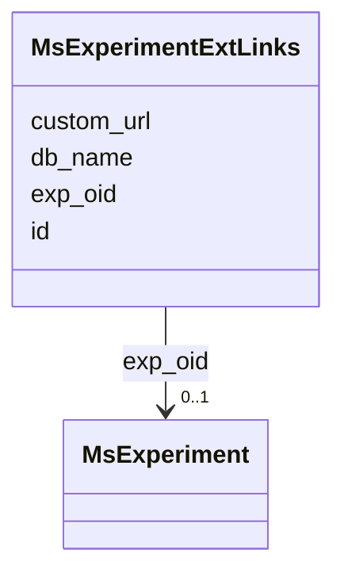

# Class: MsExperimentExtLinks 


URI: [img_proteome:MsExperimentExtLinks](https://w3id.org/jgi/img_proteome/MsExperimentExtLinks)





<!-- no inheritance hierarchy -->


## Slots

| Name | Cardinality and Range | Description | Inheritance |
| ---  | --- | --- | --- |
| [exp_oid](exp_oid.md) | 0..1 <br/> [MsExperiment](MsExperiment.md) | Foreign key to ms_experiment | direct |
| [db_name](db_name.md) | 0..1 <br/> [String](String.md) |  | direct |
| [id](id.md) | 0..1 <br/> [String](String.md) |  | direct |
| [custom_url](custom_url.md) | 0..1 <br/> [String](String.md) |  | direct |


## Identifier and Mapping Information


### Schema Source


* from schema: https://w3id.org/jgi/img_proteome


## Mappings

| Mapping Type | Mapped Value |
| ---  | ---  |
| self | img_proteome:MsExperimentExtLinks |
| native | img_proteome:MsExperimentExtLinks |


## LinkML Source

<!-- TODO: investigate https://stackoverflow.com/questions/37606292/how-to-create-tabbed-code-blocks-in-mkdocs-or-sphinx -->

### Direct

<details>
```yaml
name: ms_experiment_ext_links
from_schema: https://w3id.org/jgi/img_proteome
attributes:
  exp_oid:
    name: exp_oid
    description: Foreign key to ms_experiment
    from_schema: https://w3id.org/jgi/img_proteome
    domain_of:
    - ms_experiment
    - ms_experiment_ext_links
    - ms_experiment_publications
    - ms_experiment_sop
    range: ms_experiment
    required: false
  db_name:
    name: db_name
    from_schema: https://w3id.org/jgi/img_proteome
    rank: 1000
    domain_of:
    - ms_experiment_ext_links
    - ms_sample_ext_links
    range: string
    required: false
  id:
    name: id
    from_schema: https://w3id.org/jgi/img_proteome
    rank: 1000
    domain_of:
    - ms_experiment_ext_links
    - ms_sample_ext_links
    - plan_table
    range: string
    required: false
  custom_url:
    name: custom_url
    from_schema: https://w3id.org/jgi/img_proteome
    rank: 1000
    domain_of:
    - ms_experiment_ext_links
    - ms_sample_ext_links
    range: string
    required: false

```
</details>

### Induced

<details>
```yaml
name: ms_experiment_ext_links
from_schema: https://w3id.org/jgi/img_proteome
attributes:
  exp_oid:
    name: exp_oid
    description: Foreign key to ms_experiment
    from_schema: https://w3id.org/jgi/img_proteome
    alias: exp_oid
    owner: ms_experiment_ext_links
    domain_of:
    - ms_experiment
    - ms_experiment_ext_links
    - ms_experiment_publications
    - ms_experiment_sop
    range: ms_experiment
    required: false
  db_name:
    name: db_name
    from_schema: https://w3id.org/jgi/img_proteome
    rank: 1000
    alias: db_name
    owner: ms_experiment_ext_links
    domain_of:
    - ms_experiment_ext_links
    - ms_sample_ext_links
    range: string
    required: false
  id:
    name: id
    from_schema: https://w3id.org/jgi/img_proteome
    rank: 1000
    alias: id
    owner: ms_experiment_ext_links
    domain_of:
    - ms_experiment_ext_links
    - ms_sample_ext_links
    - plan_table
    range: string
    required: false
  custom_url:
    name: custom_url
    from_schema: https://w3id.org/jgi/img_proteome
    rank: 1000
    alias: custom_url
    owner: ms_experiment_ext_links
    domain_of:
    - ms_experiment_ext_links
    - ms_sample_ext_links
    range: string
    required: false

```
</details>