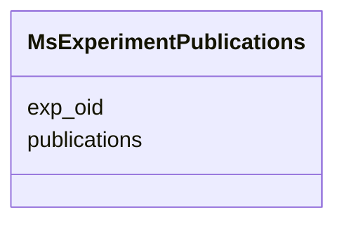

# Class: MsExperimentPublications 


URI: [img_proteome:MsExperimentPublications](https://w3id.org/jgi/img_proteome/MsExperimentPublications)





<!-- no inheritance hierarchy -->


## Slots

| Name | Cardinality and Range | Description | Inheritance |
| ---  | --- | --- | --- |
| [exp_oid](exp_oid.md) | 0..1 <br/> [Float](Float.md) |  | direct |
| [publications](publications.md) | 0..1 <br/> [String](String.md) |  | direct |


## Identifier and Mapping Information


### Schema Source


* from schema: https://w3id.org/jgi/img_proteome


## Mappings

| Mapping Type | Mapped Value |
| ---  | ---  |
| self | img_proteome:MsExperimentPublications |
| native | img_proteome:MsExperimentPublications |


## LinkML Source

<!-- TODO: investigate https://stackoverflow.com/questions/37606292/how-to-create-tabbed-code-blocks-in-mkdocs-or-sphinx -->

### Direct

<details>
```yaml
name: ms_experiment_publications
from_schema: https://w3id.org/jgi/img_proteome
attributes:
  exp_oid:
    name: exp_oid
    from_schema: https://w3id.org/jgi/img_proteome
    domain_of:
    - ms_experiment
    - ms_experiment_ext_links
    - ms_experiment_publications
    - ms_experiment_sop
    range: float
    required: false
  publications:
    name: publications
    from_schema: https://w3id.org/jgi/img_proteome
    rank: 1000
    domain_of:
    - ms_experiment_publications
    range: string
    required: false

```
</details>

### Induced

<details>
```yaml
name: ms_experiment_publications
from_schema: https://w3id.org/jgi/img_proteome
attributes:
  exp_oid:
    name: exp_oid
    from_schema: https://w3id.org/jgi/img_proteome
    alias: exp_oid
    owner: ms_experiment_publications
    domain_of:
    - ms_experiment
    - ms_experiment_ext_links
    - ms_experiment_publications
    - ms_experiment_sop
    range: float
    required: false
  publications:
    name: publications
    from_schema: https://w3id.org/jgi/img_proteome
    rank: 1000
    alias: publications
    owner: ms_experiment_publications
    domain_of:
    - ms_experiment_publications
    range: string
    required: false

```
</details>