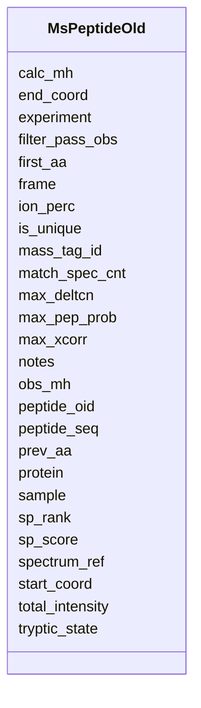

# Class: MsPeptideOld 


URI: [img_proteome:MsPeptideOld](https://w3id.org/jgi/img_proteome/MsPeptideOld)





<!-- no inheritance hierarchy -->


## Slots

| Name | Cardinality and Range | Description | Inheritance |
| ---  | --- | --- | --- |
| [peptide_oid](peptide_oid.md) | 0..1 <br/> [Integer](Integer.md) |  | direct |
| [mass_tag_id](mass_tag_id.md) | 0..1 <br/> [String](String.md) |  | direct |
| [protein](protein.md) | 0..1 <br/> [Integer](Integer.md) |  | direct |
| [peptide_seq](peptide_seq.md) | 0..1 <br/> [String](String.md) |  | direct |
| [start_coord](start_coord.md) | 0..1 <br/> [Integer](Integer.md) |  | direct |
| [end_coord](end_coord.md) | 0..1 <br/> [Integer](Integer.md) |  | direct |
| [frame](frame.md) | 0..1 <br/> [Integer](Integer.md) |  | direct |
| [spectrum_ref](spectrum_ref.md) | 0..1 <br/> [String](String.md) |  | direct |
| [tryptic_state](tryptic_state.md) | 0..1 <br/> [String](String.md) |  | direct |
| [first_aa](first_aa.md) | 0..1 <br/> [String](String.md) |  | direct |
| [prev_aa](prev_aa.md) | 0..1 <br/> [String](String.md) |  | direct |
| [max_xcorr](max_xcorr.md) | 0..1 <br/> [Float](Float.md) |  | direct |
| [max_deltcn](max_deltcn.md) | 0..1 <br/> [Float](Float.md) |  | direct |
| [max_pep_prob](max_pep_prob.md) | 0..1 <br/> [Float](Float.md) |  | direct |
| [filter_pass_obs](filter_pass_obs.md) | 0..1 <br/> [Integer](Integer.md) |  | direct |
| [obs_mh](obs_mh.md) | 0..1 <br/> [Float](Float.md) |  | direct |
| [calc_mh](calc_mh.md) | 0..1 <br/> [Float](Float.md) |  | direct |
| [ion_perc](ion_perc.md) | 0..1 <br/> [Float](Float.md) |  | direct |
| [match_spec_cnt](match_spec_cnt.md) | 0..1 <br/> [Integer](Integer.md) |  | direct |
| [notes](notes.md) | 0..1 <br/> [String](String.md) |  | direct |
| [experiment](experiment.md) | 0..1 <br/> [Integer](Integer.md) |  | direct |
| [sample](sample.md) | 0..1 <br/> [Integer](Integer.md) |  | direct |
| [sp_score](sp_score.md) | 0..1 <br/> [Float](Float.md) |  | direct |
| [sp_rank](sp_rank.md) | 0..1 <br/> [Integer](Integer.md) |  | direct |
| [is_unique](is_unique.md) | 0..1 <br/> [String](String.md) |  | direct |
| [total_intensity](total_intensity.md) | 0..1 <br/> [Float](Float.md) |  | direct |


## Identifier and Mapping Information


### Schema Source


* from schema: https://w3id.org/jgi/img_proteome


## Mappings

| Mapping Type | Mapped Value |
| ---  | ---  |
| self | img_proteome:MsPeptideOld |
| native | img_proteome:MsPeptideOld |


## LinkML Source

<!-- TODO: investigate https://stackoverflow.com/questions/37606292/how-to-create-tabbed-code-blocks-in-mkdocs-or-sphinx -->

### Direct

<details>
```yaml
name: ms_peptide_old
from_schema: https://w3id.org/jgi/img_proteome
attributes:
  peptide_oid:
    name: peptide_oid
    from_schema: https://w3id.org/jgi/img_proteome
    domain_of:
    - ms_peptide
    - ms_peptide_old
    range: integer
    required: false
  mass_tag_id:
    name: mass_tag_id
    from_schema: https://w3id.org/jgi/img_proteome
    domain_of:
    - ms_peptide
    - ms_peptide_old
    range: string
    required: false
  protein:
    name: protein
    from_schema: https://w3id.org/jgi/img_proteome
    domain_of:
    - ms_peptide
    - ms_peptide_old
    range: integer
    required: false
  peptide_seq:
    name: peptide_seq
    from_schema: https://w3id.org/jgi/img_proteome
    domain_of:
    - ms_peptide
    - ms_peptide_old
    range: string
    required: false
  start_coord:
    name: start_coord
    from_schema: https://w3id.org/jgi/img_proteome
    domain_of:
    - ms_peptide
    - ms_peptide_old
    - ms_protein
    - ms_protein_img_genes
    - ms_protein_img_genes_old
    - ms_protein_old
    range: integer
    required: false
  end_coord:
    name: end_coord
    from_schema: https://w3id.org/jgi/img_proteome
    domain_of:
    - ms_peptide
    - ms_peptide_old
    - ms_protein
    - ms_protein_img_genes
    - ms_protein_img_genes_old
    - ms_protein_old
    range: integer
    required: false
  frame:
    name: frame
    from_schema: https://w3id.org/jgi/img_proteome
    domain_of:
    - ms_peptide
    - ms_peptide_old
    range: integer
    required: false
  spectrum_ref:
    name: spectrum_ref
    from_schema: https://w3id.org/jgi/img_proteome
    domain_of:
    - ms_peptide
    - ms_peptide_old
    range: string
    required: false
  tryptic_state:
    name: tryptic_state
    from_schema: https://w3id.org/jgi/img_proteome
    domain_of:
    - ms_peptide
    - ms_peptide_old
    range: string
    required: false
  first_aa:
    name: first_aa
    from_schema: https://w3id.org/jgi/img_proteome
    domain_of:
    - ms_peptide
    - ms_peptide_old
    range: string
    required: false
  prev_aa:
    name: prev_aa
    from_schema: https://w3id.org/jgi/img_proteome
    domain_of:
    - ms_peptide
    - ms_peptide_old
    range: string
    required: false
  max_xcorr:
    name: max_xcorr
    from_schema: https://w3id.org/jgi/img_proteome
    domain_of:
    - ms_peptide
    - ms_peptide_old
    range: float
    required: false
  max_deltcn:
    name: max_deltcn
    from_schema: https://w3id.org/jgi/img_proteome
    domain_of:
    - ms_peptide
    - ms_peptide_old
    range: float
    required: false
  max_pep_prob:
    name: max_pep_prob
    from_schema: https://w3id.org/jgi/img_proteome
    domain_of:
    - ms_peptide
    - ms_peptide_old
    range: float
    required: false
  filter_pass_obs:
    name: filter_pass_obs
    from_schema: https://w3id.org/jgi/img_proteome
    domain_of:
    - ms_peptide
    - ms_peptide_old
    range: integer
    required: false
  obs_mh:
    name: obs_mh
    from_schema: https://w3id.org/jgi/img_proteome
    domain_of:
    - ms_peptide
    - ms_peptide_old
    range: float
    required: false
  calc_mh:
    name: calc_mh
    from_schema: https://w3id.org/jgi/img_proteome
    domain_of:
    - ms_peptide
    - ms_peptide_old
    range: float
    required: false
  ion_perc:
    name: ion_perc
    from_schema: https://w3id.org/jgi/img_proteome
    domain_of:
    - ms_peptide
    - ms_peptide_old
    range: float
    required: false
  match_spec_cnt:
    name: match_spec_cnt
    from_schema: https://w3id.org/jgi/img_proteome
    domain_of:
    - ms_peptide
    - ms_peptide_old
    range: integer
    required: false
  notes:
    name: notes
    from_schema: https://w3id.org/jgi/img_proteome
    domain_of:
    - ms_experiment
    - ms_peptide
    - ms_peptide_old
    - ms_protein
    - ms_protein_old
    range: string
    required: false
  experiment:
    name: experiment
    from_schema: https://w3id.org/jgi/img_proteome
    domain_of:
    - ms_peptide
    - ms_peptide_old
    - ms_protein
    - ms_protein_old
    - ms_sample
    range: integer
    required: false
  sample:
    name: sample
    from_schema: https://w3id.org/jgi/img_proteome
    domain_of:
    - ms_peptide
    - ms_peptide_old
    - ms_protein
    - ms_protein_old
    range: integer
    required: false
  sp_score:
    name: sp_score
    from_schema: https://w3id.org/jgi/img_proteome
    domain_of:
    - ms_peptide
    - ms_peptide_old
    range: float
    required: false
  sp_rank:
    name: sp_rank
    from_schema: https://w3id.org/jgi/img_proteome
    domain_of:
    - ms_peptide
    - ms_peptide_old
    range: integer
    required: false
  is_unique:
    name: is_unique
    from_schema: https://w3id.org/jgi/img_proteome
    domain_of:
    - ms_peptide
    - ms_peptide_old
    range: string
    required: false
  total_intensity:
    name: total_intensity
    from_schema: https://w3id.org/jgi/img_proteome
    domain_of:
    - ms_peptide
    - ms_peptide_old
    range: float
    required: false

```
</details>

### Induced

<details>
```yaml
name: ms_peptide_old
from_schema: https://w3id.org/jgi/img_proteome
attributes:
  peptide_oid:
    name: peptide_oid
    from_schema: https://w3id.org/jgi/img_proteome
    alias: peptide_oid
    owner: ms_peptide_old
    domain_of:
    - ms_peptide
    - ms_peptide_old
    range: integer
    required: false
  mass_tag_id:
    name: mass_tag_id
    from_schema: https://w3id.org/jgi/img_proteome
    alias: mass_tag_id
    owner: ms_peptide_old
    domain_of:
    - ms_peptide
    - ms_peptide_old
    range: string
    required: false
  protein:
    name: protein
    from_schema: https://w3id.org/jgi/img_proteome
    alias: protein
    owner: ms_peptide_old
    domain_of:
    - ms_peptide
    - ms_peptide_old
    range: integer
    required: false
  peptide_seq:
    name: peptide_seq
    from_schema: https://w3id.org/jgi/img_proteome
    alias: peptide_seq
    owner: ms_peptide_old
    domain_of:
    - ms_peptide
    - ms_peptide_old
    range: string
    required: false
  start_coord:
    name: start_coord
    from_schema: https://w3id.org/jgi/img_proteome
    alias: start_coord
    owner: ms_peptide_old
    domain_of:
    - ms_peptide
    - ms_peptide_old
    - ms_protein
    - ms_protein_img_genes
    - ms_protein_img_genes_old
    - ms_protein_old
    range: integer
    required: false
  end_coord:
    name: end_coord
    from_schema: https://w3id.org/jgi/img_proteome
    alias: end_coord
    owner: ms_peptide_old
    domain_of:
    - ms_peptide
    - ms_peptide_old
    - ms_protein
    - ms_protein_img_genes
    - ms_protein_img_genes_old
    - ms_protein_old
    range: integer
    required: false
  frame:
    name: frame
    from_schema: https://w3id.org/jgi/img_proteome
    alias: frame
    owner: ms_peptide_old
    domain_of:
    - ms_peptide
    - ms_peptide_old
    range: integer
    required: false
  spectrum_ref:
    name: spectrum_ref
    from_schema: https://w3id.org/jgi/img_proteome
    alias: spectrum_ref
    owner: ms_peptide_old
    domain_of:
    - ms_peptide
    - ms_peptide_old
    range: string
    required: false
  tryptic_state:
    name: tryptic_state
    from_schema: https://w3id.org/jgi/img_proteome
    alias: tryptic_state
    owner: ms_peptide_old
    domain_of:
    - ms_peptide
    - ms_peptide_old
    range: string
    required: false
  first_aa:
    name: first_aa
    from_schema: https://w3id.org/jgi/img_proteome
    alias: first_aa
    owner: ms_peptide_old
    domain_of:
    - ms_peptide
    - ms_peptide_old
    range: string
    required: false
  prev_aa:
    name: prev_aa
    from_schema: https://w3id.org/jgi/img_proteome
    alias: prev_aa
    owner: ms_peptide_old
    domain_of:
    - ms_peptide
    - ms_peptide_old
    range: string
    required: false
  max_xcorr:
    name: max_xcorr
    from_schema: https://w3id.org/jgi/img_proteome
    alias: max_xcorr
    owner: ms_peptide_old
    domain_of:
    - ms_peptide
    - ms_peptide_old
    range: float
    required: false
  max_deltcn:
    name: max_deltcn
    from_schema: https://w3id.org/jgi/img_proteome
    alias: max_deltcn
    owner: ms_peptide_old
    domain_of:
    - ms_peptide
    - ms_peptide_old
    range: float
    required: false
  max_pep_prob:
    name: max_pep_prob
    from_schema: https://w3id.org/jgi/img_proteome
    alias: max_pep_prob
    owner: ms_peptide_old
    domain_of:
    - ms_peptide
    - ms_peptide_old
    range: float
    required: false
  filter_pass_obs:
    name: filter_pass_obs
    from_schema: https://w3id.org/jgi/img_proteome
    alias: filter_pass_obs
    owner: ms_peptide_old
    domain_of:
    - ms_peptide
    - ms_peptide_old
    range: integer
    required: false
  obs_mh:
    name: obs_mh
    from_schema: https://w3id.org/jgi/img_proteome
    alias: obs_mh
    owner: ms_peptide_old
    domain_of:
    - ms_peptide
    - ms_peptide_old
    range: float
    required: false
  calc_mh:
    name: calc_mh
    from_schema: https://w3id.org/jgi/img_proteome
    alias: calc_mh
    owner: ms_peptide_old
    domain_of:
    - ms_peptide
    - ms_peptide_old
    range: float
    required: false
  ion_perc:
    name: ion_perc
    from_schema: https://w3id.org/jgi/img_proteome
    alias: ion_perc
    owner: ms_peptide_old
    domain_of:
    - ms_peptide
    - ms_peptide_old
    range: float
    required: false
  match_spec_cnt:
    name: match_spec_cnt
    from_schema: https://w3id.org/jgi/img_proteome
    alias: match_spec_cnt
    owner: ms_peptide_old
    domain_of:
    - ms_peptide
    - ms_peptide_old
    range: integer
    required: false
  notes:
    name: notes
    from_schema: https://w3id.org/jgi/img_proteome
    alias: notes
    owner: ms_peptide_old
    domain_of:
    - ms_experiment
    - ms_peptide
    - ms_peptide_old
    - ms_protein
    - ms_protein_old
    range: string
    required: false
  experiment:
    name: experiment
    from_schema: https://w3id.org/jgi/img_proteome
    alias: experiment
    owner: ms_peptide_old
    domain_of:
    - ms_peptide
    - ms_peptide_old
    - ms_protein
    - ms_protein_old
    - ms_sample
    range: integer
    required: false
  sample:
    name: sample
    from_schema: https://w3id.org/jgi/img_proteome
    alias: sample
    owner: ms_peptide_old
    domain_of:
    - ms_peptide
    - ms_peptide_old
    - ms_protein
    - ms_protein_old
    range: integer
    required: false
  sp_score:
    name: sp_score
    from_schema: https://w3id.org/jgi/img_proteome
    alias: sp_score
    owner: ms_peptide_old
    domain_of:
    - ms_peptide
    - ms_peptide_old
    range: float
    required: false
  sp_rank:
    name: sp_rank
    from_schema: https://w3id.org/jgi/img_proteome
    alias: sp_rank
    owner: ms_peptide_old
    domain_of:
    - ms_peptide
    - ms_peptide_old
    range: integer
    required: false
  is_unique:
    name: is_unique
    from_schema: https://w3id.org/jgi/img_proteome
    alias: is_unique
    owner: ms_peptide_old
    domain_of:
    - ms_peptide
    - ms_peptide_old
    range: string
    required: false
  total_intensity:
    name: total_intensity
    from_schema: https://w3id.org/jgi/img_proteome
    alias: total_intensity
    owner: ms_peptide_old
    domain_of:
    - ms_peptide
    - ms_peptide_old
    range: float
    required: false

```
</details>