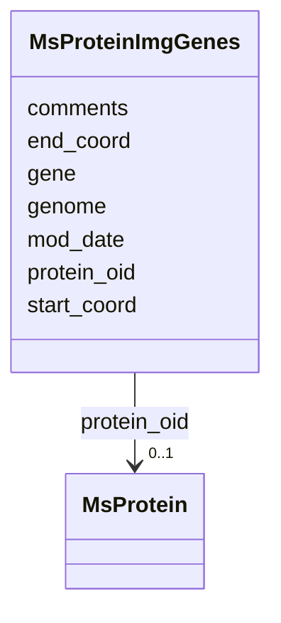

# Class: MsProteinImgGenes 


URI: [img_proteome:MsProteinImgGenes](https://w3id.org/jgi/img_proteome/MsProteinImgGenes)





<!-- no inheritance hierarchy -->


## Slots

| Name | Cardinality and Range | Description | Inheritance |
| ---  | --- | --- | --- |
| [protein_oid](protein_oid.md) | 0..1 <br/> [MsProtein](MsProtein.md) | Foreign key to ms_protein | direct |
| [gene](gene.md) | 0..1 <br/> [Integer](Integer.md) |  | direct |
| [genome](genome.md) | 0..1 <br/> [Integer](Integer.md) |  | direct |
| [start_coord](start_coord.md) | 0..1 <br/> [Integer](Integer.md) |  | direct |
| [end_coord](end_coord.md) | 0..1 <br/> [Integer](Integer.md) |  | direct |
| [mod_date](mod_date.md) | 0..1 <br/> [Datetime](Datetime.md) |  | direct |
| [comments](comments.md) | 0..1 <br/> [String](String.md) |  | direct |


## Identifier and Mapping Information


### Schema Source


* from schema: https://w3id.org/jgi/img_proteome


## Mappings

| Mapping Type | Mapped Value |
| ---  | ---  |
| self | img_proteome:MsProteinImgGenes |
| native | img_proteome:MsProteinImgGenes |


## LinkML Source

<!-- TODO: investigate https://stackoverflow.com/questions/37606292/how-to-create-tabbed-code-blocks-in-mkdocs-or-sphinx -->

### Direct

<details>
```yaml
name: ms_protein_img_genes
from_schema: https://w3id.org/jgi/img_proteome
attributes:
  protein_oid:
    name: protein_oid
    description: Foreign key to ms_protein
    from_schema: https://w3id.org/jgi/img_proteome
    domain_of:
    - ms_protein
    - ms_protein_img_genes
    - ms_protein_img_genes_old
    - ms_protein_old
    range: ms_protein
    required: false
  gene:
    name: gene
    from_schema: https://w3id.org/jgi/img_proteome
    rank: 1000
    domain_of:
    - ms_protein_img_genes
    - ms_protein_img_genes_old
    range: integer
    required: false
  genome:
    name: genome
    from_schema: https://w3id.org/jgi/img_proteome
    rank: 1000
    domain_of:
    - ms_protein_img_genes
    - ms_protein_img_genes_old
    range: integer
    required: false
  start_coord:
    name: start_coord
    from_schema: https://w3id.org/jgi/img_proteome
    domain_of:
    - ms_peptide
    - ms_peptide_old
    - ms_protein
    - ms_protein_img_genes
    - ms_protein_img_genes_old
    - ms_protein_old
    range: integer
    required: false
  end_coord:
    name: end_coord
    from_schema: https://w3id.org/jgi/img_proteome
    domain_of:
    - ms_peptide
    - ms_peptide_old
    - ms_protein
    - ms_protein_img_genes
    - ms_protein_img_genes_old
    - ms_protein_old
    range: integer
    required: false
  mod_date:
    name: mod_date
    from_schema: https://w3id.org/jgi/img_proteome
    rank: 1000
    domain_of:
    - ms_protein_img_genes
    - ms_protein_img_genes_old
    range: datetime
    required: false
  comments:
    name: comments
    from_schema: https://w3id.org/jgi/img_proteome
    rank: 1000
    domain_of:
    - ms_protein_img_genes
    - ms_protein_img_genes_old
    range: string
    required: false

```
</details>

### Induced

<details>
```yaml
name: ms_protein_img_genes
from_schema: https://w3id.org/jgi/img_proteome
attributes:
  protein_oid:
    name: protein_oid
    description: Foreign key to ms_protein
    from_schema: https://w3id.org/jgi/img_proteome
    alias: protein_oid
    owner: ms_protein_img_genes
    domain_of:
    - ms_protein
    - ms_protein_img_genes
    - ms_protein_img_genes_old
    - ms_protein_old
    range: ms_protein
    required: false
  gene:
    name: gene
    from_schema: https://w3id.org/jgi/img_proteome
    rank: 1000
    alias: gene
    owner: ms_protein_img_genes
    domain_of:
    - ms_protein_img_genes
    - ms_protein_img_genes_old
    range: integer
    required: false
  genome:
    name: genome
    from_schema: https://w3id.org/jgi/img_proteome
    rank: 1000
    alias: genome
    owner: ms_protein_img_genes
    domain_of:
    - ms_protein_img_genes
    - ms_protein_img_genes_old
    range: integer
    required: false
  start_coord:
    name: start_coord
    from_schema: https://w3id.org/jgi/img_proteome
    alias: start_coord
    owner: ms_protein_img_genes
    domain_of:
    - ms_peptide
    - ms_peptide_old
    - ms_protein
    - ms_protein_img_genes
    - ms_protein_img_genes_old
    - ms_protein_old
    range: integer
    required: false
  end_coord:
    name: end_coord
    from_schema: https://w3id.org/jgi/img_proteome
    alias: end_coord
    owner: ms_protein_img_genes
    domain_of:
    - ms_peptide
    - ms_peptide_old
    - ms_protein
    - ms_protein_img_genes
    - ms_protein_img_genes_old
    - ms_protein_old
    range: integer
    required: false
  mod_date:
    name: mod_date
    from_schema: https://w3id.org/jgi/img_proteome
    rank: 1000
    alias: mod_date
    owner: ms_protein_img_genes
    domain_of:
    - ms_protein_img_genes
    - ms_protein_img_genes_old
    range: datetime
    required: false
  comments:
    name: comments
    from_schema: https://w3id.org/jgi/img_proteome
    rank: 1000
    alias: comments
    owner: ms_protein_img_genes
    domain_of:
    - ms_protein_img_genes
    - ms_protein_img_genes_old
    range: string
    required: false

```
</details>