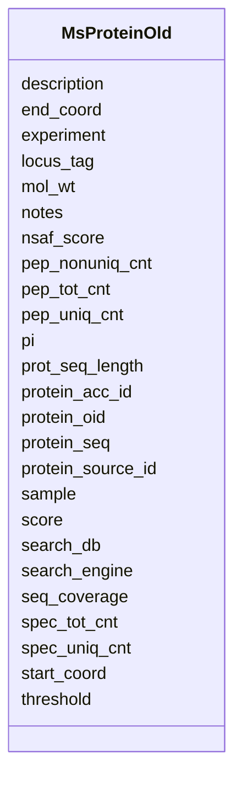

# Class: MsProteinOld 


URI: [img_proteome:MsProteinOld](https://w3id.org/jgi/img_proteome/MsProteinOld)





<!-- no inheritance hierarchy -->


## Slots

| Name | Cardinality and Range | Description | Inheritance |
| ---  | --- | --- | --- |
| [protein_oid](protein_oid.md) | 0..1 <br/> [Integer](Integer.md) |  | direct |
| [protein_source_id](protein_source_id.md) | 0..1 <br/> [String](String.md) |  | direct |
| [protein_acc_id](protein_acc_id.md) | 0..1 <br/> [String](String.md) |  | direct |
| [search_engine](search_engine.md) | 0..1 <br/> [String](String.md) |  | direct |
| [search_db](search_db.md) | 0..1 <br/> [String](String.md) |  | direct |
| [score](score.md) | 0..1 <br/> [Float](Float.md) |  | direct |
| [threshold](threshold.md) | 0..1 <br/> [Float](Float.md) |  | direct |
| [seq_coverage](seq_coverage.md) | 0..1 <br/> [Float](Float.md) |  | direct |
| [pep_uniq_cnt](pep_uniq_cnt.md) | 0..1 <br/> [Integer](Integer.md) |  | direct |
| [pep_nonuniq_cnt](pep_nonuniq_cnt.md) | 0..1 <br/> [Integer](Integer.md) |  | direct |
| [pep_tot_cnt](pep_tot_cnt.md) | 0..1 <br/> [Integer](Integer.md) |  | direct |
| [spec_uniq_cnt](spec_uniq_cnt.md) | 0..1 <br/> [Integer](Integer.md) |  | direct |
| [spec_tot_cnt](spec_tot_cnt.md) | 0..1 <br/> [Integer](Integer.md) |  | direct |
| [nsaf_score](nsaf_score.md) | 0..1 <br/> [Float](Float.md) |  | direct |
| [experiment](experiment.md) | 0..1 <br/> [Integer](Integer.md) |  | direct |
| [sample](sample.md) | 0..1 <br/> [Integer](Integer.md) |  | direct |
| [protein_seq](protein_seq.md) | 0..1 <br/> [String](String.md) |  | direct |
| [locus_tag](locus_tag.md) | 0..1 <br/> [String](String.md) |  | direct |
| [start_coord](start_coord.md) | 0..1 <br/> [Integer](Integer.md) |  | direct |
| [end_coord](end_coord.md) | 0..1 <br/> [Integer](Integer.md) |  | direct |
| [prot_seq_length](prot_seq_length.md) | 0..1 <br/> [Integer](Integer.md) |  | direct |
| [mol_wt](mol_wt.md) | 0..1 <br/> [Float](Float.md) |  | direct |
| [pi](pi.md) | 0..1 <br/> [Float](Float.md) |  | direct |
| [description](description.md) | 0..1 <br/> [String](String.md) |  | direct |
| [notes](notes.md) | 0..1 <br/> [String](String.md) |  | direct |


## Identifier and Mapping Information


### Schema Source


* from schema: https://w3id.org/jgi/img_proteome


## Mappings

| Mapping Type | Mapped Value |
| ---  | ---  |
| self | img_proteome:MsProteinOld |
| native | img_proteome:MsProteinOld |


## LinkML Source

<!-- TODO: investigate https://stackoverflow.com/questions/37606292/how-to-create-tabbed-code-blocks-in-mkdocs-or-sphinx -->

### Direct

<details>
```yaml
name: ms_protein_old
from_schema: https://w3id.org/jgi/img_proteome
attributes:
  protein_oid:
    name: protein_oid
    from_schema: https://w3id.org/jgi/img_proteome
    domain_of:
    - ms_protein
    - ms_protein_img_genes
    - ms_protein_img_genes_old
    - ms_protein_old
    range: integer
    required: false
  protein_source_id:
    name: protein_source_id
    from_schema: https://w3id.org/jgi/img_proteome
    domain_of:
    - ms_protein
    - ms_protein_old
    range: string
    required: false
  protein_acc_id:
    name: protein_acc_id
    from_schema: https://w3id.org/jgi/img_proteome
    domain_of:
    - ms_protein
    - ms_protein_old
    range: string
    required: false
  search_engine:
    name: search_engine
    from_schema: https://w3id.org/jgi/img_proteome
    domain_of:
    - ms_protein
    - ms_protein_old
    range: string
    required: false
  search_db:
    name: search_db
    from_schema: https://w3id.org/jgi/img_proteome
    domain_of:
    - ms_protein
    - ms_protein_old
    range: string
    required: false
  score:
    name: score
    from_schema: https://w3id.org/jgi/img_proteome
    domain_of:
    - ms_protein
    - ms_protein_old
    range: float
    required: false
  threshold:
    name: threshold
    from_schema: https://w3id.org/jgi/img_proteome
    domain_of:
    - ms_protein
    - ms_protein_old
    range: float
    required: false
  seq_coverage:
    name: seq_coverage
    from_schema: https://w3id.org/jgi/img_proteome
    domain_of:
    - ms_protein
    - ms_protein_old
    range: float
    required: false
  pep_uniq_cnt:
    name: pep_uniq_cnt
    from_schema: https://w3id.org/jgi/img_proteome
    domain_of:
    - ms_protein
    - ms_protein_old
    range: integer
    required: false
  pep_nonuniq_cnt:
    name: pep_nonuniq_cnt
    from_schema: https://w3id.org/jgi/img_proteome
    domain_of:
    - ms_protein
    - ms_protein_old
    range: integer
    required: false
  pep_tot_cnt:
    name: pep_tot_cnt
    from_schema: https://w3id.org/jgi/img_proteome
    domain_of:
    - ms_protein
    - ms_protein_old
    range: integer
    required: false
  spec_uniq_cnt:
    name: spec_uniq_cnt
    from_schema: https://w3id.org/jgi/img_proteome
    domain_of:
    - ms_protein
    - ms_protein_old
    range: integer
    required: false
  spec_tot_cnt:
    name: spec_tot_cnt
    from_schema: https://w3id.org/jgi/img_proteome
    domain_of:
    - ms_protein
    - ms_protein_old
    range: integer
    required: false
  nsaf_score:
    name: nsaf_score
    from_schema: https://w3id.org/jgi/img_proteome
    domain_of:
    - ms_protein
    - ms_protein_old
    range: float
    required: false
  experiment:
    name: experiment
    from_schema: https://w3id.org/jgi/img_proteome
    domain_of:
    - ms_peptide
    - ms_peptide_old
    - ms_protein
    - ms_protein_old
    - ms_sample
    range: integer
    required: false
  sample:
    name: sample
    from_schema: https://w3id.org/jgi/img_proteome
    domain_of:
    - ms_peptide
    - ms_peptide_old
    - ms_protein
    - ms_protein_old
    range: integer
    required: false
  protein_seq:
    name: protein_seq
    from_schema: https://w3id.org/jgi/img_proteome
    domain_of:
    - ms_protein
    - ms_protein_old
    range: string
    required: false
  locus_tag:
    name: locus_tag
    from_schema: https://w3id.org/jgi/img_proteome
    domain_of:
    - ms_protein
    - ms_protein_old
    range: string
    required: false
  start_coord:
    name: start_coord
    from_schema: https://w3id.org/jgi/img_proteome
    domain_of:
    - ms_peptide
    - ms_peptide_old
    - ms_protein
    - ms_protein_img_genes
    - ms_protein_img_genes_old
    - ms_protein_old
    range: integer
    required: false
  end_coord:
    name: end_coord
    from_schema: https://w3id.org/jgi/img_proteome
    domain_of:
    - ms_peptide
    - ms_peptide_old
    - ms_protein
    - ms_protein_img_genes
    - ms_protein_img_genes_old
    - ms_protein_old
    range: integer
    required: false
  prot_seq_length:
    name: prot_seq_length
    from_schema: https://w3id.org/jgi/img_proteome
    domain_of:
    - ms_protein
    - ms_protein_old
    range: integer
    required: false
  mol_wt:
    name: mol_wt
    from_schema: https://w3id.org/jgi/img_proteome
    domain_of:
    - ms_protein
    - ms_protein_old
    range: float
    required: false
  pi:
    name: pi
    from_schema: https://w3id.org/jgi/img_proteome
    domain_of:
    - ms_protein
    - ms_protein_old
    range: float
    required: false
  description:
    name: description
    from_schema: https://w3id.org/jgi/img_proteome
    domain_of:
    - ms_experiment
    - ms_protein
    - ms_protein_old
    - ms_sample
    range: string
    required: false
  notes:
    name: notes
    from_schema: https://w3id.org/jgi/img_proteome
    domain_of:
    - ms_experiment
    - ms_peptide
    - ms_peptide_old
    - ms_protein
    - ms_protein_old
    range: string
    required: false

```
</details>

### Induced

<details>
```yaml
name: ms_protein_old
from_schema: https://w3id.org/jgi/img_proteome
attributes:
  protein_oid:
    name: protein_oid
    from_schema: https://w3id.org/jgi/img_proteome
    alias: protein_oid
    owner: ms_protein_old
    domain_of:
    - ms_protein
    - ms_protein_img_genes
    - ms_protein_img_genes_old
    - ms_protein_old
    range: integer
    required: false
  protein_source_id:
    name: protein_source_id
    from_schema: https://w3id.org/jgi/img_proteome
    alias: protein_source_id
    owner: ms_protein_old
    domain_of:
    - ms_protein
    - ms_protein_old
    range: string
    required: false
  protein_acc_id:
    name: protein_acc_id
    from_schema: https://w3id.org/jgi/img_proteome
    alias: protein_acc_id
    owner: ms_protein_old
    domain_of:
    - ms_protein
    - ms_protein_old
    range: string
    required: false
  search_engine:
    name: search_engine
    from_schema: https://w3id.org/jgi/img_proteome
    alias: search_engine
    owner: ms_protein_old
    domain_of:
    - ms_protein
    - ms_protein_old
    range: string
    required: false
  search_db:
    name: search_db
    from_schema: https://w3id.org/jgi/img_proteome
    alias: search_db
    owner: ms_protein_old
    domain_of:
    - ms_protein
    - ms_protein_old
    range: string
    required: false
  score:
    name: score
    from_schema: https://w3id.org/jgi/img_proteome
    alias: score
    owner: ms_protein_old
    domain_of:
    - ms_protein
    - ms_protein_old
    range: float
    required: false
  threshold:
    name: threshold
    from_schema: https://w3id.org/jgi/img_proteome
    alias: threshold
    owner: ms_protein_old
    domain_of:
    - ms_protein
    - ms_protein_old
    range: float
    required: false
  seq_coverage:
    name: seq_coverage
    from_schema: https://w3id.org/jgi/img_proteome
    alias: seq_coverage
    owner: ms_protein_old
    domain_of:
    - ms_protein
    - ms_protein_old
    range: float
    required: false
  pep_uniq_cnt:
    name: pep_uniq_cnt
    from_schema: https://w3id.org/jgi/img_proteome
    alias: pep_uniq_cnt
    owner: ms_protein_old
    domain_of:
    - ms_protein
    - ms_protein_old
    range: integer
    required: false
  pep_nonuniq_cnt:
    name: pep_nonuniq_cnt
    from_schema: https://w3id.org/jgi/img_proteome
    alias: pep_nonuniq_cnt
    owner: ms_protein_old
    domain_of:
    - ms_protein
    - ms_protein_old
    range: integer
    required: false
  pep_tot_cnt:
    name: pep_tot_cnt
    from_schema: https://w3id.org/jgi/img_proteome
    alias: pep_tot_cnt
    owner: ms_protein_old
    domain_of:
    - ms_protein
    - ms_protein_old
    range: integer
    required: false
  spec_uniq_cnt:
    name: spec_uniq_cnt
    from_schema: https://w3id.org/jgi/img_proteome
    alias: spec_uniq_cnt
    owner: ms_protein_old
    domain_of:
    - ms_protein
    - ms_protein_old
    range: integer
    required: false
  spec_tot_cnt:
    name: spec_tot_cnt
    from_schema: https://w3id.org/jgi/img_proteome
    alias: spec_tot_cnt
    owner: ms_protein_old
    domain_of:
    - ms_protein
    - ms_protein_old
    range: integer
    required: false
  nsaf_score:
    name: nsaf_score
    from_schema: https://w3id.org/jgi/img_proteome
    alias: nsaf_score
    owner: ms_protein_old
    domain_of:
    - ms_protein
    - ms_protein_old
    range: float
    required: false
  experiment:
    name: experiment
    from_schema: https://w3id.org/jgi/img_proteome
    alias: experiment
    owner: ms_protein_old
    domain_of:
    - ms_peptide
    - ms_peptide_old
    - ms_protein
    - ms_protein_old
    - ms_sample
    range: integer
    required: false
  sample:
    name: sample
    from_schema: https://w3id.org/jgi/img_proteome
    alias: sample
    owner: ms_protein_old
    domain_of:
    - ms_peptide
    - ms_peptide_old
    - ms_protein
    - ms_protein_old
    range: integer
    required: false
  protein_seq:
    name: protein_seq
    from_schema: https://w3id.org/jgi/img_proteome
    alias: protein_seq
    owner: ms_protein_old
    domain_of:
    - ms_protein
    - ms_protein_old
    range: string
    required: false
  locus_tag:
    name: locus_tag
    from_schema: https://w3id.org/jgi/img_proteome
    alias: locus_tag
    owner: ms_protein_old
    domain_of:
    - ms_protein
    - ms_protein_old
    range: string
    required: false
  start_coord:
    name: start_coord
    from_schema: https://w3id.org/jgi/img_proteome
    alias: start_coord
    owner: ms_protein_old
    domain_of:
    - ms_peptide
    - ms_peptide_old
    - ms_protein
    - ms_protein_img_genes
    - ms_protein_img_genes_old
    - ms_protein_old
    range: integer
    required: false
  end_coord:
    name: end_coord
    from_schema: https://w3id.org/jgi/img_proteome
    alias: end_coord
    owner: ms_protein_old
    domain_of:
    - ms_peptide
    - ms_peptide_old
    - ms_protein
    - ms_protein_img_genes
    - ms_protein_img_genes_old
    - ms_protein_old
    range: integer
    required: false
  prot_seq_length:
    name: prot_seq_length
    from_schema: https://w3id.org/jgi/img_proteome
    alias: prot_seq_length
    owner: ms_protein_old
    domain_of:
    - ms_protein
    - ms_protein_old
    range: integer
    required: false
  mol_wt:
    name: mol_wt
    from_schema: https://w3id.org/jgi/img_proteome
    alias: mol_wt
    owner: ms_protein_old
    domain_of:
    - ms_protein
    - ms_protein_old
    range: float
    required: false
  pi:
    name: pi
    from_schema: https://w3id.org/jgi/img_proteome
    alias: pi
    owner: ms_protein_old
    domain_of:
    - ms_protein
    - ms_protein_old
    range: float
    required: false
  description:
    name: description
    from_schema: https://w3id.org/jgi/img_proteome
    alias: description
    owner: ms_protein_old
    domain_of:
    - ms_experiment
    - ms_protein
    - ms_protein_old
    - ms_sample
    range: string
    required: false
  notes:
    name: notes
    from_schema: https://w3id.org/jgi/img_proteome
    alias: notes
    owner: ms_protein_old
    domain_of:
    - ms_experiment
    - ms_peptide
    - ms_peptide_old
    - ms_protein
    - ms_protein_old
    range: string
    required: false

```
</details>