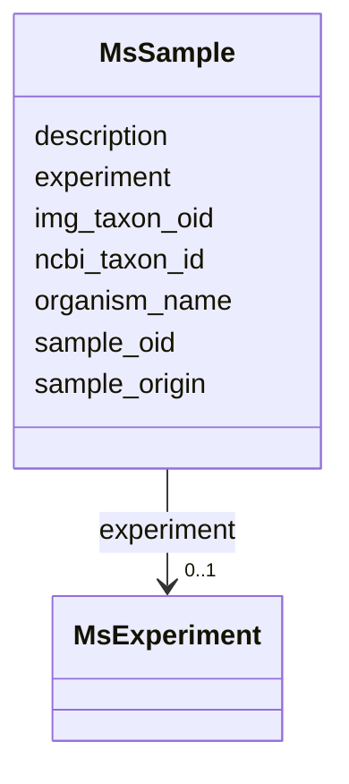

# Class: MsSample 


URI: [img_proteome:MsSample](https://w3id.org/jgi/img_proteome/MsSample)





<!-- no inheritance hierarchy -->


## Slots

| Name | Cardinality and Range | Description | Inheritance |
| ---  | --- | --- | --- |
| [sample_oid](sample_oid.md) | 0..1 <br/> [Integer](Integer.md) |  | direct |
| [description](description.md) | 0..1 <br/> [String](String.md) |  | direct |
| [sample_origin](sample_origin.md) | 0..1 <br/> [String](String.md) |  | direct |
| [ncbi_taxon_id](ncbi_taxon_id.md) | 0..1 <br/> [Integer](Integer.md) |  | direct |
| [organism_name](organism_name.md) | 0..1 <br/> [String](String.md) |  | direct |
| [img_taxon_oid](img_taxon_oid.md) | 0..1 <br/> [Integer](Integer.md) |  | direct |
| [experiment](experiment.md) | 0..1 <br/> [MsExperiment](MsExperiment.md) | Foreign key to ms_experiment | direct |


## Identifier and Mapping Information


### Schema Source


* from schema: https://w3id.org/jgi/img_proteome


## Mappings

| Mapping Type | Mapped Value |
| ---  | ---  |
| self | img_proteome:MsSample |
| native | img_proteome:MsSample |


## LinkML Source

<!-- TODO: investigate https://stackoverflow.com/questions/37606292/how-to-create-tabbed-code-blocks-in-mkdocs-or-sphinx -->

### Direct

<details>
```yaml
name: ms_sample
from_schema: https://w3id.org/jgi/img_proteome
attributes:
  sample_oid:
    name: sample_oid
    from_schema: https://w3id.org/jgi/img_proteome
    rank: 1000
    domain_of:
    - ms_sample
    - ms_sample_ext_links
    - ms_sample_sop
    range: integer
    required: false
  description:
    name: description
    from_schema: https://w3id.org/jgi/img_proteome
    domain_of:
    - ms_experiment
    - ms_protein
    - ms_protein_old
    - ms_sample
    range: string
    required: false
  sample_origin:
    name: sample_origin
    from_schema: https://w3id.org/jgi/img_proteome
    rank: 1000
    domain_of:
    - ms_sample
    range: string
    required: false
  ncbi_taxon_id:
    name: ncbi_taxon_id
    from_schema: https://w3id.org/jgi/img_proteome
    rank: 1000
    domain_of:
    - ms_sample
    range: integer
    required: false
  organism_name:
    name: organism_name
    from_schema: https://w3id.org/jgi/img_proteome
    rank: 1000
    domain_of:
    - ms_sample
    range: string
    required: false
  img_taxon_oid:
    name: img_taxon_oid
    from_schema: https://w3id.org/jgi/img_proteome
    rank: 1000
    domain_of:
    - ms_sample
    range: integer
    required: false
  experiment:
    name: experiment
    description: Foreign key to ms_experiment
    from_schema: https://w3id.org/jgi/img_proteome
    domain_of:
    - ms_peptide
    - ms_peptide_old
    - ms_protein
    - ms_protein_old
    - ms_sample
    range: ms_experiment
    required: false

```
</details>

### Induced

<details>
```yaml
name: ms_sample
from_schema: https://w3id.org/jgi/img_proteome
attributes:
  sample_oid:
    name: sample_oid
    from_schema: https://w3id.org/jgi/img_proteome
    rank: 1000
    alias: sample_oid
    owner: ms_sample
    domain_of:
    - ms_sample
    - ms_sample_ext_links
    - ms_sample_sop
    range: integer
    required: false
  description:
    name: description
    from_schema: https://w3id.org/jgi/img_proteome
    alias: description
    owner: ms_sample
    domain_of:
    - ms_experiment
    - ms_protein
    - ms_protein_old
    - ms_sample
    range: string
    required: false
  sample_origin:
    name: sample_origin
    from_schema: https://w3id.org/jgi/img_proteome
    rank: 1000
    alias: sample_origin
    owner: ms_sample
    domain_of:
    - ms_sample
    range: string
    required: false
  ncbi_taxon_id:
    name: ncbi_taxon_id
    from_schema: https://w3id.org/jgi/img_proteome
    rank: 1000
    alias: ncbi_taxon_id
    owner: ms_sample
    domain_of:
    - ms_sample
    range: integer
    required: false
  organism_name:
    name: organism_name
    from_schema: https://w3id.org/jgi/img_proteome
    rank: 1000
    alias: organism_name
    owner: ms_sample
    domain_of:
    - ms_sample
    range: string
    required: false
  img_taxon_oid:
    name: img_taxon_oid
    from_schema: https://w3id.org/jgi/img_proteome
    rank: 1000
    alias: img_taxon_oid
    owner: ms_sample
    domain_of:
    - ms_sample
    range: integer
    required: false
  experiment:
    name: experiment
    description: Foreign key to ms_experiment
    from_schema: https://w3id.org/jgi/img_proteome
    alias: experiment
    owner: ms_sample
    domain_of:
    - ms_peptide
    - ms_peptide_old
    - ms_protein
    - ms_protein_old
    - ms_sample
    range: ms_experiment
    required: false

```
</details>