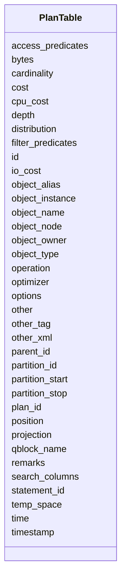

# Class: PlanTable 


URI: [img_proteome:PlanTable](https://w3id.org/jgi/img_proteome/PlanTable)





<!-- no inheritance hierarchy -->


## Slots

| Name | Cardinality and Range | Description | Inheritance |
| ---  | --- | --- | --- |
| [statement_id](statement_id.md) | 0..1 <br/> [String](String.md) |  | direct |
| [plan_id](plan_id.md) | 0..1 <br/> [Float](Float.md) |  | direct |
| [timestamp](timestamp.md) | 0..1 <br/> [Datetime](Datetime.md) |  | direct |
| [remarks](remarks.md) | 0..1 <br/> [String](String.md) |  | direct |
| [operation](operation.md) | 0..1 <br/> [String](String.md) |  | direct |
| [options](options.md) | 0..1 <br/> [String](String.md) |  | direct |
| [object_node](object_node.md) | 0..1 <br/> [String](String.md) |  | direct |
| [object_owner](object_owner.md) | 0..1 <br/> [String](String.md) |  | direct |
| [object_name](object_name.md) | 0..1 <br/> [String](String.md) |  | direct |
| [object_alias](object_alias.md) | 0..1 <br/> [String](String.md) |  | direct |
| [object_instance](object_instance.md) | 0..1 <br/> [Float](Float.md) |  | direct |
| [object_type](object_type.md) | 0..1 <br/> [String](String.md) |  | direct |
| [optimizer](optimizer.md) | 0..1 <br/> [String](String.md) |  | direct |
| [search_columns](search_columns.md) | 0..1 <br/> [Float](Float.md) |  | direct |
| [id](id.md) | 0..1 <br/> [Float](Float.md) |  | direct |
| [parent_id](parent_id.md) | 0..1 <br/> [Float](Float.md) |  | direct |
| [depth](depth.md) | 0..1 <br/> [Float](Float.md) |  | direct |
| [position](position.md) | 0..1 <br/> [Float](Float.md) |  | direct |
| [cost](cost.md) | 0..1 <br/> [Float](Float.md) |  | direct |
| [cardinality](cardinality.md) | 0..1 <br/> [Float](Float.md) |  | direct |
| [bytes](bytes.md) | 0..1 <br/> [Float](Float.md) |  | direct |
| [other_tag](other_tag.md) | 0..1 <br/> [String](String.md) |  | direct |
| [partition_start](partition_start.md) | 0..1 <br/> [String](String.md) |  | direct |
| [partition_stop](partition_stop.md) | 0..1 <br/> [String](String.md) |  | direct |
| [partition_id](partition_id.md) | 0..1 <br/> [Float](Float.md) |  | direct |
| [other](other.md) | 0..1 <br/> [String](String.md) |  | direct |
| [distribution](distribution.md) | 0..1 <br/> [String](String.md) |  | direct |
| [cpu_cost](cpu_cost.md) | 0..1 <br/> [Float](Float.md) |  | direct |
| [io_cost](io_cost.md) | 0..1 <br/> [Float](Float.md) |  | direct |
| [temp_space](temp_space.md) | 0..1 <br/> [Float](Float.md) |  | direct |
| [access_predicates](access_predicates.md) | 0..1 <br/> [String](String.md) |  | direct |
| [filter_predicates](filter_predicates.md) | 0..1 <br/> [String](String.md) |  | direct |
| [projection](projection.md) | 0..1 <br/> [String](String.md) |  | direct |
| [time](time.md) | 0..1 <br/> [Float](Float.md) |  | direct |
| [qblock_name](qblock_name.md) | 0..1 <br/> [String](String.md) |  | direct |
| [other_xml](other_xml.md) | 0..1 <br/> [String](String.md) |  | direct |


## Identifier and Mapping Information


### Schema Source


* from schema: https://w3id.org/jgi/img_proteome


## Mappings

| Mapping Type | Mapped Value |
| ---  | ---  |
| self | img_proteome:PlanTable |
| native | img_proteome:PlanTable |


## LinkML Source

<!-- TODO: investigate https://stackoverflow.com/questions/37606292/how-to-create-tabbed-code-blocks-in-mkdocs-or-sphinx -->

### Direct

<details>
```yaml
name: plan_table
from_schema: https://w3id.org/jgi/img_proteome
attributes:
  statement_id:
    name: statement_id
    from_schema: https://w3id.org/jgi/img_proteome
    rank: 1000
    domain_of:
    - plan_table
    range: string
    required: false
  plan_id:
    name: plan_id
    from_schema: https://w3id.org/jgi/img_proteome
    rank: 1000
    domain_of:
    - plan_table
    range: float
    required: false
  timestamp:
    name: timestamp
    from_schema: https://w3id.org/jgi/img_proteome
    rank: 1000
    domain_of:
    - plan_table
    range: datetime
    required: false
  remarks:
    name: remarks
    from_schema: https://w3id.org/jgi/img_proteome
    rank: 1000
    domain_of:
    - plan_table
    range: string
    required: false
  operation:
    name: operation
    from_schema: https://w3id.org/jgi/img_proteome
    rank: 1000
    domain_of:
    - plan_table
    range: string
    required: false
  options:
    name: options
    from_schema: https://w3id.org/jgi/img_proteome
    rank: 1000
    domain_of:
    - plan_table
    range: string
    required: false
  object_node:
    name: object_node
    from_schema: https://w3id.org/jgi/img_proteome
    rank: 1000
    domain_of:
    - plan_table
    range: string
    required: false
  object_owner:
    name: object_owner
    from_schema: https://w3id.org/jgi/img_proteome
    rank: 1000
    domain_of:
    - plan_table
    range: string
    required: false
  object_name:
    name: object_name
    from_schema: https://w3id.org/jgi/img_proteome
    rank: 1000
    domain_of:
    - plan_table
    range: string
    required: false
  object_alias:
    name: object_alias
    from_schema: https://w3id.org/jgi/img_proteome
    rank: 1000
    domain_of:
    - plan_table
    range: string
    required: false
  object_instance:
    name: object_instance
    from_schema: https://w3id.org/jgi/img_proteome
    rank: 1000
    domain_of:
    - plan_table
    range: float
    required: false
  object_type:
    name: object_type
    from_schema: https://w3id.org/jgi/img_proteome
    rank: 1000
    domain_of:
    - plan_table
    range: string
    required: false
  optimizer:
    name: optimizer
    from_schema: https://w3id.org/jgi/img_proteome
    rank: 1000
    domain_of:
    - plan_table
    range: string
    required: false
  search_columns:
    name: search_columns
    from_schema: https://w3id.org/jgi/img_proteome
    rank: 1000
    domain_of:
    - plan_table
    range: float
    required: false
  id:
    name: id
    from_schema: https://w3id.org/jgi/img_proteome
    domain_of:
    - ms_experiment_ext_links
    - ms_sample_ext_links
    - plan_table
    range: float
    required: false
  parent_id:
    name: parent_id
    from_schema: https://w3id.org/jgi/img_proteome
    rank: 1000
    domain_of:
    - plan_table
    range: float
    required: false
  depth:
    name: depth
    from_schema: https://w3id.org/jgi/img_proteome
    rank: 1000
    domain_of:
    - plan_table
    range: float
    required: false
  position:
    name: position
    from_schema: https://w3id.org/jgi/img_proteome
    rank: 1000
    domain_of:
    - plan_table
    range: float
    required: false
  cost:
    name: cost
    from_schema: https://w3id.org/jgi/img_proteome
    rank: 1000
    domain_of:
    - plan_table
    range: float
    required: false
  cardinality:
    name: cardinality
    from_schema: https://w3id.org/jgi/img_proteome
    rank: 1000
    domain_of:
    - plan_table
    range: float
    required: false
  bytes:
    name: bytes
    from_schema: https://w3id.org/jgi/img_proteome
    rank: 1000
    domain_of:
    - plan_table
    range: float
    required: false
  other_tag:
    name: other_tag
    from_schema: https://w3id.org/jgi/img_proteome
    rank: 1000
    domain_of:
    - plan_table
    range: string
    required: false
  partition_start:
    name: partition_start
    from_schema: https://w3id.org/jgi/img_proteome
    rank: 1000
    domain_of:
    - plan_table
    range: string
    required: false
  partition_stop:
    name: partition_stop
    from_schema: https://w3id.org/jgi/img_proteome
    rank: 1000
    domain_of:
    - plan_table
    range: string
    required: false
  partition_id:
    name: partition_id
    from_schema: https://w3id.org/jgi/img_proteome
    rank: 1000
    domain_of:
    - plan_table
    range: float
    required: false
  other:
    name: other
    from_schema: https://w3id.org/jgi/img_proteome
    rank: 1000
    domain_of:
    - plan_table
    range: string
    required: false
  distribution:
    name: distribution
    from_schema: https://w3id.org/jgi/img_proteome
    rank: 1000
    domain_of:
    - plan_table
    range: string
    required: false
  cpu_cost:
    name: cpu_cost
    from_schema: https://w3id.org/jgi/img_proteome
    rank: 1000
    domain_of:
    - plan_table
    range: float
    required: false
  io_cost:
    name: io_cost
    from_schema: https://w3id.org/jgi/img_proteome
    rank: 1000
    domain_of:
    - plan_table
    range: float
    required: false
  temp_space:
    name: temp_space
    from_schema: https://w3id.org/jgi/img_proteome
    rank: 1000
    domain_of:
    - plan_table
    range: float
    required: false
  access_predicates:
    name: access_predicates
    from_schema: https://w3id.org/jgi/img_proteome
    rank: 1000
    domain_of:
    - plan_table
    range: string
    required: false
  filter_predicates:
    name: filter_predicates
    from_schema: https://w3id.org/jgi/img_proteome
    rank: 1000
    domain_of:
    - plan_table
    range: string
    required: false
  projection:
    name: projection
    from_schema: https://w3id.org/jgi/img_proteome
    rank: 1000
    domain_of:
    - plan_table
    range: string
    required: false
  time:
    name: time
    from_schema: https://w3id.org/jgi/img_proteome
    rank: 1000
    domain_of:
    - plan_table
    range: float
    required: false
  qblock_name:
    name: qblock_name
    from_schema: https://w3id.org/jgi/img_proteome
    rank: 1000
    domain_of:
    - plan_table
    range: string
    required: false
  other_xml:
    name: other_xml
    from_schema: https://w3id.org/jgi/img_proteome
    rank: 1000
    domain_of:
    - plan_table
    range: string
    required: false

```
</details>

### Induced

<details>
```yaml
name: plan_table
from_schema: https://w3id.org/jgi/img_proteome
attributes:
  statement_id:
    name: statement_id
    from_schema: https://w3id.org/jgi/img_proteome
    rank: 1000
    alias: statement_id
    owner: plan_table
    domain_of:
    - plan_table
    range: string
    required: false
  plan_id:
    name: plan_id
    from_schema: https://w3id.org/jgi/img_proteome
    rank: 1000
    alias: plan_id
    owner: plan_table
    domain_of:
    - plan_table
    range: float
    required: false
  timestamp:
    name: timestamp
    from_schema: https://w3id.org/jgi/img_proteome
    rank: 1000
    alias: timestamp
    owner: plan_table
    domain_of:
    - plan_table
    range: datetime
    required: false
  remarks:
    name: remarks
    from_schema: https://w3id.org/jgi/img_proteome
    rank: 1000
    alias: remarks
    owner: plan_table
    domain_of:
    - plan_table
    range: string
    required: false
  operation:
    name: operation
    from_schema: https://w3id.org/jgi/img_proteome
    rank: 1000
    alias: operation
    owner: plan_table
    domain_of:
    - plan_table
    range: string
    required: false
  options:
    name: options
    from_schema: https://w3id.org/jgi/img_proteome
    rank: 1000
    alias: options
    owner: plan_table
    domain_of:
    - plan_table
    range: string
    required: false
  object_node:
    name: object_node
    from_schema: https://w3id.org/jgi/img_proteome
    rank: 1000
    alias: object_node
    owner: plan_table
    domain_of:
    - plan_table
    range: string
    required: false
  object_owner:
    name: object_owner
    from_schema: https://w3id.org/jgi/img_proteome
    rank: 1000
    alias: object_owner
    owner: plan_table
    domain_of:
    - plan_table
    range: string
    required: false
  object_name:
    name: object_name
    from_schema: https://w3id.org/jgi/img_proteome
    rank: 1000
    alias: object_name
    owner: plan_table
    domain_of:
    - plan_table
    range: string
    required: false
  object_alias:
    name: object_alias
    from_schema: https://w3id.org/jgi/img_proteome
    rank: 1000
    alias: object_alias
    owner: plan_table
    domain_of:
    - plan_table
    range: string
    required: false
  object_instance:
    name: object_instance
    from_schema: https://w3id.org/jgi/img_proteome
    rank: 1000
    alias: object_instance
    owner: plan_table
    domain_of:
    - plan_table
    range: float
    required: false
  object_type:
    name: object_type
    from_schema: https://w3id.org/jgi/img_proteome
    rank: 1000
    alias: object_type
    owner: plan_table
    domain_of:
    - plan_table
    range: string
    required: false
  optimizer:
    name: optimizer
    from_schema: https://w3id.org/jgi/img_proteome
    rank: 1000
    alias: optimizer
    owner: plan_table
    domain_of:
    - plan_table
    range: string
    required: false
  search_columns:
    name: search_columns
    from_schema: https://w3id.org/jgi/img_proteome
    rank: 1000
    alias: search_columns
    owner: plan_table
    domain_of:
    - plan_table
    range: float
    required: false
  id:
    name: id
    from_schema: https://w3id.org/jgi/img_proteome
    alias: id
    owner: plan_table
    domain_of:
    - ms_experiment_ext_links
    - ms_sample_ext_links
    - plan_table
    range: float
    required: false
  parent_id:
    name: parent_id
    from_schema: https://w3id.org/jgi/img_proteome
    rank: 1000
    alias: parent_id
    owner: plan_table
    domain_of:
    - plan_table
    range: float
    required: false
  depth:
    name: depth
    from_schema: https://w3id.org/jgi/img_proteome
    rank: 1000
    alias: depth
    owner: plan_table
    domain_of:
    - plan_table
    range: float
    required: false
  position:
    name: position
    from_schema: https://w3id.org/jgi/img_proteome
    rank: 1000
    alias: position
    owner: plan_table
    domain_of:
    - plan_table
    range: float
    required: false
  cost:
    name: cost
    from_schema: https://w3id.org/jgi/img_proteome
    rank: 1000
    alias: cost
    owner: plan_table
    domain_of:
    - plan_table
    range: float
    required: false
  cardinality:
    name: cardinality
    from_schema: https://w3id.org/jgi/img_proteome
    rank: 1000
    alias: cardinality
    owner: plan_table
    domain_of:
    - plan_table
    range: float
    required: false
  bytes:
    name: bytes
    from_schema: https://w3id.org/jgi/img_proteome
    rank: 1000
    alias: bytes
    owner: plan_table
    domain_of:
    - plan_table
    range: float
    required: false
  other_tag:
    name: other_tag
    from_schema: https://w3id.org/jgi/img_proteome
    rank: 1000
    alias: other_tag
    owner: plan_table
    domain_of:
    - plan_table
    range: string
    required: false
  partition_start:
    name: partition_start
    from_schema: https://w3id.org/jgi/img_proteome
    rank: 1000
    alias: partition_start
    owner: plan_table
    domain_of:
    - plan_table
    range: string
    required: false
  partition_stop:
    name: partition_stop
    from_schema: https://w3id.org/jgi/img_proteome
    rank: 1000
    alias: partition_stop
    owner: plan_table
    domain_of:
    - plan_table
    range: string
    required: false
  partition_id:
    name: partition_id
    from_schema: https://w3id.org/jgi/img_proteome
    rank: 1000
    alias: partition_id
    owner: plan_table
    domain_of:
    - plan_table
    range: float
    required: false
  other:
    name: other
    from_schema: https://w3id.org/jgi/img_proteome
    rank: 1000
    alias: other
    owner: plan_table
    domain_of:
    - plan_table
    range: string
    required: false
  distribution:
    name: distribution
    from_schema: https://w3id.org/jgi/img_proteome
    rank: 1000
    alias: distribution
    owner: plan_table
    domain_of:
    - plan_table
    range: string
    required: false
  cpu_cost:
    name: cpu_cost
    from_schema: https://w3id.org/jgi/img_proteome
    rank: 1000
    alias: cpu_cost
    owner: plan_table
    domain_of:
    - plan_table
    range: float
    required: false
  io_cost:
    name: io_cost
    from_schema: https://w3id.org/jgi/img_proteome
    rank: 1000
    alias: io_cost
    owner: plan_table
    domain_of:
    - plan_table
    range: float
    required: false
  temp_space:
    name: temp_space
    from_schema: https://w3id.org/jgi/img_proteome
    rank: 1000
    alias: temp_space
    owner: plan_table
    domain_of:
    - plan_table
    range: float
    required: false
  access_predicates:
    name: access_predicates
    from_schema: https://w3id.org/jgi/img_proteome
    rank: 1000
    alias: access_predicates
    owner: plan_table
    domain_of:
    - plan_table
    range: string
    required: false
  filter_predicates:
    name: filter_predicates
    from_schema: https://w3id.org/jgi/img_proteome
    rank: 1000
    alias: filter_predicates
    owner: plan_table
    domain_of:
    - plan_table
    range: string
    required: false
  projection:
    name: projection
    from_schema: https://w3id.org/jgi/img_proteome
    rank: 1000
    alias: projection
    owner: plan_table
    domain_of:
    - plan_table
    range: string
    required: false
  time:
    name: time
    from_schema: https://w3id.org/jgi/img_proteome
    rank: 1000
    alias: time
    owner: plan_table
    domain_of:
    - plan_table
    range: float
    required: false
  qblock_name:
    name: qblock_name
    from_schema: https://w3id.org/jgi/img_proteome
    rank: 1000
    alias: qblock_name
    owner: plan_table
    domain_of:
    - plan_table
    range: string
    required: false
  other_xml:
    name: other_xml
    from_schema: https://w3id.org/jgi/img_proteome
    rank: 1000
    alias: other_xml
    owner: plan_table
    domain_of:
    - plan_table
    range: string
    required: false

```
</details>