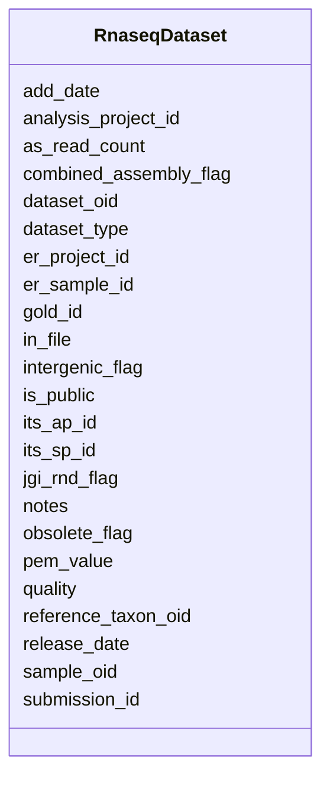

# Class: RnaseqDataset 


URI: [img_rnaseq:RnaseqDataset](https://w3id.org/jgi/img_rnaseq/RnaseqDataset)





<!-- no inheritance hierarchy -->


## Slots

| Name | Cardinality and Range | Description | Inheritance |
| ---  | --- | --- | --- |
| [dataset_oid](dataset_oid.md) | 0..1 <br/> [Float](Float.md) |  | direct |
| [sample_oid](sample_oid.md) | 0..1 <br/> [String](String.md) |  | direct |
| [reference_taxon_oid](reference_taxon_oid.md) | 0..1 <br/> [Float](Float.md) |  | direct |
| [notes](notes.md) | 0..1 <br/> [String](String.md) |  | direct |
| [gold_id](gold_id.md) | 0..1 <br/> [String](String.md) |  | direct |
| [er_project_id](er_project_id.md) | 0..1 <br/> [Float](Float.md) |  | direct |
| [er_sample_id](er_sample_id.md) | 0..1 <br/> [Float](Float.md) |  | direct |
| [analysis_project_id](analysis_project_id.md) | 0..1 <br/> [String](String.md) |  | direct |
| [add_date](add_date.md) | 0..1 <br/> [Datetime](Datetime.md) |  | direct |
| [is_public](is_public.md) | 0..1 <br/> [String](String.md) |  | direct |
| [submission_id](submission_id.md) | 0..1 <br/> [Float](Float.md) |  | direct |
| [in_file](in_file.md) | 0..1 <br/> [String](String.md) |  | direct |
| [obsolete_flag](obsolete_flag.md) | 0..1 <br/> [String](String.md) |  | direct |
| [dataset_type](dataset_type.md) | 0..1 <br/> [String](String.md) |  | direct |
| [release_date](release_date.md) | 0..1 <br/> [Datetime](Datetime.md) |  | direct |
| [jgi_rnd_flag](jgi_rnd_flag.md) | 0..1 <br/> [String](String.md) |  | direct |
| [its_ap_id](its_ap_id.md) | 0..1 <br/> [Float](Float.md) |  | direct |
| [its_sp_id](its_sp_id.md) | 0..1 <br/> [Float](Float.md) |  | direct |
| [combined_assembly_flag](combined_assembly_flag.md) | 0..1 <br/> [String](String.md) |  | direct |
| [intergenic_flag](intergenic_flag.md) | 0..1 <br/> [String](String.md) |  | direct |
| [quality](quality.md) | 0..1 <br/> [String](String.md) |  | direct |
| [pem_value](pem_value.md) | 0..1 <br/> [Float](Float.md) |  | direct |
| [as_read_count](as_read_count.md) | 0..1 <br/> [Integer](Integer.md) |  | direct |


## Usages

| used by | used in | type | used |
| ---  | --- | --- | --- |
| [RnaseqDatasetStats](RnaseqDatasetStats.md) | [dataset_oid](dataset_oid.md) | range | [RnaseqDataset](RnaseqDataset.md) |


## Identifier and Mapping Information


### Schema Source


* from schema: https://w3id.org/jgi/img_rnaseq


## Mappings

| Mapping Type | Mapped Value |
| ---  | ---  |
| self | img_rnaseq:RnaseqDataset |
| native | img_rnaseq:RnaseqDataset |


## LinkML Source

<!-- TODO: investigate https://stackoverflow.com/questions/37606292/how-to-create-tabbed-code-blocks-in-mkdocs-or-sphinx -->

### Direct

<details>
```yaml
name: rnaseq_dataset
from_schema: https://w3id.org/jgi/img_rnaseq
attributes:
  dataset_oid:
    name: dataset_oid
    from_schema: https://w3id.org/jgi/img_rnaseq
    rank: 1000
    domain_of:
    - rnaseq_dataset
    - rnaseq_dataset_stats
    - rnaseq_sample
    range: float
    required: false
  sample_oid:
    name: sample_oid
    from_schema: https://w3id.org/jgi/img_rnaseq
    rank: 1000
    domain_of:
    - rnaseq_dataset
    - rnaseq_sample
    - rnaseq_sample_ext_links
    - rnaseq_sample_sop
    range: string
    required: false
  reference_taxon_oid:
    name: reference_taxon_oid
    from_schema: https://w3id.org/jgi/img_rnaseq
    rank: 1000
    domain_of:
    - rnaseq_dataset
    range: float
    required: false
  notes:
    name: notes
    from_schema: https://w3id.org/jgi/img_rnaseq
    rank: 1000
    domain_of:
    - rnaseq_dataset
    - rnaseq_experiment
    - rnaseq_sample
    range: string
    required: false
  gold_id:
    name: gold_id
    from_schema: https://w3id.org/jgi/img_rnaseq
    rank: 1000
    domain_of:
    - rnaseq_dataset
    - rnaseq_sample
    range: string
    required: false
  er_project_id:
    name: er_project_id
    from_schema: https://w3id.org/jgi/img_rnaseq
    rank: 1000
    domain_of:
    - rnaseq_dataset
    - rnaseq_sample
    range: float
    required: false
  er_sample_id:
    name: er_sample_id
    from_schema: https://w3id.org/jgi/img_rnaseq
    rank: 1000
    domain_of:
    - rnaseq_dataset
    - rnaseq_sample
    range: float
    required: false
  analysis_project_id:
    name: analysis_project_id
    from_schema: https://w3id.org/jgi/img_rnaseq
    rank: 1000
    domain_of:
    - rnaseq_dataset
    - rnaseq_sample
    range: string
    required: false
  add_date:
    name: add_date
    from_schema: https://w3id.org/jgi/img_rnaseq
    rank: 1000
    domain_of:
    - rnaseq_dataset
    - rnaseq_experiment
    - rnaseq_sample
    range: datetime
    required: false
  is_public:
    name: is_public
    from_schema: https://w3id.org/jgi/img_rnaseq
    rank: 1000
    domain_of:
    - rnaseq_dataset
    - rnaseq_experiment
    - rnaseq_sample
    range: string
    required: false
  submission_id:
    name: submission_id
    from_schema: https://w3id.org/jgi/img_rnaseq
    rank: 1000
    domain_of:
    - rnaseq_dataset
    - rnaseq_experiment
    - rnaseq_sample
    range: float
    required: false
  in_file:
    name: in_file
    from_schema: https://w3id.org/jgi/img_rnaseq
    rank: 1000
    domain_of:
    - rnaseq_dataset
    - rnaseq_experiment
    - rnaseq_sample
    range: string
    required: false
  obsolete_flag:
    name: obsolete_flag
    from_schema: https://w3id.org/jgi/img_rnaseq
    rank: 1000
    domain_of:
    - rnaseq_dataset
    - rnaseq_sample
    range: string
    required: false
  dataset_type:
    name: dataset_type
    from_schema: https://w3id.org/jgi/img_rnaseq
    rank: 1000
    domain_of:
    - rnaseq_dataset
    range: string
    required: false
  release_date:
    name: release_date
    from_schema: https://w3id.org/jgi/img_rnaseq
    rank: 1000
    domain_of:
    - rnaseq_dataset
    range: datetime
    required: false
  jgi_rnd_flag:
    name: jgi_rnd_flag
    from_schema: https://w3id.org/jgi/img_rnaseq
    rank: 1000
    domain_of:
    - rnaseq_dataset
    range: string
    required: false
  its_ap_id:
    name: its_ap_id
    from_schema: https://w3id.org/jgi/img_rnaseq
    rank: 1000
    domain_of:
    - rnaseq_dataset
    range: float
    required: false
  its_sp_id:
    name: its_sp_id
    from_schema: https://w3id.org/jgi/img_rnaseq
    rank: 1000
    domain_of:
    - rnaseq_dataset
    range: float
    required: false
  combined_assembly_flag:
    name: combined_assembly_flag
    from_schema: https://w3id.org/jgi/img_rnaseq
    rank: 1000
    domain_of:
    - rnaseq_dataset
    range: string
    required: false
  intergenic_flag:
    name: intergenic_flag
    from_schema: https://w3id.org/jgi/img_rnaseq
    rank: 1000
    domain_of:
    - rnaseq_dataset
    range: string
    required: false
  quality:
    name: quality
    from_schema: https://w3id.org/jgi/img_rnaseq
    rank: 1000
    domain_of:
    - rnaseq_dataset
    range: string
    required: false
  pem_value:
    name: pem_value
    from_schema: https://w3id.org/jgi/img_rnaseq
    rank: 1000
    domain_of:
    - rnaseq_dataset
    range: float
    required: false
  as_read_count:
    name: as_read_count
    from_schema: https://w3id.org/jgi/img_rnaseq
    rank: 1000
    domain_of:
    - rnaseq_dataset
    range: integer
    required: false

```
</details>

### Induced

<details>
```yaml
name: rnaseq_dataset
from_schema: https://w3id.org/jgi/img_rnaseq
attributes:
  dataset_oid:
    name: dataset_oid
    from_schema: https://w3id.org/jgi/img_rnaseq
    rank: 1000
    alias: dataset_oid
    owner: rnaseq_dataset
    domain_of:
    - rnaseq_dataset
    - rnaseq_dataset_stats
    - rnaseq_sample
    range: float
    required: false
  sample_oid:
    name: sample_oid
    from_schema: https://w3id.org/jgi/img_rnaseq
    rank: 1000
    alias: sample_oid
    owner: rnaseq_dataset
    domain_of:
    - rnaseq_dataset
    - rnaseq_sample
    - rnaseq_sample_ext_links
    - rnaseq_sample_sop
    range: string
    required: false
  reference_taxon_oid:
    name: reference_taxon_oid
    from_schema: https://w3id.org/jgi/img_rnaseq
    rank: 1000
    alias: reference_taxon_oid
    owner: rnaseq_dataset
    domain_of:
    - rnaseq_dataset
    range: float
    required: false
  notes:
    name: notes
    from_schema: https://w3id.org/jgi/img_rnaseq
    rank: 1000
    alias: notes
    owner: rnaseq_dataset
    domain_of:
    - rnaseq_dataset
    - rnaseq_experiment
    - rnaseq_sample
    range: string
    required: false
  gold_id:
    name: gold_id
    from_schema: https://w3id.org/jgi/img_rnaseq
    rank: 1000
    alias: gold_id
    owner: rnaseq_dataset
    domain_of:
    - rnaseq_dataset
    - rnaseq_sample
    range: string
    required: false
  er_project_id:
    name: er_project_id
    from_schema: https://w3id.org/jgi/img_rnaseq
    rank: 1000
    alias: er_project_id
    owner: rnaseq_dataset
    domain_of:
    - rnaseq_dataset
    - rnaseq_sample
    range: float
    required: false
  er_sample_id:
    name: er_sample_id
    from_schema: https://w3id.org/jgi/img_rnaseq
    rank: 1000
    alias: er_sample_id
    owner: rnaseq_dataset
    domain_of:
    - rnaseq_dataset
    - rnaseq_sample
    range: float
    required: false
  analysis_project_id:
    name: analysis_project_id
    from_schema: https://w3id.org/jgi/img_rnaseq
    rank: 1000
    alias: analysis_project_id
    owner: rnaseq_dataset
    domain_of:
    - rnaseq_dataset
    - rnaseq_sample
    range: string
    required: false
  add_date:
    name: add_date
    from_schema: https://w3id.org/jgi/img_rnaseq
    rank: 1000
    alias: add_date
    owner: rnaseq_dataset
    domain_of:
    - rnaseq_dataset
    - rnaseq_experiment
    - rnaseq_sample
    range: datetime
    required: false
  is_public:
    name: is_public
    from_schema: https://w3id.org/jgi/img_rnaseq
    rank: 1000
    alias: is_public
    owner: rnaseq_dataset
    domain_of:
    - rnaseq_dataset
    - rnaseq_experiment
    - rnaseq_sample
    range: string
    required: false
  submission_id:
    name: submission_id
    from_schema: https://w3id.org/jgi/img_rnaseq
    rank: 1000
    alias: submission_id
    owner: rnaseq_dataset
    domain_of:
    - rnaseq_dataset
    - rnaseq_experiment
    - rnaseq_sample
    range: float
    required: false
  in_file:
    name: in_file
    from_schema: https://w3id.org/jgi/img_rnaseq
    rank: 1000
    alias: in_file
    owner: rnaseq_dataset
    domain_of:
    - rnaseq_dataset
    - rnaseq_experiment
    - rnaseq_sample
    range: string
    required: false
  obsolete_flag:
    name: obsolete_flag
    from_schema: https://w3id.org/jgi/img_rnaseq
    rank: 1000
    alias: obsolete_flag
    owner: rnaseq_dataset
    domain_of:
    - rnaseq_dataset
    - rnaseq_sample
    range: string
    required: false
  dataset_type:
    name: dataset_type
    from_schema: https://w3id.org/jgi/img_rnaseq
    rank: 1000
    alias: dataset_type
    owner: rnaseq_dataset
    domain_of:
    - rnaseq_dataset
    range: string
    required: false
  release_date:
    name: release_date
    from_schema: https://w3id.org/jgi/img_rnaseq
    rank: 1000
    alias: release_date
    owner: rnaseq_dataset
    domain_of:
    - rnaseq_dataset
    range: datetime
    required: false
  jgi_rnd_flag:
    name: jgi_rnd_flag
    from_schema: https://w3id.org/jgi/img_rnaseq
    rank: 1000
    alias: jgi_rnd_flag
    owner: rnaseq_dataset
    domain_of:
    - rnaseq_dataset
    range: string
    required: false
  its_ap_id:
    name: its_ap_id
    from_schema: https://w3id.org/jgi/img_rnaseq
    rank: 1000
    alias: its_ap_id
    owner: rnaseq_dataset
    domain_of:
    - rnaseq_dataset
    range: float
    required: false
  its_sp_id:
    name: its_sp_id
    from_schema: https://w3id.org/jgi/img_rnaseq
    rank: 1000
    alias: its_sp_id
    owner: rnaseq_dataset
    domain_of:
    - rnaseq_dataset
    range: float
    required: false
  combined_assembly_flag:
    name: combined_assembly_flag
    from_schema: https://w3id.org/jgi/img_rnaseq
    rank: 1000
    alias: combined_assembly_flag
    owner: rnaseq_dataset
    domain_of:
    - rnaseq_dataset
    range: string
    required: false
  intergenic_flag:
    name: intergenic_flag
    from_schema: https://w3id.org/jgi/img_rnaseq
    rank: 1000
    alias: intergenic_flag
    owner: rnaseq_dataset
    domain_of:
    - rnaseq_dataset
    range: string
    required: false
  quality:
    name: quality
    from_schema: https://w3id.org/jgi/img_rnaseq
    rank: 1000
    alias: quality
    owner: rnaseq_dataset
    domain_of:
    - rnaseq_dataset
    range: string
    required: false
  pem_value:
    name: pem_value
    from_schema: https://w3id.org/jgi/img_rnaseq
    rank: 1000
    alias: pem_value
    owner: rnaseq_dataset
    domain_of:
    - rnaseq_dataset
    range: float
    required: false
  as_read_count:
    name: as_read_count
    from_schema: https://w3id.org/jgi/img_rnaseq
    rank: 1000
    alias: as_read_count
    owner: rnaseq_dataset
    domain_of:
    - rnaseq_dataset
    range: integer
    required: false

```
</details>