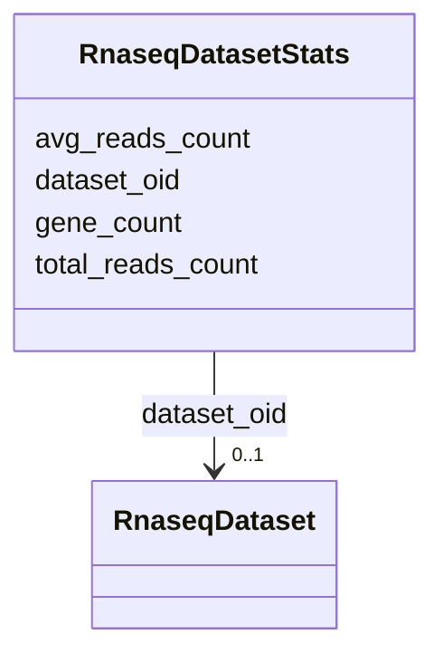

# Class: RnaseqDatasetStats 


URI: [img_rnaseq:RnaseqDatasetStats](https://w3id.org/jgi/img_rnaseq/RnaseqDatasetStats)





<!-- no inheritance hierarchy -->


## Slots

| Name | Cardinality and Range | Description | Inheritance |
| ---  | --- | --- | --- |
| [dataset_oid](dataset_oid.md) | 0..1 <br/> [RnaseqDataset](RnaseqDataset.md) | Foreign key to rnaseq_dataset | direct |
| [gene_count](gene_count.md) | 0..1 <br/> [Float](Float.md) |  | direct |
| [total_reads_count](total_reads_count.md) | 0..1 <br/> [Float](Float.md) |  | direct |
| [avg_reads_count](avg_reads_count.md) | 0..1 <br/> [Float](Float.md) |  | direct |


## Identifier and Mapping Information


### Schema Source


* from schema: https://w3id.org/jgi/img_rnaseq


## Mappings

| Mapping Type | Mapped Value |
| ---  | ---  |
| self | img_rnaseq:RnaseqDatasetStats |
| native | img_rnaseq:RnaseqDatasetStats |


## LinkML Source

<!-- TODO: investigate https://stackoverflow.com/questions/37606292/how-to-create-tabbed-code-blocks-in-mkdocs-or-sphinx -->

### Direct

<details>
```yaml
name: rnaseq_dataset_stats
from_schema: https://w3id.org/jgi/img_rnaseq
attributes:
  dataset_oid:
    name: dataset_oid
    description: Foreign key to rnaseq_dataset
    from_schema: https://w3id.org/jgi/img_rnaseq
    domain_of:
    - rnaseq_dataset
    - rnaseq_dataset_stats
    - rnaseq_sample
    range: rnaseq_dataset
    required: false
  gene_count:
    name: gene_count
    from_schema: https://w3id.org/jgi/img_rnaseq
    rank: 1000
    domain_of:
    - rnaseq_dataset_stats
    - rnaseq_experiment_stats
    range: float
    required: false
  total_reads_count:
    name: total_reads_count
    from_schema: https://w3id.org/jgi/img_rnaseq
    rank: 1000
    domain_of:
    - rnaseq_dataset_stats
    range: float
    required: false
  avg_reads_count:
    name: avg_reads_count
    from_schema: https://w3id.org/jgi/img_rnaseq
    rank: 1000
    domain_of:
    - rnaseq_dataset_stats
    range: float
    required: false

```
</details>

### Induced

<details>
```yaml
name: rnaseq_dataset_stats
from_schema: https://w3id.org/jgi/img_rnaseq
attributes:
  dataset_oid:
    name: dataset_oid
    description: Foreign key to rnaseq_dataset
    from_schema: https://w3id.org/jgi/img_rnaseq
    alias: dataset_oid
    owner: rnaseq_dataset_stats
    domain_of:
    - rnaseq_dataset
    - rnaseq_dataset_stats
    - rnaseq_sample
    range: rnaseq_dataset
    required: false
  gene_count:
    name: gene_count
    from_schema: https://w3id.org/jgi/img_rnaseq
    rank: 1000
    alias: gene_count
    owner: rnaseq_dataset_stats
    domain_of:
    - rnaseq_dataset_stats
    - rnaseq_experiment_stats
    range: float
    required: false
  total_reads_count:
    name: total_reads_count
    from_schema: https://w3id.org/jgi/img_rnaseq
    rank: 1000
    alias: total_reads_count
    owner: rnaseq_dataset_stats
    domain_of:
    - rnaseq_dataset_stats
    range: float
    required: false
  avg_reads_count:
    name: avg_reads_count
    from_schema: https://w3id.org/jgi/img_rnaseq
    rank: 1000
    alias: avg_reads_count
    owner: rnaseq_dataset_stats
    domain_of:
    - rnaseq_dataset_stats
    range: float
    required: false

```
</details>