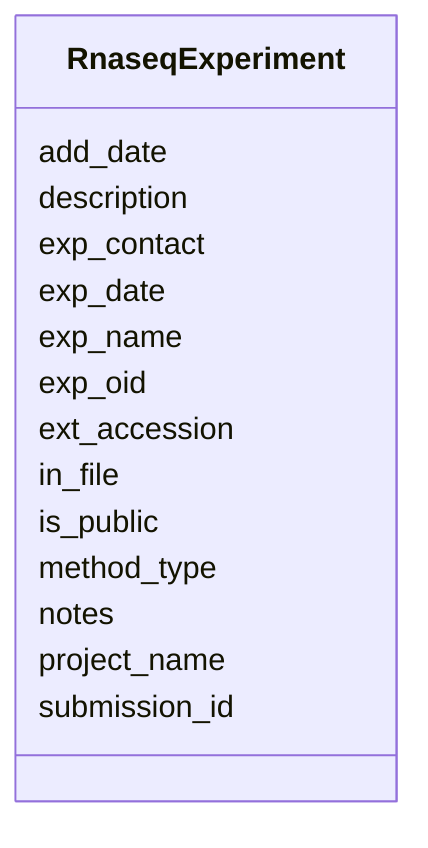

# Class: RnaseqExperiment 


URI: [img_rnaseq:RnaseqExperiment](https://w3id.org/jgi/img_rnaseq/RnaseqExperiment)





<!-- no inheritance hierarchy -->


## Slots

| Name | Cardinality and Range | Description | Inheritance |
| ---  | --- | --- | --- |
| [exp_oid](exp_oid.md) | 0..1 <br/> [Integer](Integer.md) |  | direct |
| [project_name](project_name.md) | 0..1 <br/> [String](String.md) |  | direct |
| [exp_name](exp_name.md) | 0..1 <br/> [String](String.md) |  | direct |
| [description](description.md) | 0..1 <br/> [String](String.md) |  | direct |
| [ext_accession](ext_accession.md) | 0..1 <br/> [String](String.md) |  | direct |
| [exp_date](exp_date.md) | 0..1 <br/> [String](String.md) |  | direct |
| [exp_contact](exp_contact.md) | 0..1 <br/> [String](String.md) |  | direct |
| [method_type](method_type.md) | 0..1 <br/> [String](String.md) |  | direct |
| [add_date](add_date.md) | 0..1 <br/> [Datetime](Datetime.md) |  | direct |
| [notes](notes.md) | 0..1 <br/> [String](String.md) |  | direct |
| [is_public](is_public.md) | 0..1 <br/> [String](String.md) |  | direct |
| [submission_id](submission_id.md) | 0..1 <br/> [Integer](Integer.md) |  | direct |
| [in_file](in_file.md) | 0..1 <br/> [String](String.md) |  | direct |


## Usages

| used by | used in | type | used |
| ---  | --- | --- | --- |
| [RnaseqExperimentExtLinks](RnaseqExperimentExtLinks.md) | [exp_oid](exp_oid.md) | range | [RnaseqExperiment](RnaseqExperiment.md) |
| [RnaseqExperimentPubs](RnaseqExperimentPubs.md) | [exp_oid](exp_oid.md) | range | [RnaseqExperiment](RnaseqExperiment.md) |
| [RnaseqExperimentSop](RnaseqExperimentSop.md) | [exp_oid](exp_oid.md) | range | [RnaseqExperiment](RnaseqExperiment.md) |
| [RnaseqExperimentStats](RnaseqExperimentStats.md) | [exp_oid](exp_oid.md) | range | [RnaseqExperiment](RnaseqExperiment.md) |


## Identifier and Mapping Information


### Schema Source


* from schema: https://w3id.org/jgi/img_rnaseq


## Mappings

| Mapping Type | Mapped Value |
| ---  | ---  |
| self | img_rnaseq:RnaseqExperiment |
| native | img_rnaseq:RnaseqExperiment |


## LinkML Source

<!-- TODO: investigate https://stackoverflow.com/questions/37606292/how-to-create-tabbed-code-blocks-in-mkdocs-or-sphinx -->

### Direct

<details>
```yaml
name: rnaseq_experiment
from_schema: https://w3id.org/jgi/img_rnaseq
attributes:
  exp_oid:
    name: exp_oid
    from_schema: https://w3id.org/jgi/img_rnaseq
    rank: 1000
    domain_of:
    - rnaseq_experiment
    - rnaseq_experiment_ext_links
    - rnaseq_experiment_pubs
    - rnaseq_experiment_sop
    - rnaseq_experiment_stats
    range: integer
    required: false
  project_name:
    name: project_name
    from_schema: https://w3id.org/jgi/img_rnaseq
    rank: 1000
    domain_of:
    - rnaseq_experiment
    range: string
    required: false
  exp_name:
    name: exp_name
    from_schema: https://w3id.org/jgi/img_rnaseq
    rank: 1000
    domain_of:
    - rnaseq_experiment
    range: string
    required: false
  description:
    name: description
    from_schema: https://w3id.org/jgi/img_rnaseq
    rank: 1000
    domain_of:
    - rnaseq_experiment
    - rnaseq_sample
    range: string
    required: false
  ext_accession:
    name: ext_accession
    from_schema: https://w3id.org/jgi/img_rnaseq
    rank: 1000
    domain_of:
    - rnaseq_experiment
    range: string
    required: false
  exp_date:
    name: exp_date
    from_schema: https://w3id.org/jgi/img_rnaseq
    rank: 1000
    domain_of:
    - rnaseq_experiment
    range: string
    required: false
  exp_contact:
    name: exp_contact
    from_schema: https://w3id.org/jgi/img_rnaseq
    rank: 1000
    domain_of:
    - rnaseq_experiment
    range: string
    required: false
  method_type:
    name: method_type
    from_schema: https://w3id.org/jgi/img_rnaseq
    rank: 1000
    domain_of:
    - rnaseq_experiment
    range: string
    required: false
  add_date:
    name: add_date
    from_schema: https://w3id.org/jgi/img_rnaseq
    domain_of:
    - rnaseq_dataset
    - rnaseq_experiment
    - rnaseq_sample
    range: datetime
    required: false
  notes:
    name: notes
    from_schema: https://w3id.org/jgi/img_rnaseq
    domain_of:
    - rnaseq_dataset
    - rnaseq_experiment
    - rnaseq_sample
    range: string
    required: false
  is_public:
    name: is_public
    from_schema: https://w3id.org/jgi/img_rnaseq
    domain_of:
    - rnaseq_dataset
    - rnaseq_experiment
    - rnaseq_sample
    range: string
    required: false
  submission_id:
    name: submission_id
    from_schema: https://w3id.org/jgi/img_rnaseq
    domain_of:
    - rnaseq_dataset
    - rnaseq_experiment
    - rnaseq_sample
    range: integer
    required: false
  in_file:
    name: in_file
    from_schema: https://w3id.org/jgi/img_rnaseq
    domain_of:
    - rnaseq_dataset
    - rnaseq_experiment
    - rnaseq_sample
    range: string
    required: false

```
</details>

### Induced

<details>
```yaml
name: rnaseq_experiment
from_schema: https://w3id.org/jgi/img_rnaseq
attributes:
  exp_oid:
    name: exp_oid
    from_schema: https://w3id.org/jgi/img_rnaseq
    rank: 1000
    alias: exp_oid
    owner: rnaseq_experiment
    domain_of:
    - rnaseq_experiment
    - rnaseq_experiment_ext_links
    - rnaseq_experiment_pubs
    - rnaseq_experiment_sop
    - rnaseq_experiment_stats
    range: integer
    required: false
  project_name:
    name: project_name
    from_schema: https://w3id.org/jgi/img_rnaseq
    rank: 1000
    alias: project_name
    owner: rnaseq_experiment
    domain_of:
    - rnaseq_experiment
    range: string
    required: false
  exp_name:
    name: exp_name
    from_schema: https://w3id.org/jgi/img_rnaseq
    rank: 1000
    alias: exp_name
    owner: rnaseq_experiment
    domain_of:
    - rnaseq_experiment
    range: string
    required: false
  description:
    name: description
    from_schema: https://w3id.org/jgi/img_rnaseq
    rank: 1000
    alias: description
    owner: rnaseq_experiment
    domain_of:
    - rnaseq_experiment
    - rnaseq_sample
    range: string
    required: false
  ext_accession:
    name: ext_accession
    from_schema: https://w3id.org/jgi/img_rnaseq
    rank: 1000
    alias: ext_accession
    owner: rnaseq_experiment
    domain_of:
    - rnaseq_experiment
    range: string
    required: false
  exp_date:
    name: exp_date
    from_schema: https://w3id.org/jgi/img_rnaseq
    rank: 1000
    alias: exp_date
    owner: rnaseq_experiment
    domain_of:
    - rnaseq_experiment
    range: string
    required: false
  exp_contact:
    name: exp_contact
    from_schema: https://w3id.org/jgi/img_rnaseq
    rank: 1000
    alias: exp_contact
    owner: rnaseq_experiment
    domain_of:
    - rnaseq_experiment
    range: string
    required: false
  method_type:
    name: method_type
    from_schema: https://w3id.org/jgi/img_rnaseq
    rank: 1000
    alias: method_type
    owner: rnaseq_experiment
    domain_of:
    - rnaseq_experiment
    range: string
    required: false
  add_date:
    name: add_date
    from_schema: https://w3id.org/jgi/img_rnaseq
    alias: add_date
    owner: rnaseq_experiment
    domain_of:
    - rnaseq_dataset
    - rnaseq_experiment
    - rnaseq_sample
    range: datetime
    required: false
  notes:
    name: notes
    from_schema: https://w3id.org/jgi/img_rnaseq
    alias: notes
    owner: rnaseq_experiment
    domain_of:
    - rnaseq_dataset
    - rnaseq_experiment
    - rnaseq_sample
    range: string
    required: false
  is_public:
    name: is_public
    from_schema: https://w3id.org/jgi/img_rnaseq
    alias: is_public
    owner: rnaseq_experiment
    domain_of:
    - rnaseq_dataset
    - rnaseq_experiment
    - rnaseq_sample
    range: string
    required: false
  submission_id:
    name: submission_id
    from_schema: https://w3id.org/jgi/img_rnaseq
    alias: submission_id
    owner: rnaseq_experiment
    domain_of:
    - rnaseq_dataset
    - rnaseq_experiment
    - rnaseq_sample
    range: integer
    required: false
  in_file:
    name: in_file
    from_schema: https://w3id.org/jgi/img_rnaseq
    alias: in_file
    owner: rnaseq_experiment
    domain_of:
    - rnaseq_dataset
    - rnaseq_experiment
    - rnaseq_sample
    range: string
    required: false

```
</details>