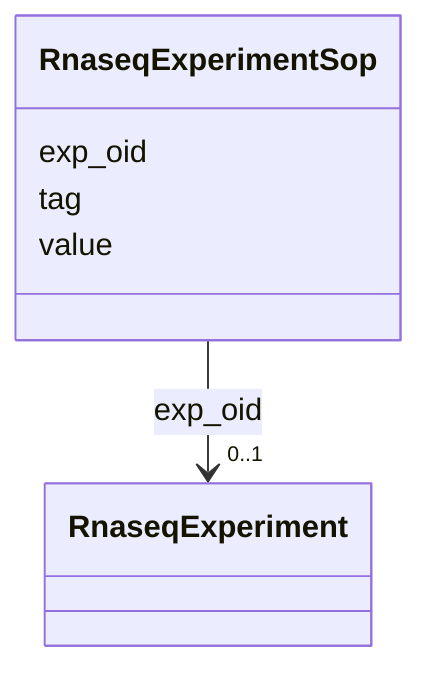

# Class: RnaseqExperimentSop 


URI: [img_rnaseq:RnaseqExperimentSop](https://w3id.org/jgi/img_rnaseq/RnaseqExperimentSop)





<!-- no inheritance hierarchy -->


## Slots

| Name | Cardinality and Range | Description | Inheritance |
| ---  | --- | --- | --- |
| [exp_oid](exp_oid.md) | 0..1 <br/> [RnaseqExperiment](RnaseqExperiment.md) | Foreign key to rnaseq_experiment | direct |
| [tag](tag.md) | 0..1 <br/> [String](String.md) |  | direct |
| [value](value.md) | 0..1 <br/> [String](String.md) |  | direct |


## Identifier and Mapping Information


### Schema Source


* from schema: https://w3id.org/jgi/img_rnaseq


## Mappings

| Mapping Type | Mapped Value |
| ---  | ---  |
| self | img_rnaseq:RnaseqExperimentSop |
| native | img_rnaseq:RnaseqExperimentSop |


## LinkML Source

<!-- TODO: investigate https://stackoverflow.com/questions/37606292/how-to-create-tabbed-code-blocks-in-mkdocs-or-sphinx -->

### Direct

<details>
```yaml
name: rnaseq_experiment_sop
from_schema: https://w3id.org/jgi/img_rnaseq
attributes:
  exp_oid:
    name: exp_oid
    description: Foreign key to rnaseq_experiment
    from_schema: https://w3id.org/jgi/img_rnaseq
    domain_of:
    - rnaseq_experiment
    - rnaseq_experiment_ext_links
    - rnaseq_experiment_pubs
    - rnaseq_experiment_sop
    - rnaseq_experiment_stats
    range: rnaseq_experiment
    required: false
  tag:
    name: tag
    from_schema: https://w3id.org/jgi/img_rnaseq
    rank: 1000
    domain_of:
    - rnaseq_experiment_sop
    - rnaseq_sample_sop
    range: string
    required: false
  value:
    name: value
    from_schema: https://w3id.org/jgi/img_rnaseq
    rank: 1000
    domain_of:
    - rnaseq_experiment_sop
    - rnaseq_sample_sop
    range: string
    required: false

```
</details>

### Induced

<details>
```yaml
name: rnaseq_experiment_sop
from_schema: https://w3id.org/jgi/img_rnaseq
attributes:
  exp_oid:
    name: exp_oid
    description: Foreign key to rnaseq_experiment
    from_schema: https://w3id.org/jgi/img_rnaseq
    alias: exp_oid
    owner: rnaseq_experiment_sop
    domain_of:
    - rnaseq_experiment
    - rnaseq_experiment_ext_links
    - rnaseq_experiment_pubs
    - rnaseq_experiment_sop
    - rnaseq_experiment_stats
    range: rnaseq_experiment
    required: false
  tag:
    name: tag
    from_schema: https://w3id.org/jgi/img_rnaseq
    rank: 1000
    alias: tag
    owner: rnaseq_experiment_sop
    domain_of:
    - rnaseq_experiment_sop
    - rnaseq_sample_sop
    range: string
    required: false
  value:
    name: value
    from_schema: https://w3id.org/jgi/img_rnaseq
    rank: 1000
    alias: value
    owner: rnaseq_experiment_sop
    domain_of:
    - rnaseq_experiment_sop
    - rnaseq_sample_sop
    range: string
    required: false

```
</details>