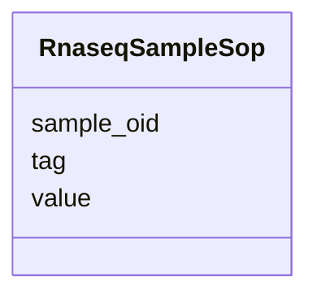

# Class: RnaseqSampleSop 


URI: [img_rnaseq:RnaseqSampleSop](https://w3id.org/jgi/img_rnaseq/RnaseqSampleSop)





<!-- no inheritance hierarchy -->


## Slots

| Name | Cardinality and Range | Description | Inheritance |
| ---  | --- | --- | --- |
| [sample_oid](sample_oid.md) | 0..1 <br/> [String](String.md) |  | direct |
| [tag](tag.md) | 0..1 <br/> [String](String.md) |  | direct |
| [value](value.md) | 0..1 <br/> [String](String.md) |  | direct |


## Identifier and Mapping Information


### Schema Source


* from schema: https://w3id.org/jgi/img_rnaseq


## Mappings

| Mapping Type | Mapped Value |
| ---  | ---  |
| self | img_rnaseq:RnaseqSampleSop |
| native | img_rnaseq:RnaseqSampleSop |


## LinkML Source

<!-- TODO: investigate https://stackoverflow.com/questions/37606292/how-to-create-tabbed-code-blocks-in-mkdocs-or-sphinx -->

### Direct

<details>
```yaml
name: rnaseq_sample_sop
from_schema: https://w3id.org/jgi/img_rnaseq
attributes:
  sample_oid:
    name: sample_oid
    from_schema: https://w3id.org/jgi/img_rnaseq
    domain_of:
    - rnaseq_dataset
    - rnaseq_sample
    - rnaseq_sample_ext_links
    - rnaseq_sample_sop
    range: string
    required: false
  tag:
    name: tag
    from_schema: https://w3id.org/jgi/img_rnaseq
    domain_of:
    - rnaseq_experiment_sop
    - rnaseq_sample_sop
    range: string
    required: false
  value:
    name: value
    from_schema: https://w3id.org/jgi/img_rnaseq
    domain_of:
    - rnaseq_experiment_sop
    - rnaseq_sample_sop
    range: string
    required: false

```
</details>

### Induced

<details>
```yaml
name: rnaseq_sample_sop
from_schema: https://w3id.org/jgi/img_rnaseq
attributes:
  sample_oid:
    name: sample_oid
    from_schema: https://w3id.org/jgi/img_rnaseq
    alias: sample_oid
    owner: rnaseq_sample_sop
    domain_of:
    - rnaseq_dataset
    - rnaseq_sample
    - rnaseq_sample_ext_links
    - rnaseq_sample_sop
    range: string
    required: false
  tag:
    name: tag
    from_schema: https://w3id.org/jgi/img_rnaseq
    alias: tag
    owner: rnaseq_sample_sop
    domain_of:
    - rnaseq_experiment_sop
    - rnaseq_sample_sop
    range: string
    required: false
  value:
    name: value
    from_schema: https://w3id.org/jgi/img_rnaseq
    alias: value
    owner: rnaseq_sample_sop
    domain_of:
    - rnaseq_experiment_sop
    - rnaseq_sample_sop
    range: string
    required: false

```
</details>