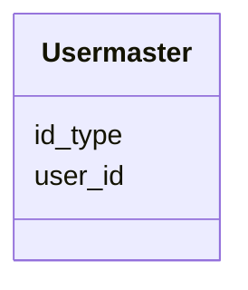

# Class: Usermaster 


URI: [img_rnaseq:Usermaster](https://w3id.org/jgi/img_rnaseq/Usermaster)





<!-- no inheritance hierarchy -->


## Slots

| Name | Cardinality and Range | Description | Inheritance |
| ---  | --- | --- | --- |
| [user_id](user_id.md) | 0..1 <br/> [Float](Float.md) |  | direct |
| [id_type](id_type.md) | 0..1 <br/> [String](String.md) |  | direct |


## Identifier and Mapping Information


### Schema Source


* from schema: https://w3id.org/jgi/img_rnaseq


## Mappings

| Mapping Type | Mapped Value |
| ---  | ---  |
| self | img_rnaseq:Usermaster |
| native | img_rnaseq:Usermaster |


## LinkML Source

<!-- TODO: investigate https://stackoverflow.com/questions/37606292/how-to-create-tabbed-code-blocks-in-mkdocs-or-sphinx -->

### Direct

<details>
```yaml
name: usermaster
from_schema: https://w3id.org/jgi/img_rnaseq
attributes:
  user_id:
    name: user_id
    from_schema: https://w3id.org/jgi/img_rnaseq
    rank: 1000
    domain_of:
    - usermaster
    range: float
    required: false
  id_type:
    name: id_type
    from_schema: https://w3id.org/jgi/img_rnaseq
    rank: 1000
    domain_of:
    - usermaster
    range: string
    required: false

```
</details>

### Induced

<details>
```yaml
name: usermaster
from_schema: https://w3id.org/jgi/img_rnaseq
attributes:
  user_id:
    name: user_id
    from_schema: https://w3id.org/jgi/img_rnaseq
    rank: 1000
    alias: user_id
    owner: usermaster
    domain_of:
    - usermaster
    range: float
    required: false
  id_type:
    name: id_type
    from_schema: https://w3id.org/jgi/img_rnaseq
    rank: 1000
    alias: id_type
    owner: usermaster
    domain_of:
    - usermaster
    range: string
    required: false

```
</details>