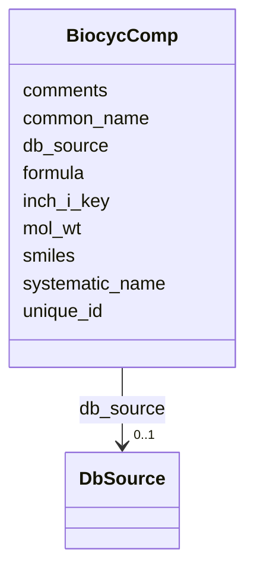

# Class: BiocycComp 


URI: [img_sat_v450:BiocycComp](https://w3id.org/jgi/img_sat_v450/BiocycComp)





<!-- no inheritance hierarchy -->


## Slots

| Name | Cardinality and Range | Description | Inheritance |
| ---  | --- | --- | --- |
| [unique_id](unique_id.md) | 0..1 <br/> [String](String.md) |  | direct |
| [common_name](common_name.md) | 0..1 <br/> [String](String.md) |  | direct |
| [systematic_name](systematic_name.md) | 0..1 <br/> [String](String.md) |  | direct |
| [comments](comments.md) | 0..1 <br/> [String](String.md) |  | direct |
| [mol_wt](mol_wt.md) | 0..1 <br/> [Float](Float.md) |  | direct |
| [smiles](smiles.md) | 0..1 <br/> [String](String.md) |  | direct |
| [db_source](db_source.md) | 0..1 <br/> [DbSource](DbSource.md) | Foreign key to db_source | direct |
| [formula](formula.md) | 0..1 <br/> [String](String.md) |  | direct |
| [inch_i_key](inch_i_key.md) | 0..1 <br/> [String](String.md) |  | direct |


## Usages

| used by | used in | type | used |
| ---  | --- | --- | --- |
| [BiocycCompExtLinks](BiocycCompExtLinks.md) | [unique_id](unique_id.md) | range | [BiocycComp](BiocycComp.md) |
| [BiocycCompSynonyms](BiocycCompSynonyms.md) | [unique_id](unique_id.md) | range | [BiocycComp](BiocycComp.md) |
| [BiocycCompTypes](BiocycCompTypes.md) | [unique_id](unique_id.md) | range | [BiocycComp](BiocycComp.md) |
| [BiocycReactionLeftHand](BiocycReactionLeftHand.md) | [substrate](substrate.md) | range | [BiocycComp](BiocycComp.md) |
| [BiocycReactionRightHand](BiocycReactionRightHand.md) | [substrate](substrate.md) | range | [BiocycComp](BiocycComp.md) |


## Identifier and Mapping Information


### Schema Source


* from schema: https://w3id.org/jgi/img_sat_v450


## Mappings

| Mapping Type | Mapped Value |
| ---  | ---  |
| self | img_sat_v450:BiocycComp |
| native | img_sat_v450:BiocycComp |


## LinkML Source

<!-- TODO: investigate https://stackoverflow.com/questions/37606292/how-to-create-tabbed-code-blocks-in-mkdocs-or-sphinx -->

### Direct

<details>
```yaml
name: biocyc_comp
from_schema: https://w3id.org/jgi/img_sat_v450
attributes:
  unique_id:
    name: unique_id
    from_schema: https://w3id.org/jgi/img_sat_v450
    domain_of:
    - biocyc_class
    - biocyc_class_parents
    - biocyc_class_synonyms
    - biocyc_class_types
    - biocyc_comp
    - biocyc_comp_ext_links
    - biocyc_comp_synonyms
    - biocyc_comp_types
    - biocyc_enzrxn
    - biocyc_enzrxn_ext_links
    - biocyc_enzrxn_prosth_groups
    - biocyc_enzrxn_synonyms
    - biocyc_pathway
    - biocyc_pathway_comments
    - biocyc_pathway_ext_links
    - biocyc_pathway_in_species
    - biocyc_pathway_pwy_links
    - biocyc_pathway_sub_pwys
    - biocyc_pathway_super_pwys
    - biocyc_pathway_taxon_range
    - biocyc_pathway_types
    - biocyc_protein
    - biocyc_protein_catalyzes
    - biocyc_protein_ext_links
    - biocyc_protein_in_species
    - biocyc_protein_synonyms
    - biocyc_protein_types
    - biocyc_reaction
    - biocyc_reaction_ext_links
    - biocyc_reaction_in_pwys
    - biocyc_reaction_left_hand
    - biocyc_reaction_right_hand
    - biocyc_reaction_synonyms
    - biocyc_reaction_types
    range: string
    required: false
  common_name:
    name: common_name
    from_schema: https://w3id.org/jgi/img_sat_v450
    domain_of:
    - biocyc_class
    - biocyc_comp
    - biocyc_enzrxn
    - biocyc_pathway
    - biocyc_protein
    - biocyc_reaction
    - compound
    range: string
    required: false
  systematic_name:
    name: systematic_name
    from_schema: https://w3id.org/jgi/img_sat_v450
    rank: 1000
    domain_of:
    - biocyc_comp
    - biocyc_protein
    - enzyme
    - enzyme_transferred
    range: string
    required: false
  comments:
    name: comments
    from_schema: https://w3id.org/jgi/img_sat_v450
    domain_of:
    - biocyc_class
    - biocyc_comp
    - biocyc_enzrxn
    - biocyc_pathway_comments
    - biocyc_protein
    - biocyc_reaction
    - enzyme
    - enzyme_transferred
    - go_term
    - pfam_clan
    - pfam_dead
    - pfam_family
    - reaction
    range: string
    required: false
  mol_wt:
    name: mol_wt
    from_schema: https://w3id.org/jgi/img_sat_v450
    rank: 1000
    domain_of:
    - biocyc_comp
    range: float
    required: false
  smiles:
    name: smiles
    from_schema: https://w3id.org/jgi/img_sat_v450
    rank: 1000
    domain_of:
    - biocyc_comp
    - compound
    range: string
    required: false
  db_source:
    name: db_source
    description: Foreign key to db_source
    from_schema: https://w3id.org/jgi/img_sat_v450
    rank: 1000
    domain_of:
    - biocyc_comp
    - cog
    - compound
    - go_term
    - kegg_pathway
    - kog
    - pfam_family
    range: db_source
    required: false
  formula:
    name: formula
    from_schema: https://w3id.org/jgi/img_sat_v450
    rank: 1000
    domain_of:
    - biocyc_comp
    - compound
    range: string
    required: false
  inch_i_key:
    name: inch_i_key
    from_schema: https://w3id.org/jgi/img_sat_v450
    rank: 1000
    domain_of:
    - biocyc_comp
    range: string
    required: false

```
</details>

### Induced

<details>
```yaml
name: biocyc_comp
from_schema: https://w3id.org/jgi/img_sat_v450
attributes:
  unique_id:
    name: unique_id
    from_schema: https://w3id.org/jgi/img_sat_v450
    alias: unique_id
    owner: biocyc_comp
    domain_of:
    - biocyc_class
    - biocyc_class_parents
    - biocyc_class_synonyms
    - biocyc_class_types
    - biocyc_comp
    - biocyc_comp_ext_links
    - biocyc_comp_synonyms
    - biocyc_comp_types
    - biocyc_enzrxn
    - biocyc_enzrxn_ext_links
    - biocyc_enzrxn_prosth_groups
    - biocyc_enzrxn_synonyms
    - biocyc_pathway
    - biocyc_pathway_comments
    - biocyc_pathway_ext_links
    - biocyc_pathway_in_species
    - biocyc_pathway_pwy_links
    - biocyc_pathway_sub_pwys
    - biocyc_pathway_super_pwys
    - biocyc_pathway_taxon_range
    - biocyc_pathway_types
    - biocyc_protein
    - biocyc_protein_catalyzes
    - biocyc_protein_ext_links
    - biocyc_protein_in_species
    - biocyc_protein_synonyms
    - biocyc_protein_types
    - biocyc_reaction
    - biocyc_reaction_ext_links
    - biocyc_reaction_in_pwys
    - biocyc_reaction_left_hand
    - biocyc_reaction_right_hand
    - biocyc_reaction_synonyms
    - biocyc_reaction_types
    range: string
    required: false
  common_name:
    name: common_name
    from_schema: https://w3id.org/jgi/img_sat_v450
    alias: common_name
    owner: biocyc_comp
    domain_of:
    - biocyc_class
    - biocyc_comp
    - biocyc_enzrxn
    - biocyc_pathway
    - biocyc_protein
    - biocyc_reaction
    - compound
    range: string
    required: false
  systematic_name:
    name: systematic_name
    from_schema: https://w3id.org/jgi/img_sat_v450
    rank: 1000
    alias: systematic_name
    owner: biocyc_comp
    domain_of:
    - biocyc_comp
    - biocyc_protein
    - enzyme
    - enzyme_transferred
    range: string
    required: false
  comments:
    name: comments
    from_schema: https://w3id.org/jgi/img_sat_v450
    alias: comments
    owner: biocyc_comp
    domain_of:
    - biocyc_class
    - biocyc_comp
    - biocyc_enzrxn
    - biocyc_pathway_comments
    - biocyc_protein
    - biocyc_reaction
    - enzyme
    - enzyme_transferred
    - go_term
    - pfam_clan
    - pfam_dead
    - pfam_family
    - reaction
    range: string
    required: false
  mol_wt:
    name: mol_wt
    from_schema: https://w3id.org/jgi/img_sat_v450
    rank: 1000
    alias: mol_wt
    owner: biocyc_comp
    domain_of:
    - biocyc_comp
    range: float
    required: false
  smiles:
    name: smiles
    from_schema: https://w3id.org/jgi/img_sat_v450
    rank: 1000
    alias: smiles
    owner: biocyc_comp
    domain_of:
    - biocyc_comp
    - compound
    range: string
    required: false
  db_source:
    name: db_source
    description: Foreign key to db_source
    from_schema: https://w3id.org/jgi/img_sat_v450
    rank: 1000
    alias: db_source
    owner: biocyc_comp
    domain_of:
    - biocyc_comp
    - cog
    - compound
    - go_term
    - kegg_pathway
    - kog
    - pfam_family
    range: db_source
    required: false
  formula:
    name: formula
    from_schema: https://w3id.org/jgi/img_sat_v450
    rank: 1000
    alias: formula
    owner: biocyc_comp
    domain_of:
    - biocyc_comp
    - compound
    range: string
    required: false
  inch_i_key:
    name: inch_i_key
    from_schema: https://w3id.org/jgi/img_sat_v450
    rank: 1000
    alias: inch_i_key
    owner: biocyc_comp
    domain_of:
    - biocyc_comp
    range: string
    required: false

```
</details>