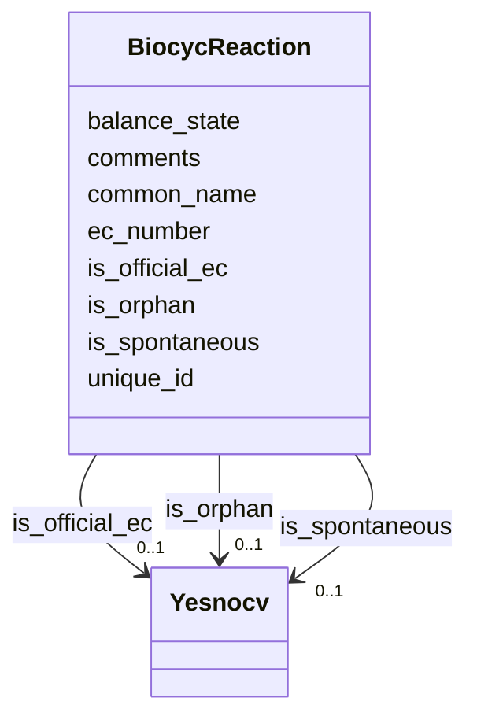

# Class: BiocycReaction 


URI: [img_sat_v450:BiocycReaction](https://w3id.org/jgi/img_sat_v450/BiocycReaction)





<!-- no inheritance hierarchy -->


## Slots

| Name | Cardinality and Range | Description | Inheritance |
| ---  | --- | --- | --- |
| [unique_id](unique_id.md) | 0..1 <br/> [String](String.md) |  | direct |
| [common_name](common_name.md) | 0..1 <br/> [String](String.md) |  | direct |
| [balance_state](balance_state.md) | 0..1 <br/> [String](String.md) |  | direct |
| [ec_number](ec_number.md) | 0..1 <br/> [String](String.md) |  | direct |
| [is_official_ec](is_official_ec.md) | 0..1 <br/> [Yesnocv](Yesnocv.md) | Foreign key to yesnocv | direct |
| [is_orphan](is_orphan.md) | 0..1 <br/> [Yesnocv](Yesnocv.md) | Foreign key to yesnocv | direct |
| [is_spontaneous](is_spontaneous.md) | 0..1 <br/> [Yesnocv](Yesnocv.md) | Foreign key to yesnocv | direct |
| [comments](comments.md) | 0..1 <br/> [String](String.md) |  | direct |


## Usages

| used by | used in | type | used |
| ---  | --- | --- | --- |
| [BiocycEnzrxn](BiocycEnzrxn.md) | [Reaction](Reaction.md) | range | [BiocycReaction](BiocycReaction.md) |
| [BiocycReactionExtLinks](BiocycReactionExtLinks.md) | [unique_id](unique_id.md) | range | [BiocycReaction](BiocycReaction.md) |
| [BiocycReactionInPwys](BiocycReactionInPwys.md) | [unique_id](unique_id.md) | range | [BiocycReaction](BiocycReaction.md) |
| [BiocycReactionLeftHand](BiocycReactionLeftHand.md) | [unique_id](unique_id.md) | range | [BiocycReaction](BiocycReaction.md) |
| [BiocycReactionRightHand](BiocycReactionRightHand.md) | [unique_id](unique_id.md) | range | [BiocycReaction](BiocycReaction.md) |
| [BiocycReactionSynonyms](BiocycReactionSynonyms.md) | [unique_id](unique_id.md) | range | [BiocycReaction](BiocycReaction.md) |
| [BiocycReactionTypes](BiocycReactionTypes.md) | [unique_id](unique_id.md) | range | [BiocycReaction](BiocycReaction.md) |


## Identifier and Mapping Information


### Schema Source


* from schema: https://w3id.org/jgi/img_sat_v450


## Mappings

| Mapping Type | Mapped Value |
| ---  | ---  |
| self | img_sat_v450:BiocycReaction |
| native | img_sat_v450:BiocycReaction |


## LinkML Source

<!-- TODO: investigate https://stackoverflow.com/questions/37606292/how-to-create-tabbed-code-blocks-in-mkdocs-or-sphinx -->

### Direct

<details>
```yaml
name: biocyc_reaction
from_schema: https://w3id.org/jgi/img_sat_v450
attributes:
  unique_id:
    name: unique_id
    from_schema: https://w3id.org/jgi/img_sat_v450
    domain_of:
    - biocyc_class
    - biocyc_class_parents
    - biocyc_class_synonyms
    - biocyc_class_types
    - biocyc_comp
    - biocyc_comp_ext_links
    - biocyc_comp_synonyms
    - biocyc_comp_types
    - biocyc_enzrxn
    - biocyc_enzrxn_ext_links
    - biocyc_enzrxn_prosth_groups
    - biocyc_enzrxn_synonyms
    - biocyc_pathway
    - biocyc_pathway_comments
    - biocyc_pathway_ext_links
    - biocyc_pathway_in_species
    - biocyc_pathway_pwy_links
    - biocyc_pathway_sub_pwys
    - biocyc_pathway_super_pwys
    - biocyc_pathway_taxon_range
    - biocyc_pathway_types
    - biocyc_protein
    - biocyc_protein_catalyzes
    - biocyc_protein_ext_links
    - biocyc_protein_in_species
    - biocyc_protein_synonyms
    - biocyc_protein_types
    - biocyc_reaction
    - biocyc_reaction_ext_links
    - biocyc_reaction_in_pwys
    - biocyc_reaction_left_hand
    - biocyc_reaction_right_hand
    - biocyc_reaction_synonyms
    - biocyc_reaction_types
    range: string
    required: false
  common_name:
    name: common_name
    from_schema: https://w3id.org/jgi/img_sat_v450
    domain_of:
    - biocyc_class
    - biocyc_comp
    - biocyc_enzrxn
    - biocyc_pathway
    - biocyc_protein
    - biocyc_reaction
    - compound
    range: string
    required: false
  balance_state:
    name: balance_state
    from_schema: https://w3id.org/jgi/img_sat_v450
    rank: 1000
    domain_of:
    - biocyc_reaction
    range: string
    required: false
  ec_number:
    name: ec_number
    from_schema: https://w3id.org/jgi/img_sat_v450
    domain_of:
    - biocyc_protein_catalyzes
    - biocyc_reaction
    - enzyme
    - enzyme_enz_aliases
    - enzyme_ext_links
    - enzyme_products
    - enzyme_substrates
    - enzyme_transferred
    - ko2ec
    range: string
    required: false
  is_official_ec:
    name: is_official_ec
    description: Foreign key to yesnocv
    from_schema: https://w3id.org/jgi/img_sat_v450
    rank: 1000
    domain_of:
    - biocyc_reaction
    range: yesnocv
    required: false
  is_orphan:
    name: is_orphan
    description: Foreign key to yesnocv
    from_schema: https://w3id.org/jgi/img_sat_v450
    rank: 1000
    domain_of:
    - biocyc_reaction
    range: yesnocv
    required: false
  is_spontaneous:
    name: is_spontaneous
    description: Foreign key to yesnocv
    from_schema: https://w3id.org/jgi/img_sat_v450
    rank: 1000
    domain_of:
    - biocyc_reaction
    range: yesnocv
    required: false
  comments:
    name: comments
    from_schema: https://w3id.org/jgi/img_sat_v450
    domain_of:
    - biocyc_class
    - biocyc_comp
    - biocyc_enzrxn
    - biocyc_pathway_comments
    - biocyc_protein
    - biocyc_reaction
    - enzyme
    - enzyme_transferred
    - go_term
    - pfam_clan
    - pfam_dead
    - pfam_family
    - reaction
    range: string
    required: false

```
</details>

### Induced

<details>
```yaml
name: biocyc_reaction
from_schema: https://w3id.org/jgi/img_sat_v450
attributes:
  unique_id:
    name: unique_id
    from_schema: https://w3id.org/jgi/img_sat_v450
    alias: unique_id
    owner: biocyc_reaction
    domain_of:
    - biocyc_class
    - biocyc_class_parents
    - biocyc_class_synonyms
    - biocyc_class_types
    - biocyc_comp
    - biocyc_comp_ext_links
    - biocyc_comp_synonyms
    - biocyc_comp_types
    - biocyc_enzrxn
    - biocyc_enzrxn_ext_links
    - biocyc_enzrxn_prosth_groups
    - biocyc_enzrxn_synonyms
    - biocyc_pathway
    - biocyc_pathway_comments
    - biocyc_pathway_ext_links
    - biocyc_pathway_in_species
    - biocyc_pathway_pwy_links
    - biocyc_pathway_sub_pwys
    - biocyc_pathway_super_pwys
    - biocyc_pathway_taxon_range
    - biocyc_pathway_types
    - biocyc_protein
    - biocyc_protein_catalyzes
    - biocyc_protein_ext_links
    - biocyc_protein_in_species
    - biocyc_protein_synonyms
    - biocyc_protein_types
    - biocyc_reaction
    - biocyc_reaction_ext_links
    - biocyc_reaction_in_pwys
    - biocyc_reaction_left_hand
    - biocyc_reaction_right_hand
    - biocyc_reaction_synonyms
    - biocyc_reaction_types
    range: string
    required: false
  common_name:
    name: common_name
    from_schema: https://w3id.org/jgi/img_sat_v450
    alias: common_name
    owner: biocyc_reaction
    domain_of:
    - biocyc_class
    - biocyc_comp
    - biocyc_enzrxn
    - biocyc_pathway
    - biocyc_protein
    - biocyc_reaction
    - compound
    range: string
    required: false
  balance_state:
    name: balance_state
    from_schema: https://w3id.org/jgi/img_sat_v450
    rank: 1000
    alias: balance_state
    owner: biocyc_reaction
    domain_of:
    - biocyc_reaction
    range: string
    required: false
  ec_number:
    name: ec_number
    from_schema: https://w3id.org/jgi/img_sat_v450
    alias: ec_number
    owner: biocyc_reaction
    domain_of:
    - biocyc_protein_catalyzes
    - biocyc_reaction
    - enzyme
    - enzyme_enz_aliases
    - enzyme_ext_links
    - enzyme_products
    - enzyme_substrates
    - enzyme_transferred
    - ko2ec
    range: string
    required: false
  is_official_ec:
    name: is_official_ec
    description: Foreign key to yesnocv
    from_schema: https://w3id.org/jgi/img_sat_v450
    rank: 1000
    alias: is_official_ec
    owner: biocyc_reaction
    domain_of:
    - biocyc_reaction
    range: yesnocv
    required: false
  is_orphan:
    name: is_orphan
    description: Foreign key to yesnocv
    from_schema: https://w3id.org/jgi/img_sat_v450
    rank: 1000
    alias: is_orphan
    owner: biocyc_reaction
    domain_of:
    - biocyc_reaction
    range: yesnocv
    required: false
  is_spontaneous:
    name: is_spontaneous
    description: Foreign key to yesnocv
    from_schema: https://w3id.org/jgi/img_sat_v450
    rank: 1000
    alias: is_spontaneous
    owner: biocyc_reaction
    domain_of:
    - biocyc_reaction
    range: yesnocv
    required: false
  comments:
    name: comments
    from_schema: https://w3id.org/jgi/img_sat_v450
    alias: comments
    owner: biocyc_reaction
    domain_of:
    - biocyc_class
    - biocyc_comp
    - biocyc_enzrxn
    - biocyc_pathway_comments
    - biocyc_protein
    - biocyc_reaction
    - enzyme
    - enzyme_transferred
    - go_term
    - pfam_clan
    - pfam_dead
    - pfam_family
    - reaction
    range: string
    required: false

```
</details>