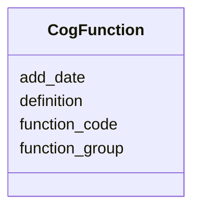

# Class: CogFunction 


URI: [img_sat_v450:CogFunction](https://w3id.org/jgi/img_sat_v450/CogFunction)





<!-- no inheritance hierarchy -->


## Slots

| Name | Cardinality and Range | Description | Inheritance |
| ---  | --- | --- | --- |
| [function_code](function_code.md) | 0..1 <br/> [String](String.md) |  | direct |
| [definition](definition.md) | 0..1 <br/> [String](String.md) |  | direct |
| [function_group](function_group.md) | 0..1 <br/> [String](String.md) |  | direct |
| [add_date](add_date.md) | 0..1 <br/> [Datetime](Datetime.md) |  | direct |


## Usages

| used by | used in | type | used |
| ---  | --- | --- | --- |
| [CogPathway](CogPathway.md) | [function](function.md) | range | [CogFunction](CogFunction.md) |
| [PfamFamilyCogs](PfamFamilyCogs.md) | [functions](functions.md) | range | [CogFunction](CogFunction.md) |


## Identifier and Mapping Information


### Schema Source


* from schema: https://w3id.org/jgi/img_sat_v450


## Mappings

| Mapping Type | Mapped Value |
| ---  | ---  |
| self | img_sat_v450:CogFunction |
| native | img_sat_v450:CogFunction |


## LinkML Source

<!-- TODO: investigate https://stackoverflow.com/questions/37606292/how-to-create-tabbed-code-blocks-in-mkdocs-or-sphinx -->

### Direct

<details>
```yaml
name: cog_function
from_schema: https://w3id.org/jgi/img_sat_v450
attributes:
  function_code:
    name: function_code
    from_schema: https://w3id.org/jgi/img_sat_v450
    rank: 1000
    domain_of:
    - cog_function
    - kog_function
    range: string
    required: false
  definition:
    name: definition
    from_schema: https://w3id.org/jgi/img_sat_v450
    rank: 1000
    domain_of:
    - cog_function
    - go_term
    - kegg_module
    - ko_term
    - kog_function
    range: string
    required: false
  function_group:
    name: function_group
    from_schema: https://w3id.org/jgi/img_sat_v450
    rank: 1000
    domain_of:
    - cog_function
    - eggnog_hierarchy
    - kog_function
    range: string
    required: false
  add_date:
    name: add_date
    from_schema: https://w3id.org/jgi/img_sat_v450
    domain_of:
    - cog
    - cog_function
    - cog_species
    - compound
    - enzyme
    - enzyme_transferred
    - genome_property
    - go_graph_path
    - go_term
    - image_roi
    - kegg_pathway
    - km_image_roi
    - ko_term
    - kog
    - kog_function
    - mpw_pgl_pathway
    - pfam_clan
    - pfam_family
    - property_step
    - reaction
    - tigr_role
    - tigrfam
    range: datetime
    required: false

```
</details>

### Induced

<details>
```yaml
name: cog_function
from_schema: https://w3id.org/jgi/img_sat_v450
attributes:
  function_code:
    name: function_code
    from_schema: https://w3id.org/jgi/img_sat_v450
    rank: 1000
    alias: function_code
    owner: cog_function
    domain_of:
    - cog_function
    - kog_function
    range: string
    required: false
  definition:
    name: definition
    from_schema: https://w3id.org/jgi/img_sat_v450
    rank: 1000
    alias: definition
    owner: cog_function
    domain_of:
    - cog_function
    - go_term
    - kegg_module
    - ko_term
    - kog_function
    range: string
    required: false
  function_group:
    name: function_group
    from_schema: https://w3id.org/jgi/img_sat_v450
    rank: 1000
    alias: function_group
    owner: cog_function
    domain_of:
    - cog_function
    - eggnog_hierarchy
    - kog_function
    range: string
    required: false
  add_date:
    name: add_date
    from_schema: https://w3id.org/jgi/img_sat_v450
    alias: add_date
    owner: cog_function
    domain_of:
    - cog
    - cog_function
    - cog_species
    - compound
    - enzyme
    - enzyme_transferred
    - genome_property
    - go_graph_path
    - go_term
    - image_roi
    - kegg_pathway
    - km_image_roi
    - ko_term
    - kog
    - kog_function
    - mpw_pgl_pathway
    - pfam_clan
    - pfam_family
    - property_step
    - reaction
    - tigr_role
    - tigrfam
    range: datetime
    required: false

```
</details>