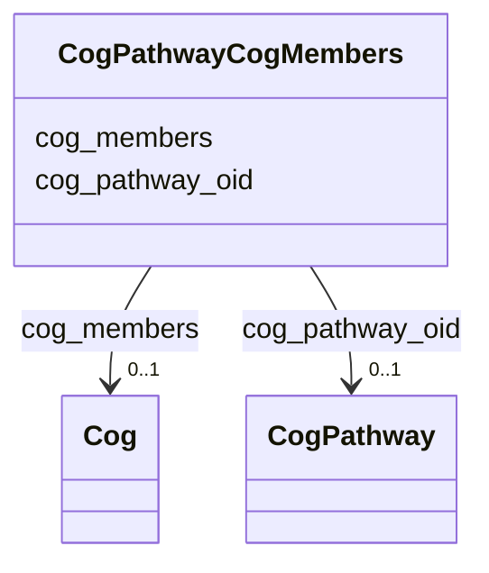

# Class: CogPathwayCogMembers 


URI: [img_sat_v450:CogPathwayCogMembers](https://w3id.org/jgi/img_sat_v450/CogPathwayCogMembers)





<!-- no inheritance hierarchy -->


## Slots

| Name | Cardinality and Range | Description | Inheritance |
| ---  | --- | --- | --- |
| [cog_pathway_oid](cog_pathway_oid.md) | 0..1 <br/> [CogPathway](CogPathway.md) | Foreign key to cog_pathway | direct |
| [cog_members](cog_members.md) | 0..1 <br/> [Cog](Cog.md) | Foreign key to cog | direct |


## Identifier and Mapping Information


### Schema Source


* from schema: https://w3id.org/jgi/img_sat_v450


## Mappings

| Mapping Type | Mapped Value |
| ---  | ---  |
| self | img_sat_v450:CogPathwayCogMembers |
| native | img_sat_v450:CogPathwayCogMembers |


## LinkML Source

<!-- TODO: investigate https://stackoverflow.com/questions/37606292/how-to-create-tabbed-code-blocks-in-mkdocs-or-sphinx -->

### Direct

<details>
```yaml
name: cog_pathway_cog_members
from_schema: https://w3id.org/jgi/img_sat_v450
attributes:
  cog_pathway_oid:
    name: cog_pathway_oid
    description: Foreign key to cog_pathway
    from_schema: https://w3id.org/jgi/img_sat_v450
    domain_of:
    - cog_pathway
    - cog_pathway_cog_members
    range: cog_pathway
    required: false
  cog_members:
    name: cog_members
    description: Foreign key to cog
    from_schema: https://w3id.org/jgi/img_sat_v450
    rank: 1000
    domain_of:
    - cog_pathway_cog_members
    range: cog
    required: false

```
</details>

### Induced

<details>
```yaml
name: cog_pathway_cog_members
from_schema: https://w3id.org/jgi/img_sat_v450
attributes:
  cog_pathway_oid:
    name: cog_pathway_oid
    description: Foreign key to cog_pathway
    from_schema: https://w3id.org/jgi/img_sat_v450
    alias: cog_pathway_oid
    owner: cog_pathway_cog_members
    domain_of:
    - cog_pathway
    - cog_pathway_cog_members
    range: cog_pathway
    required: false
  cog_members:
    name: cog_members
    description: Foreign key to cog
    from_schema: https://w3id.org/jgi/img_sat_v450
    rank: 1000
    alias: cog_members
    owner: cog_pathway_cog_members
    domain_of:
    - cog_pathway_cog_members
    range: cog
    required: false

```
</details>