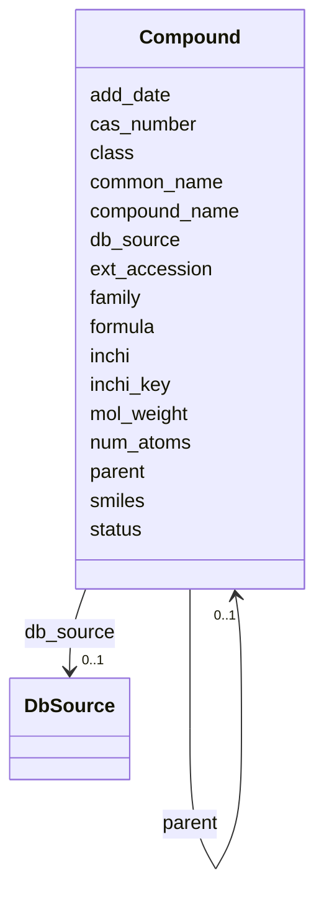

# Class: Compound 


URI: [img_sat_v450:Compound](https://w3id.org/jgi/img_sat_v450/Compound)





<!-- no inheritance hierarchy -->


## Slots

| Name | Cardinality and Range | Description | Inheritance |
| ---  | --- | --- | --- |
| [ext_accession](ext_accession.md) | 0..1 <br/> [String](String.md) |  | direct |
| [db_source](db_source.md) | 0..1 <br/> [DbSource](DbSource.md) | Foreign key to db_source | direct |
| [compound_name](compound_name.md) | 0..1 <br/> [String](String.md) |  | direct |
| [common_name](common_name.md) | 0..1 <br/> [String](String.md) |  | direct |
| [class](class.md) | 0..1 <br/> [String](String.md) |  | direct |
| [formula](formula.md) | 0..1 <br/> [String](String.md) |  | direct |
| [parent](parent.md) | 0..1 <br/> [Compound](Compound.md) | Foreign key to compound | direct |
| [status](status.md) | 0..1 <br/> [String](String.md) |  | direct |
| [add_date](add_date.md) | 0..1 <br/> [Datetime](Datetime.md) |  | direct |
| [family](family.md) | 0..1 <br/> [String](String.md) |  | direct |
| [mol_weight](mol_weight.md) | 0..1 <br/> [Float](Float.md) |  | direct |
| [num_atoms](num_atoms.md) | 0..1 <br/> [Float](Float.md) |  | direct |
| [smiles](smiles.md) | 0..1 <br/> [String](String.md) |  | direct |
| [inchi](inchi.md) | 0..1 <br/> [String](String.md) |  | direct |
| [inchi_key](inchi_key.md) | 0..1 <br/> [String](String.md) |  | direct |
| [cas_number](cas_number.md) | 0..1 <br/> [String](String.md) |  | direct |


## Usages

| used by | used in | type | used |
| ---  | --- | --- | --- |
| [Compound](Compound.md) | [parent](parent.md) | range | [Compound](Compound.md) |
| [CompoundAliases](CompoundAliases.md) | [ext_accession](ext_accession.md) | range | [Compound](Compound.md) |
| [CompoundExtLinks](CompoundExtLinks.md) | [ext_accession](ext_accession.md) | range | [Compound](Compound.md) |
| [EnzymeProducts](EnzymeProducts.md) | [products](products.md) | range | [Compound](Compound.md) |
| [EnzymeSubstrates](EnzymeSubstrates.md) | [substrates](substrates.md) | range | [Compound](Compound.md) |
| [ImageRoiCompounds](ImageRoiCompounds.md) | [compounds](compounds.md) | range | [Compound](Compound.md) |
| [KeggModuleCompounds](KeggModuleCompounds.md) | [compounds](compounds.md) | range | [Compound](Compound.md) |
| [ReactionCompounds](ReactionCompounds.md) | [compounds](compounds.md) | range | [Compound](Compound.md) |


## Identifier and Mapping Information


### Schema Source


* from schema: https://w3id.org/jgi/img_sat_v450


## Mappings

| Mapping Type | Mapped Value |
| ---  | ---  |
| self | img_sat_v450:Compound |
| native | img_sat_v450:Compound |


## LinkML Source

<!-- TODO: investigate https://stackoverflow.com/questions/37606292/how-to-create-tabbed-code-blocks-in-mkdocs-or-sphinx -->

### Direct

<details>
```yaml
name: compound
from_schema: https://w3id.org/jgi/img_sat_v450
attributes:
  ext_accession:
    name: ext_accession
    from_schema: https://w3id.org/jgi/img_sat_v450
    rank: 1000
    domain_of:
    - compound
    - compound_aliases
    - compound_ext_links
    - interpro
    - interpro_go_terms
    - pfam_clan
    - pfam_clan_pfam_families
    - pfam_family
    - pfam_family_cogs
    - pfam_family_ext_links
    - pfam_family_genome_properties
    - reaction
    - reaction_compounds
    - reaction_enzymes
    - reaction_ext_links
    - tigrfam
    - tigrfam_enzymes
    - tigrfam_genome_properties
    - tigrfam_roles
    range: string
    required: false
  db_source:
    name: db_source
    description: Foreign key to db_source
    from_schema: https://w3id.org/jgi/img_sat_v450
    domain_of:
    - biocyc_comp
    - cog
    - compound
    - go_term
    - kegg_pathway
    - kog
    - pfam_family
    range: db_source
    required: false
  compound_name:
    name: compound_name
    from_schema: https://w3id.org/jgi/img_sat_v450
    rank: 1000
    domain_of:
    - compound
    - mpw_pgl_compound
    range: string
    required: false
  common_name:
    name: common_name
    from_schema: https://w3id.org/jgi/img_sat_v450
    domain_of:
    - biocyc_class
    - biocyc_comp
    - biocyc_enzrxn
    - biocyc_pathway
    - biocyc_protein
    - biocyc_reaction
    - compound
    range: string
    required: false
  class:
    name: class
    from_schema: https://w3id.org/jgi/img_sat_v450
    rank: 1000
    domain_of:
    - compound
    - ko_term_classes
    range: string
    required: false
  formula:
    name: formula
    from_schema: https://w3id.org/jgi/img_sat_v450
    domain_of:
    - biocyc_comp
    - compound
    range: string
    required: false
  parent:
    name: parent
    description: Foreign key to compound
    from_schema: https://w3id.org/jgi/img_sat_v450
    rank: 1000
    domain_of:
    - compound
    - go_term_parents
    range: compound
    required: false
  status:
    name: status
    from_schema: https://w3id.org/jgi/img_sat_v450
    rank: 1000
    domain_of:
    - compound
    range: string
    required: false
  add_date:
    name: add_date
    from_schema: https://w3id.org/jgi/img_sat_v450
    domain_of:
    - cog
    - cog_function
    - cog_species
    - compound
    - enzyme
    - enzyme_transferred
    - genome_property
    - go_graph_path
    - go_term
    - image_roi
    - kegg_pathway
    - km_image_roi
    - ko_term
    - kog
    - kog_function
    - mpw_pgl_pathway
    - pfam_clan
    - pfam_family
    - property_step
    - reaction
    - tigr_role
    - tigrfam
    range: datetime
    required: false
  family:
    name: family
    from_schema: https://w3id.org/jgi/img_sat_v450
    rank: 1000
    domain_of:
    - compound
    range: string
    required: false
  mol_weight:
    name: mol_weight
    from_schema: https://w3id.org/jgi/img_sat_v450
    rank: 1000
    domain_of:
    - compound
    range: float
    required: false
  num_atoms:
    name: num_atoms
    from_schema: https://w3id.org/jgi/img_sat_v450
    rank: 1000
    domain_of:
    - compound
    range: float
    required: false
  smiles:
    name: smiles
    from_schema: https://w3id.org/jgi/img_sat_v450
    domain_of:
    - biocyc_comp
    - compound
    range: string
    required: false
  inchi:
    name: inchi
    from_schema: https://w3id.org/jgi/img_sat_v450
    rank: 1000
    domain_of:
    - compound
    range: string
    required: false
  inchi_key:
    name: inchi_key
    from_schema: https://w3id.org/jgi/img_sat_v450
    rank: 1000
    domain_of:
    - compound
    range: string
    required: false
  cas_number:
    name: cas_number
    from_schema: https://w3id.org/jgi/img_sat_v450
    rank: 1000
    domain_of:
    - compound
    - enzyme
    - enzyme_transferred
    range: string
    required: false

```
</details>

### Induced

<details>
```yaml
name: compound
from_schema: https://w3id.org/jgi/img_sat_v450
attributes:
  ext_accession:
    name: ext_accession
    from_schema: https://w3id.org/jgi/img_sat_v450
    rank: 1000
    alias: ext_accession
    owner: compound
    domain_of:
    - compound
    - compound_aliases
    - compound_ext_links
    - interpro
    - interpro_go_terms
    - pfam_clan
    - pfam_clan_pfam_families
    - pfam_family
    - pfam_family_cogs
    - pfam_family_ext_links
    - pfam_family_genome_properties
    - reaction
    - reaction_compounds
    - reaction_enzymes
    - reaction_ext_links
    - tigrfam
    - tigrfam_enzymes
    - tigrfam_genome_properties
    - tigrfam_roles
    range: string
    required: false
  db_source:
    name: db_source
    description: Foreign key to db_source
    from_schema: https://w3id.org/jgi/img_sat_v450
    alias: db_source
    owner: compound
    domain_of:
    - biocyc_comp
    - cog
    - compound
    - go_term
    - kegg_pathway
    - kog
    - pfam_family
    range: db_source
    required: false
  compound_name:
    name: compound_name
    from_schema: https://w3id.org/jgi/img_sat_v450
    rank: 1000
    alias: compound_name
    owner: compound
    domain_of:
    - compound
    - mpw_pgl_compound
    range: string
    required: false
  common_name:
    name: common_name
    from_schema: https://w3id.org/jgi/img_sat_v450
    alias: common_name
    owner: compound
    domain_of:
    - biocyc_class
    - biocyc_comp
    - biocyc_enzrxn
    - biocyc_pathway
    - biocyc_protein
    - biocyc_reaction
    - compound
    range: string
    required: false
  class:
    name: class
    from_schema: https://w3id.org/jgi/img_sat_v450
    rank: 1000
    alias: class
    owner: compound
    domain_of:
    - compound
    - ko_term_classes
    range: string
    required: false
  formula:
    name: formula
    from_schema: https://w3id.org/jgi/img_sat_v450
    alias: formula
    owner: compound
    domain_of:
    - biocyc_comp
    - compound
    range: string
    required: false
  parent:
    name: parent
    description: Foreign key to compound
    from_schema: https://w3id.org/jgi/img_sat_v450
    rank: 1000
    alias: parent
    owner: compound
    domain_of:
    - compound
    - go_term_parents
    range: compound
    required: false
  status:
    name: status
    from_schema: https://w3id.org/jgi/img_sat_v450
    rank: 1000
    alias: status
    owner: compound
    domain_of:
    - compound
    range: string
    required: false
  add_date:
    name: add_date
    from_schema: https://w3id.org/jgi/img_sat_v450
    alias: add_date
    owner: compound
    domain_of:
    - cog
    - cog_function
    - cog_species
    - compound
    - enzyme
    - enzyme_transferred
    - genome_property
    - go_graph_path
    - go_term
    - image_roi
    - kegg_pathway
    - km_image_roi
    - ko_term
    - kog
    - kog_function
    - mpw_pgl_pathway
    - pfam_clan
    - pfam_family
    - property_step
    - reaction
    - tigr_role
    - tigrfam
    range: datetime
    required: false
  family:
    name: family
    from_schema: https://w3id.org/jgi/img_sat_v450
    rank: 1000
    alias: family
    owner: compound
    domain_of:
    - compound
    range: string
    required: false
  mol_weight:
    name: mol_weight
    from_schema: https://w3id.org/jgi/img_sat_v450
    rank: 1000
    alias: mol_weight
    owner: compound
    domain_of:
    - compound
    range: float
    required: false
  num_atoms:
    name: num_atoms
    from_schema: https://w3id.org/jgi/img_sat_v450
    rank: 1000
    alias: num_atoms
    owner: compound
    domain_of:
    - compound
    range: float
    required: false
  smiles:
    name: smiles
    from_schema: https://w3id.org/jgi/img_sat_v450
    alias: smiles
    owner: compound
    domain_of:
    - biocyc_comp
    - compound
    range: string
    required: false
  inchi:
    name: inchi
    from_schema: https://w3id.org/jgi/img_sat_v450
    rank: 1000
    alias: inchi
    owner: compound
    domain_of:
    - compound
    range: string
    required: false
  inchi_key:
    name: inchi_key
    from_schema: https://w3id.org/jgi/img_sat_v450
    rank: 1000
    alias: inchi_key
    owner: compound
    domain_of:
    - compound
    range: string
    required: false
  cas_number:
    name: cas_number
    from_schema: https://w3id.org/jgi/img_sat_v450
    rank: 1000
    alias: cas_number
    owner: compound
    domain_of:
    - compound
    - enzyme
    - enzyme_transferred
    range: string
    required: false

```
</details>