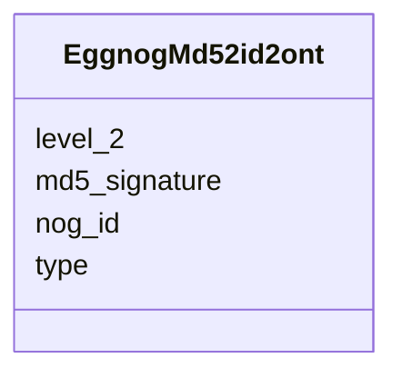

# Class: EggnogMd52id2ont 


URI: [img_sat_v450:EggnogMd52id2ont](https://w3id.org/jgi/img_sat_v450/EggnogMd52id2ont)





<!-- no inheritance hierarchy -->


## Slots

| Name | Cardinality and Range | Description | Inheritance |
| ---  | --- | --- | --- |
| [md5_signature](md5_signature.md) | 0..1 <br/> [String](String.md) |  | direct |
| [nog_id](nog_id.md) | 0..1 <br/> [String](String.md) |  | direct |
| [level_2](level_2.md) | 0..1 <br/> [String](String.md) |  | direct |
| [type](type.md) | 0..1 <br/> [String](String.md) |  | direct |


## Identifier and Mapping Information


### Schema Source


* from schema: https://w3id.org/jgi/img_sat_v450


## Mappings

| Mapping Type | Mapped Value |
| ---  | ---  |
| self | img_sat_v450:EggnogMd52id2ont |
| native | img_sat_v450:EggnogMd52id2ont |


## LinkML Source

<!-- TODO: investigate https://stackoverflow.com/questions/37606292/how-to-create-tabbed-code-blocks-in-mkdocs-or-sphinx -->

### Direct

<details>
```yaml
name: eggnog_md52id2ont
from_schema: https://w3id.org/jgi/img_sat_v450
attributes:
  md5_signature:
    name: md5_signature
    from_schema: https://w3id.org/jgi/img_sat_v450
    rank: 1000
    domain_of:
    - eggnog_md52id2ont
    range: string
    required: false
  nog_id:
    name: nog_id
    from_schema: https://w3id.org/jgi/img_sat_v450
    domain_of:
    - eggnog_hierarchy
    - eggnog_md52id2ont
    range: string
    required: false
  level_2:
    name: level_2
    from_schema: https://w3id.org/jgi/img_sat_v450
    domain_of:
    - eggnog_hierarchy
    - eggnog_md52id2ont
    - seed_functional_role
    range: string
    required: false
  type:
    name: type
    from_schema: https://w3id.org/jgi/img_sat_v450
    domain_of:
    - eggnog_hierarchy
    - eggnog_md52id2ont
    - genome_property
    - interpro
    - mpw_pgl_reaction_compounds
    - pfam_family
    range: string
    required: false

```
</details>

### Induced

<details>
```yaml
name: eggnog_md52id2ont
from_schema: https://w3id.org/jgi/img_sat_v450
attributes:
  md5_signature:
    name: md5_signature
    from_schema: https://w3id.org/jgi/img_sat_v450
    rank: 1000
    alias: md5_signature
    owner: eggnog_md52id2ont
    domain_of:
    - eggnog_md52id2ont
    range: string
    required: false
  nog_id:
    name: nog_id
    from_schema: https://w3id.org/jgi/img_sat_v450
    alias: nog_id
    owner: eggnog_md52id2ont
    domain_of:
    - eggnog_hierarchy
    - eggnog_md52id2ont
    range: string
    required: false
  level_2:
    name: level_2
    from_schema: https://w3id.org/jgi/img_sat_v450
    alias: level_2
    owner: eggnog_md52id2ont
    domain_of:
    - eggnog_hierarchy
    - eggnog_md52id2ont
    - seed_functional_role
    range: string
    required: false
  type:
    name: type
    from_schema: https://w3id.org/jgi/img_sat_v450
    alias: type
    owner: eggnog_md52id2ont
    domain_of:
    - eggnog_hierarchy
    - eggnog_md52id2ont
    - genome_property
    - interpro
    - mpw_pgl_reaction_compounds
    - pfam_family
    range: string
    required: false

```
</details>