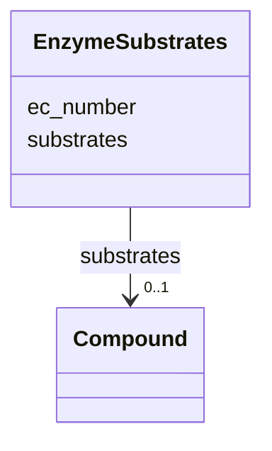

# Class: EnzymeSubstrates 


URI: [img_sat_v450:EnzymeSubstrates](https://w3id.org/jgi/img_sat_v450/EnzymeSubstrates)





<!-- no inheritance hierarchy -->


## Slots

| Name | Cardinality and Range | Description | Inheritance |
| ---  | --- | --- | --- |
| [ec_number](ec_number.md) | 0..1 <br/> [String](String.md) |  | direct |
| [substrates](substrates.md) | 0..1 <br/> [Compound](Compound.md) | Foreign key to compound | direct |


## Identifier and Mapping Information


### Schema Source


* from schema: https://w3id.org/jgi/img_sat_v450


## Mappings

| Mapping Type | Mapped Value |
| ---  | ---  |
| self | img_sat_v450:EnzymeSubstrates |
| native | img_sat_v450:EnzymeSubstrates |


## LinkML Source

<!-- TODO: investigate https://stackoverflow.com/questions/37606292/how-to-create-tabbed-code-blocks-in-mkdocs-or-sphinx -->

### Direct

<details>
```yaml
name: enzyme_substrates
from_schema: https://w3id.org/jgi/img_sat_v450
attributes:
  ec_number:
    name: ec_number
    from_schema: https://w3id.org/jgi/img_sat_v450
    domain_of:
    - biocyc_protein_catalyzes
    - biocyc_reaction
    - enzyme
    - enzyme_enz_aliases
    - enzyme_ext_links
    - enzyme_products
    - enzyme_substrates
    - enzyme_transferred
    - ko2ec
    range: string
    required: false
  substrates:
    name: substrates
    description: Foreign key to compound
    from_schema: https://w3id.org/jgi/img_sat_v450
    rank: 1000
    domain_of:
    - enzyme_substrates
    range: compound
    required: false

```
</details>

### Induced

<details>
```yaml
name: enzyme_substrates
from_schema: https://w3id.org/jgi/img_sat_v450
attributes:
  ec_number:
    name: ec_number
    from_schema: https://w3id.org/jgi/img_sat_v450
    alias: ec_number
    owner: enzyme_substrates
    domain_of:
    - biocyc_protein_catalyzes
    - biocyc_reaction
    - enzyme
    - enzyme_enz_aliases
    - enzyme_ext_links
    - enzyme_products
    - enzyme_substrates
    - enzyme_transferred
    - ko2ec
    range: string
    required: false
  substrates:
    name: substrates
    description: Foreign key to compound
    from_schema: https://w3id.org/jgi/img_sat_v450
    rank: 1000
    alias: substrates
    owner: enzyme_substrates
    domain_of:
    - enzyme_substrates
    range: compound
    required: false

```
</details>