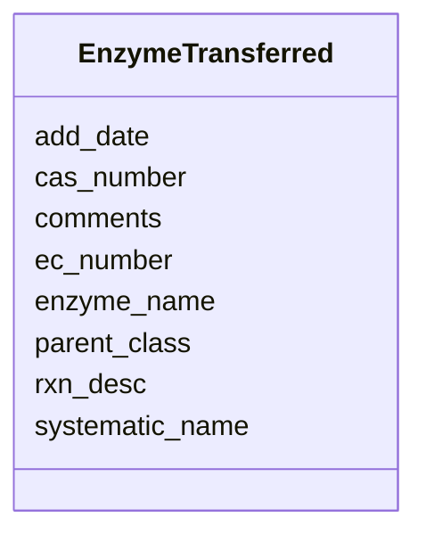

# Class: EnzymeTransferred 


URI: [img_sat_v450:EnzymeTransferred](https://w3id.org/jgi/img_sat_v450/EnzymeTransferred)





<!-- no inheritance hierarchy -->


## Slots

| Name | Cardinality and Range | Description | Inheritance |
| ---  | --- | --- | --- |
| [ec_number](ec_number.md) | 0..1 <br/> [String](String.md) |  | direct |
| [enzyme_name](enzyme_name.md) | 0..1 <br/> [String](String.md) |  | direct |
| [systematic_name](systematic_name.md) | 0..1 <br/> [String](String.md) |  | direct |
| [parent_class](parent_class.md) | 0..1 <br/> [String](String.md) |  | direct |
| [comments](comments.md) | 0..1 <br/> [String](String.md) |  | direct |
| [rxn_desc](rxn_desc.md) | 0..1 <br/> [String](String.md) |  | direct |
| [cas_number](cas_number.md) | 0..1 <br/> [String](String.md) |  | direct |
| [add_date](add_date.md) | 0..1 <br/> [Datetime](Datetime.md) |  | direct |


## Identifier and Mapping Information


### Schema Source


* from schema: https://w3id.org/jgi/img_sat_v450


## Mappings

| Mapping Type | Mapped Value |
| ---  | ---  |
| self | img_sat_v450:EnzymeTransferred |
| native | img_sat_v450:EnzymeTransferred |


## LinkML Source

<!-- TODO: investigate https://stackoverflow.com/questions/37606292/how-to-create-tabbed-code-blocks-in-mkdocs-or-sphinx -->

### Direct

<details>
```yaml
name: enzyme_transferred
from_schema: https://w3id.org/jgi/img_sat_v450
attributes:
  ec_number:
    name: ec_number
    from_schema: https://w3id.org/jgi/img_sat_v450
    domain_of:
    - biocyc_protein_catalyzes
    - biocyc_reaction
    - enzyme
    - enzyme_enz_aliases
    - enzyme_ext_links
    - enzyme_products
    - enzyme_substrates
    - enzyme_transferred
    - ko2ec
    range: string
    required: false
  enzyme_name:
    name: enzyme_name
    from_schema: https://w3id.org/jgi/img_sat_v450
    domain_of:
    - enzyme
    - enzyme_transferred
    range: string
    required: false
  systematic_name:
    name: systematic_name
    from_schema: https://w3id.org/jgi/img_sat_v450
    domain_of:
    - biocyc_comp
    - biocyc_protein
    - enzyme
    - enzyme_transferred
    range: string
    required: false
  parent_class:
    name: parent_class
    from_schema: https://w3id.org/jgi/img_sat_v450
    domain_of:
    - enzyme
    - enzyme_transferred
    range: string
    required: false
  comments:
    name: comments
    from_schema: https://w3id.org/jgi/img_sat_v450
    domain_of:
    - biocyc_class
    - biocyc_comp
    - biocyc_enzrxn
    - biocyc_pathway_comments
    - biocyc_protein
    - biocyc_reaction
    - enzyme
    - enzyme_transferred
    - go_term
    - pfam_clan
    - pfam_dead
    - pfam_family
    - reaction
    range: string
    required: false
  rxn_desc:
    name: rxn_desc
    from_schema: https://w3id.org/jgi/img_sat_v450
    domain_of:
    - enzyme
    - enzyme_transferred
    range: string
    required: false
  cas_number:
    name: cas_number
    from_schema: https://w3id.org/jgi/img_sat_v450
    domain_of:
    - compound
    - enzyme
    - enzyme_transferred
    range: string
    required: false
  add_date:
    name: add_date
    from_schema: https://w3id.org/jgi/img_sat_v450
    domain_of:
    - cog
    - cog_function
    - cog_species
    - compound
    - enzyme
    - enzyme_transferred
    - genome_property
    - go_graph_path
    - go_term
    - image_roi
    - kegg_pathway
    - km_image_roi
    - ko_term
    - kog
    - kog_function
    - mpw_pgl_pathway
    - pfam_clan
    - pfam_family
    - property_step
    - reaction
    - tigr_role
    - tigrfam
    range: datetime
    required: false

```
</details>

### Induced

<details>
```yaml
name: enzyme_transferred
from_schema: https://w3id.org/jgi/img_sat_v450
attributes:
  ec_number:
    name: ec_number
    from_schema: https://w3id.org/jgi/img_sat_v450
    alias: ec_number
    owner: enzyme_transferred
    domain_of:
    - biocyc_protein_catalyzes
    - biocyc_reaction
    - enzyme
    - enzyme_enz_aliases
    - enzyme_ext_links
    - enzyme_products
    - enzyme_substrates
    - enzyme_transferred
    - ko2ec
    range: string
    required: false
  enzyme_name:
    name: enzyme_name
    from_schema: https://w3id.org/jgi/img_sat_v450
    alias: enzyme_name
    owner: enzyme_transferred
    domain_of:
    - enzyme
    - enzyme_transferred
    range: string
    required: false
  systematic_name:
    name: systematic_name
    from_schema: https://w3id.org/jgi/img_sat_v450
    alias: systematic_name
    owner: enzyme_transferred
    domain_of:
    - biocyc_comp
    - biocyc_protein
    - enzyme
    - enzyme_transferred
    range: string
    required: false
  parent_class:
    name: parent_class
    from_schema: https://w3id.org/jgi/img_sat_v450
    alias: parent_class
    owner: enzyme_transferred
    domain_of:
    - enzyme
    - enzyme_transferred
    range: string
    required: false
  comments:
    name: comments
    from_schema: https://w3id.org/jgi/img_sat_v450
    alias: comments
    owner: enzyme_transferred
    domain_of:
    - biocyc_class
    - biocyc_comp
    - biocyc_enzrxn
    - biocyc_pathway_comments
    - biocyc_protein
    - biocyc_reaction
    - enzyme
    - enzyme_transferred
    - go_term
    - pfam_clan
    - pfam_dead
    - pfam_family
    - reaction
    range: string
    required: false
  rxn_desc:
    name: rxn_desc
    from_schema: https://w3id.org/jgi/img_sat_v450
    alias: rxn_desc
    owner: enzyme_transferred
    domain_of:
    - enzyme
    - enzyme_transferred
    range: string
    required: false
  cas_number:
    name: cas_number
    from_schema: https://w3id.org/jgi/img_sat_v450
    alias: cas_number
    owner: enzyme_transferred
    domain_of:
    - compound
    - enzyme
    - enzyme_transferred
    range: string
    required: false
  add_date:
    name: add_date
    from_schema: https://w3id.org/jgi/img_sat_v450
    alias: add_date
    owner: enzyme_transferred
    domain_of:
    - cog
    - cog_function
    - cog_species
    - compound
    - enzyme
    - enzyme_transferred
    - genome_property
    - go_graph_path
    - go_term
    - image_roi
    - kegg_pathway
    - km_image_roi
    - ko_term
    - kog
    - kog_function
    - mpw_pgl_pathway
    - pfam_clan
    - pfam_family
    - property_step
    - reaction
    - tigr_role
    - tigrfam
    range: datetime
    required: false

```
</details>