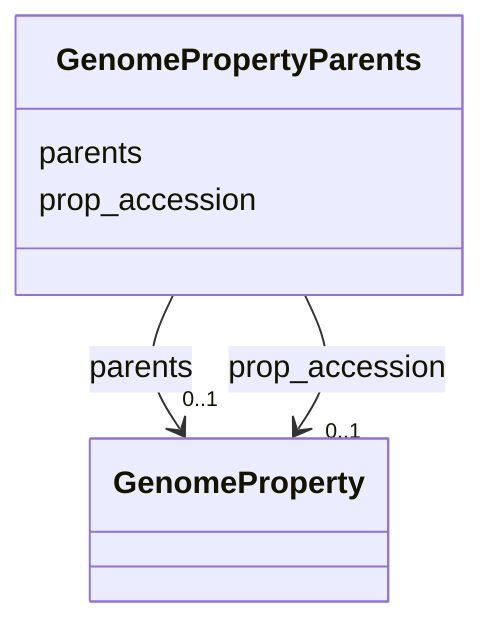

# Class: GenomePropertyParents 


URI: [img_sat_v450:GenomePropertyParents](https://w3id.org/jgi/img_sat_v450/GenomePropertyParents)





<!-- no inheritance hierarchy -->


## Slots

| Name | Cardinality and Range | Description | Inheritance |
| ---  | --- | --- | --- |
| [prop_accession](prop_accession.md) | 0..1 <br/> [GenomeProperty](GenomeProperty.md) | Foreign key to genome_property | direct |
| [parents](parents.md) | 0..1 <br/> [GenomeProperty](GenomeProperty.md) | Foreign key to genome_property | direct |


## Identifier and Mapping Information


### Schema Source


* from schema: https://w3id.org/jgi/img_sat_v450


## Mappings

| Mapping Type | Mapped Value |
| ---  | ---  |
| self | img_sat_v450:GenomePropertyParents |
| native | img_sat_v450:GenomePropertyParents |


## LinkML Source

<!-- TODO: investigate https://stackoverflow.com/questions/37606292/how-to-create-tabbed-code-blocks-in-mkdocs-or-sphinx -->

### Direct

<details>
```yaml
name: genome_property_parents
from_schema: https://w3id.org/jgi/img_sat_v450
attributes:
  prop_accession:
    name: prop_accession
    description: Foreign key to genome_property
    from_schema: https://w3id.org/jgi/img_sat_v450
    domain_of:
    - genome_property
    - genome_property_parents
    range: genome_property
    required: false
  parents:
    name: parents
    description: Foreign key to genome_property
    from_schema: https://w3id.org/jgi/img_sat_v450
    domain_of:
    - biocyc_class_parents
    - genome_property_parents
    range: genome_property
    required: false

```
</details>

### Induced

<details>
```yaml
name: genome_property_parents
from_schema: https://w3id.org/jgi/img_sat_v450
attributes:
  prop_accession:
    name: prop_accession
    description: Foreign key to genome_property
    from_schema: https://w3id.org/jgi/img_sat_v450
    alias: prop_accession
    owner: genome_property_parents
    domain_of:
    - genome_property
    - genome_property_parents
    range: genome_property
    required: false
  parents:
    name: parents
    description: Foreign key to genome_property
    from_schema: https://w3id.org/jgi/img_sat_v450
    alias: parents
    owner: genome_property_parents
    domain_of:
    - biocyc_class_parents
    - genome_property_parents
    range: genome_property
    required: false

```
</details>