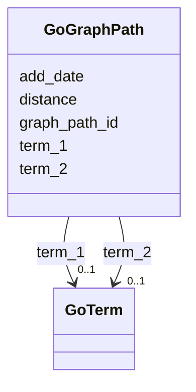

# Class: GoGraphPath 


URI: [img_sat_v450:GoGraphPath](https://w3id.org/jgi/img_sat_v450/GoGraphPath)





<!-- no inheritance hierarchy -->


## Slots

| Name | Cardinality and Range | Description | Inheritance |
| ---  | --- | --- | --- |
| [graph_path_id](graph_path_id.md) | 0..1 <br/> [Integer](Integer.md) |  | direct |
| [term_1](term_1.md) | 0..1 <br/> [GoTerm](GoTerm.md) | Foreign key to go_term | direct |
| [term_2](term_2.md) | 0..1 <br/> [GoTerm](GoTerm.md) | Foreign key to go_term | direct |
| [distance](distance.md) | 0..1 <br/> [Integer](Integer.md) |  | direct |
| [add_date](add_date.md) | 0..1 <br/> [Datetime](Datetime.md) |  | direct |


## Identifier and Mapping Information


### Schema Source


* from schema: https://w3id.org/jgi/img_sat_v450


## Mappings

| Mapping Type | Mapped Value |
| ---  | ---  |
| self | img_sat_v450:GoGraphPath |
| native | img_sat_v450:GoGraphPath |


## LinkML Source

<!-- TODO: investigate https://stackoverflow.com/questions/37606292/how-to-create-tabbed-code-blocks-in-mkdocs-or-sphinx -->

### Direct

<details>
```yaml
name: go_graph_path
from_schema: https://w3id.org/jgi/img_sat_v450
attributes:
  graph_path_id:
    name: graph_path_id
    from_schema: https://w3id.org/jgi/img_sat_v450
    rank: 1000
    domain_of:
    - go_graph_path
    range: integer
    required: false
  term_1:
    name: term_1
    description: Foreign key to go_term
    from_schema: https://w3id.org/jgi/img_sat_v450
    rank: 1000
    domain_of:
    - go_graph_path
    range: go_term
    required: false
  term_2:
    name: term_2
    description: Foreign key to go_term
    from_schema: https://w3id.org/jgi/img_sat_v450
    rank: 1000
    domain_of:
    - go_graph_path
    range: go_term
    required: false
  distance:
    name: distance
    from_schema: https://w3id.org/jgi/img_sat_v450
    rank: 1000
    domain_of:
    - go_graph_path
    range: integer
    required: false
  add_date:
    name: add_date
    from_schema: https://w3id.org/jgi/img_sat_v450
    domain_of:
    - cog
    - cog_function
    - cog_species
    - compound
    - enzyme
    - enzyme_transferred
    - genome_property
    - go_graph_path
    - go_term
    - image_roi
    - kegg_pathway
    - km_image_roi
    - ko_term
    - kog
    - kog_function
    - mpw_pgl_pathway
    - pfam_clan
    - pfam_family
    - property_step
    - reaction
    - tigr_role
    - tigrfam
    range: datetime
    required: false

```
</details>

### Induced

<details>
```yaml
name: go_graph_path
from_schema: https://w3id.org/jgi/img_sat_v450
attributes:
  graph_path_id:
    name: graph_path_id
    from_schema: https://w3id.org/jgi/img_sat_v450
    rank: 1000
    alias: graph_path_id
    owner: go_graph_path
    domain_of:
    - go_graph_path
    range: integer
    required: false
  term_1:
    name: term_1
    description: Foreign key to go_term
    from_schema: https://w3id.org/jgi/img_sat_v450
    rank: 1000
    alias: term_1
    owner: go_graph_path
    domain_of:
    - go_graph_path
    range: go_term
    required: false
  term_2:
    name: term_2
    description: Foreign key to go_term
    from_schema: https://w3id.org/jgi/img_sat_v450
    rank: 1000
    alias: term_2
    owner: go_graph_path
    domain_of:
    - go_graph_path
    range: go_term
    required: false
  distance:
    name: distance
    from_schema: https://w3id.org/jgi/img_sat_v450
    rank: 1000
    alias: distance
    owner: go_graph_path
    domain_of:
    - go_graph_path
    range: integer
    required: false
  add_date:
    name: add_date
    from_schema: https://w3id.org/jgi/img_sat_v450
    alias: add_date
    owner: go_graph_path
    domain_of:
    - cog
    - cog_function
    - cog_species
    - compound
    - enzyme
    - enzyme_transferred
    - genome_property
    - go_graph_path
    - go_term
    - image_roi
    - kegg_pathway
    - km_image_roi
    - ko_term
    - kog
    - kog_function
    - mpw_pgl_pathway
    - pfam_clan
    - pfam_family
    - property_step
    - reaction
    - tigr_role
    - tigrfam
    range: datetime
    required: false

```
</details>