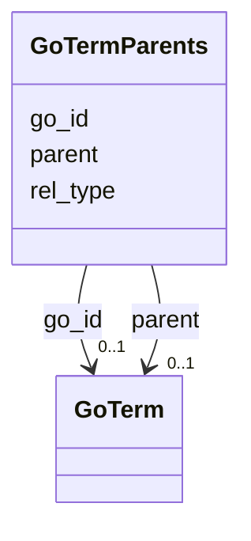

# Class: GoTermParents 


URI: [img_sat_v450:GoTermParents](https://w3id.org/jgi/img_sat_v450/GoTermParents)





<!-- no inheritance hierarchy -->


## Slots

| Name | Cardinality and Range | Description | Inheritance |
| ---  | --- | --- | --- |
| [go_id](go_id.md) | 0..1 <br/> [GoTerm](GoTerm.md) | Foreign key to go_term | direct |
| [parent](parent.md) | 0..1 <br/> [GoTerm](GoTerm.md) | Foreign key to go_term | direct |
| [rel_type](rel_type.md) | 0..1 <br/> [Integer](Integer.md) |  | direct |


## Identifier and Mapping Information


### Schema Source


* from schema: https://w3id.org/jgi/img_sat_v450


## Mappings

| Mapping Type | Mapped Value |
| ---  | ---  |
| self | img_sat_v450:GoTermParents |
| native | img_sat_v450:GoTermParents |


## LinkML Source

<!-- TODO: investigate https://stackoverflow.com/questions/37606292/how-to-create-tabbed-code-blocks-in-mkdocs-or-sphinx -->

### Direct

<details>
```yaml
name: go_term_parents
from_schema: https://w3id.org/jgi/img_sat_v450
attributes:
  go_id:
    name: go_id
    description: Foreign key to go_term
    from_schema: https://w3id.org/jgi/img_sat_v450
    domain_of:
    - go_term
    - go_term_parents
    - go_term_synonyms
    - ko2go
    - pfam2go
    - tc_family_go_terms
    range: go_term
    required: false
  parent:
    name: parent
    description: Foreign key to go_term
    from_schema: https://w3id.org/jgi/img_sat_v450
    domain_of:
    - compound
    - go_term_parents
    range: go_term
    required: false
  rel_type:
    name: rel_type
    from_schema: https://w3id.org/jgi/img_sat_v450
    rank: 1000
    domain_of:
    - go_term_parents
    range: integer
    required: false

```
</details>

### Induced

<details>
```yaml
name: go_term_parents
from_schema: https://w3id.org/jgi/img_sat_v450
attributes:
  go_id:
    name: go_id
    description: Foreign key to go_term
    from_schema: https://w3id.org/jgi/img_sat_v450
    alias: go_id
    owner: go_term_parents
    domain_of:
    - go_term
    - go_term_parents
    - go_term_synonyms
    - ko2go
    - pfam2go
    - tc_family_go_terms
    range: go_term
    required: false
  parent:
    name: parent
    description: Foreign key to go_term
    from_schema: https://w3id.org/jgi/img_sat_v450
    alias: parent
    owner: go_term_parents
    domain_of:
    - compound
    - go_term_parents
    range: go_term
    required: false
  rel_type:
    name: rel_type
    from_schema: https://w3id.org/jgi/img_sat_v450
    rank: 1000
    alias: rel_type
    owner: go_term_parents
    domain_of:
    - go_term_parents
    range: integer
    required: false

```
</details>