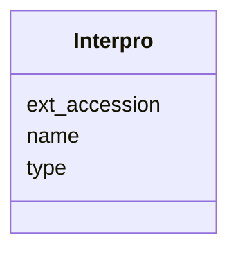

# Class: Interpro 


URI: [img_sat_v450:Interpro](https://w3id.org/jgi/img_sat_v450/Interpro)





<!-- no inheritance hierarchy -->


## Slots

| Name | Cardinality and Range | Description | Inheritance |
| ---  | --- | --- | --- |
| [ext_accession](ext_accession.md) | 0..1 <br/> [String](String.md) |  | direct |
| [name](name.md) | 0..1 <br/> [String](String.md) |  | direct |
| [type](type.md) | 0..1 <br/> [String](String.md) |  | direct |


## Usages

| used by | used in | type | used |
| ---  | --- | --- | --- |
| [InterproGoTerms](InterproGoTerms.md) | [ext_accession](ext_accession.md) | range | [Interpro](Interpro.md) |


## Identifier and Mapping Information


### Schema Source


* from schema: https://w3id.org/jgi/img_sat_v450


## Mappings

| Mapping Type | Mapped Value |
| ---  | ---  |
| self | img_sat_v450:Interpro |
| native | img_sat_v450:Interpro |


## LinkML Source

<!-- TODO: investigate https://stackoverflow.com/questions/37606292/how-to-create-tabbed-code-blocks-in-mkdocs-or-sphinx -->

### Direct

<details>
```yaml
name: interpro
from_schema: https://w3id.org/jgi/img_sat_v450
attributes:
  ext_accession:
    name: ext_accession
    from_schema: https://w3id.org/jgi/img_sat_v450
    domain_of:
    - compound
    - compound_aliases
    - compound_ext_links
    - interpro
    - interpro_go_terms
    - pfam_clan
    - pfam_clan_pfam_families
    - pfam_family
    - pfam_family_cogs
    - pfam_family_ext_links
    - pfam_family_genome_properties
    - reaction
    - reaction_compounds
    - reaction_enzymes
    - reaction_ext_links
    - tigrfam
    - tigrfam_enzymes
    - tigrfam_genome_properties
    - tigrfam_roles
    range: string
    required: false
  name:
    name: name
    from_schema: https://w3id.org/jgi/img_sat_v450
    domain_of:
    - cog2014
    - cogfunc2014
    - db_source
    - genome_property
    - interpro
    - pfam_clan
    - pfam_dead
    - pfam_family
    - property_step
    range: string
    required: false
  type:
    name: type
    from_schema: https://w3id.org/jgi/img_sat_v450
    domain_of:
    - eggnog_hierarchy
    - eggnog_md52id2ont
    - genome_property
    - interpro
    - mpw_pgl_reaction_compounds
    - pfam_family
    range: string
    required: false

```
</details>

### Induced

<details>
```yaml
name: interpro
from_schema: https://w3id.org/jgi/img_sat_v450
attributes:
  ext_accession:
    name: ext_accession
    from_schema: https://w3id.org/jgi/img_sat_v450
    alias: ext_accession
    owner: interpro
    domain_of:
    - compound
    - compound_aliases
    - compound_ext_links
    - interpro
    - interpro_go_terms
    - pfam_clan
    - pfam_clan_pfam_families
    - pfam_family
    - pfam_family_cogs
    - pfam_family_ext_links
    - pfam_family_genome_properties
    - reaction
    - reaction_compounds
    - reaction_enzymes
    - reaction_ext_links
    - tigrfam
    - tigrfam_enzymes
    - tigrfam_genome_properties
    - tigrfam_roles
    range: string
    required: false
  name:
    name: name
    from_schema: https://w3id.org/jgi/img_sat_v450
    alias: name
    owner: interpro
    domain_of:
    - cog2014
    - cogfunc2014
    - db_source
    - genome_property
    - interpro
    - pfam_clan
    - pfam_dead
    - pfam_family
    - property_step
    range: string
    required: false
  type:
    name: type
    from_schema: https://w3id.org/jgi/img_sat_v450
    alias: type
    owner: interpro
    domain_of:
    - eggnog_hierarchy
    - eggnog_md52id2ont
    - genome_property
    - interpro
    - mpw_pgl_reaction_compounds
    - pfam_family
    range: string
    required: false

```
</details>