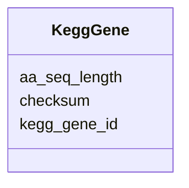

# Class: KeggGene 


URI: [img_sat_v450:KeggGene](https://w3id.org/jgi/img_sat_v450/KeggGene)





<!-- no inheritance hierarchy -->


## Slots

| Name | Cardinality and Range | Description | Inheritance |
| ---  | --- | --- | --- |
| [kegg_gene_id](kegg_gene_id.md) | 0..1 <br/> [String](String.md) |  | direct |
| [aa_seq_length](aa_seq_length.md) | 0..1 <br/> [Integer](Integer.md) |  | direct |
| [checksum](checksum.md) | 0..1 <br/> [String](String.md) |  | direct |


## Usages

| used by | used in | type | used |
| ---  | --- | --- | --- |
| [KeggGeneKoTerms](KeggGeneKoTerms.md) | [kegg_gene_id](kegg_gene_id.md) | range | [KeggGene](KeggGene.md) |
| [KeggGeneNcbiGeneIds](KeggGeneNcbiGeneIds.md) | [kegg_gene_id](kegg_gene_id.md) | range | [KeggGene](KeggGene.md) |
| [KeggGeneUniprotIds](KeggGeneUniprotIds.md) | [kegg_gene_id](kegg_gene_id.md) | range | [KeggGene](KeggGene.md) |


## Identifier and Mapping Information


### Schema Source


* from schema: https://w3id.org/jgi/img_sat_v450


## Mappings

| Mapping Type | Mapped Value |
| ---  | ---  |
| self | img_sat_v450:KeggGene |
| native | img_sat_v450:KeggGene |


## LinkML Source

<!-- TODO: investigate https://stackoverflow.com/questions/37606292/how-to-create-tabbed-code-blocks-in-mkdocs-or-sphinx -->

### Direct

<details>
```yaml
name: kegg_gene
from_schema: https://w3id.org/jgi/img_sat_v450
attributes:
  kegg_gene_id:
    name: kegg_gene_id
    from_schema: https://w3id.org/jgi/img_sat_v450
    rank: 1000
    domain_of:
    - kegg_gene
    - kegg_gene_ko_terms
    - kegg_gene_ncbi_gene_ids
    - kegg_gene_uniprot_ids
    range: string
    required: false
  aa_seq_length:
    name: aa_seq_length
    from_schema: https://w3id.org/jgi/img_sat_v450
    rank: 1000
    domain_of:
    - kegg_gene
    range: integer
    required: false
  checksum:
    name: checksum
    from_schema: https://w3id.org/jgi/img_sat_v450
    rank: 1000
    domain_of:
    - kegg_gene
    range: string
    required: false

```
</details>

### Induced

<details>
```yaml
name: kegg_gene
from_schema: https://w3id.org/jgi/img_sat_v450
attributes:
  kegg_gene_id:
    name: kegg_gene_id
    from_schema: https://w3id.org/jgi/img_sat_v450
    rank: 1000
    alias: kegg_gene_id
    owner: kegg_gene
    domain_of:
    - kegg_gene
    - kegg_gene_ko_terms
    - kegg_gene_ncbi_gene_ids
    - kegg_gene_uniprot_ids
    range: string
    required: false
  aa_seq_length:
    name: aa_seq_length
    from_schema: https://w3id.org/jgi/img_sat_v450
    rank: 1000
    alias: aa_seq_length
    owner: kegg_gene
    domain_of:
    - kegg_gene
    range: integer
    required: false
  checksum:
    name: checksum
    from_schema: https://w3id.org/jgi/img_sat_v450
    rank: 1000
    alias: checksum
    owner: kegg_gene
    domain_of:
    - kegg_gene
    range: string
    required: false

```
</details>