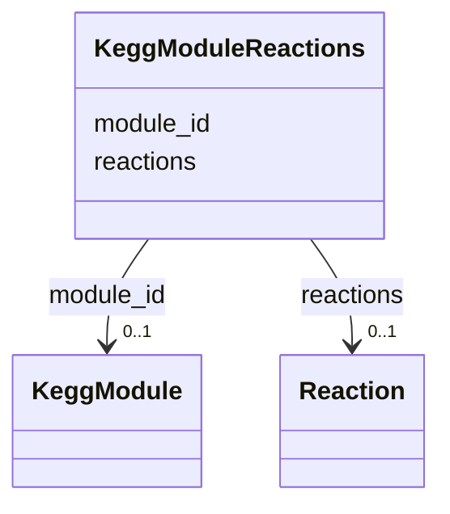

# Class: KeggModuleReactions 


URI: [img_sat_v450:KeggModuleReactions](https://w3id.org/jgi/img_sat_v450/KeggModuleReactions)





<!-- no inheritance hierarchy -->


## Slots

| Name | Cardinality and Range | Description | Inheritance |
| ---  | --- | --- | --- |
| [module_id](module_id.md) | 0..1 <br/> [KeggModule](KeggModule.md) | Foreign key to kegg_module | direct |
| [reactions](reactions.md) | 0..1 <br/> [Reaction](Reaction.md) | Foreign key to reaction | direct |


## Identifier and Mapping Information


### Schema Source


* from schema: https://w3id.org/jgi/img_sat_v450


## Mappings

| Mapping Type | Mapped Value |
| ---  | ---  |
| self | img_sat_v450:KeggModuleReactions |
| native | img_sat_v450:KeggModuleReactions |


## LinkML Source

<!-- TODO: investigate https://stackoverflow.com/questions/37606292/how-to-create-tabbed-code-blocks-in-mkdocs-or-sphinx -->

### Direct

<details>
```yaml
name: kegg_module_reactions
from_schema: https://w3id.org/jgi/img_sat_v450
attributes:
  module_id:
    name: module_id
    description: Foreign key to kegg_module
    from_schema: https://w3id.org/jgi/img_sat_v450
    domain_of:
    - kegg_module
    - kegg_module_compounds
    - kegg_module_ko_terms
    - kegg_module_reactions
    - ko2module
    range: kegg_module
    required: false
  reactions:
    name: reactions
    description: Foreign key to reaction
    from_schema: https://w3id.org/jgi/img_sat_v450
    domain_of:
    - image_roi_reactions
    - kegg_module_reactions
    - ko_term_reactions
    range: reaction
    required: false

```
</details>

### Induced

<details>
```yaml
name: kegg_module_reactions
from_schema: https://w3id.org/jgi/img_sat_v450
attributes:
  module_id:
    name: module_id
    description: Foreign key to kegg_module
    from_schema: https://w3id.org/jgi/img_sat_v450
    alias: module_id
    owner: kegg_module_reactions
    domain_of:
    - kegg_module
    - kegg_module_compounds
    - kegg_module_ko_terms
    - kegg_module_reactions
    - ko2module
    range: kegg_module
    required: false
  reactions:
    name: reactions
    description: Foreign key to reaction
    from_schema: https://w3id.org/jgi/img_sat_v450
    alias: reactions
    owner: kegg_module_reactions
    domain_of:
    - image_roi_reactions
    - kegg_module_reactions
    - ko_term_reactions
    range: reaction
    required: false

```
</details>