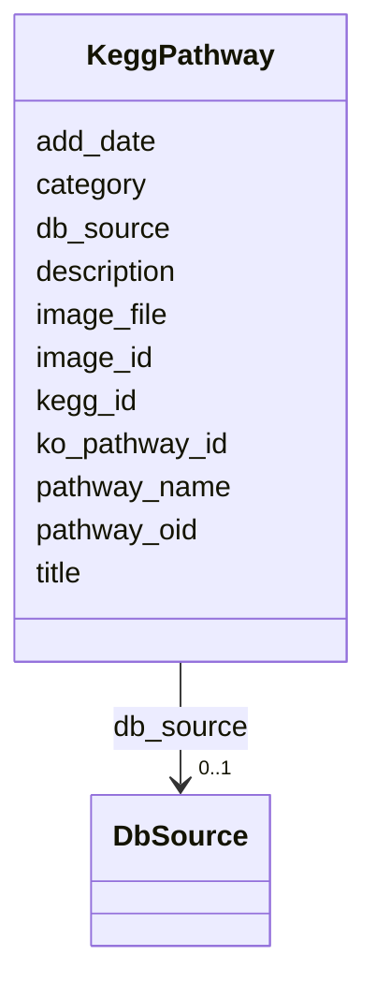

# Class: KeggPathway 


URI: [img_sat_v450:KeggPathway](https://w3id.org/jgi/img_sat_v450/KeggPathway)





<!-- no inheritance hierarchy -->


## Slots

| Name | Cardinality and Range | Description | Inheritance |
| ---  | --- | --- | --- |
| [pathway_oid](pathway_oid.md) | 0..1 <br/> [Integer](Integer.md) |  | direct |
| [pathway_name](pathway_name.md) | 0..1 <br/> [String](String.md) |  | direct |
| [title](title.md) | 0..1 <br/> [String](String.md) |  | direct |
| [description](description.md) | 0..1 <br/> [String](String.md) |  | direct |
| [category](category.md) | 0..1 <br/> [String](String.md) |  | direct |
| [db_source](db_source.md) | 0..1 <br/> [DbSource](DbSource.md) | Foreign key to db_source | direct |
| [image_id](image_id.md) | 0..1 <br/> [String](String.md) |  | direct |
| [kegg_id](kegg_id.md) | 0..1 <br/> [String](String.md) |  | direct |
| [image_file](image_file.md) | 0..1 <br/> [String](String.md) |  | direct |
| [add_date](add_date.md) | 0..1 <br/> [Datetime](Datetime.md) |  | direct |
| [ko_pathway_id](ko_pathway_id.md) | 0..1 <br/> [String](String.md) |  | direct |


## Usages

| used by | used in | type | used |
| ---  | --- | --- | --- |
| [ImageRoi](ImageRoi.md) | [pathway](pathway.md) | range | [KeggPathway](KeggPathway.md) |
| [ImageRoi](ImageRoi.md) | [related_pathway](related_pathway.md) | range | [KeggPathway](KeggPathway.md) |
| [KeggModule](KeggModule.md) | [pathway](pathway.md) | range | [KeggPathway](KeggPathway.md) |
| [KeggPathwayModules](KeggPathwayModules.md) | [pathway_oid](pathway_oid.md) | range | [KeggPathway](KeggPathway.md) |
| [KeggPathwayRelatedPathways](KeggPathwayRelatedPathways.md) | [pathway_oid](pathway_oid.md) | range | [KeggPathway](KeggPathway.md) |
| [KeggPathwayRelatedPathways](KeggPathwayRelatedPathways.md) | [related_pathways](related_pathways.md) | range | [KeggPathway](KeggPathway.md) |


## Identifier and Mapping Information


### Schema Source


* from schema: https://w3id.org/jgi/img_sat_v450


## Mappings

| Mapping Type | Mapped Value |
| ---  | ---  |
| self | img_sat_v450:KeggPathway |
| native | img_sat_v450:KeggPathway |


## LinkML Source

<!-- TODO: investigate https://stackoverflow.com/questions/37606292/how-to-create-tabbed-code-blocks-in-mkdocs-or-sphinx -->

### Direct

<details>
```yaml
name: kegg_pathway
from_schema: https://w3id.org/jgi/img_sat_v450
attributes:
  pathway_oid:
    name: pathway_oid
    from_schema: https://w3id.org/jgi/img_sat_v450
    rank: 1000
    domain_of:
    - kegg_pathway
    - kegg_pathway_modules
    - kegg_pathway_related_pathways
    - ko_term_pathways
    - mpw_pgl_pathway
    - mpw_pgl_pathway_reaction
    range: integer
    required: false
  pathway_name:
    name: pathway_name
    from_schema: https://w3id.org/jgi/img_sat_v450
    rank: 1000
    domain_of:
    - kegg_pathway
    - mpw_pgl_pathway
    range: string
    required: false
  title:
    name: title
    from_schema: https://w3id.org/jgi/img_sat_v450
    rank: 1000
    domain_of:
    - kegg_pathway
    range: string
    required: false
  description:
    name: description
    from_schema: https://w3id.org/jgi/img_sat_v450
    domain_of:
    - cog
    - genome_property
    - kegg_pathway
    - kog
    - pfam_clan
    - pfam_family
    - yesnocv
    range: string
    required: false
  category:
    name: category
    from_schema: https://w3id.org/jgi/img_sat_v450
    rank: 1000
    domain_of:
    - kegg_pathway
    range: string
    required: false
  db_source:
    name: db_source
    description: Foreign key to db_source
    from_schema: https://w3id.org/jgi/img_sat_v450
    domain_of:
    - biocyc_comp
    - cog
    - compound
    - go_term
    - kegg_pathway
    - kog
    - pfam_family
    range: db_source
    required: false
  image_id:
    name: image_id
    from_schema: https://w3id.org/jgi/img_sat_v450
    domain_of:
    - kegg_module
    - kegg_pathway
    - ko2pathway
    - ko_term_pathways
    range: string
    required: false
  kegg_id:
    name: kegg_id
    from_schema: https://w3id.org/jgi/img_sat_v450
    rank: 1000
    domain_of:
    - kegg_pathway
    range: string
    required: false
  image_file:
    name: image_file
    from_schema: https://w3id.org/jgi/img_sat_v450
    rank: 1000
    domain_of:
    - kegg_pathway
    range: string
    required: false
  add_date:
    name: add_date
    from_schema: https://w3id.org/jgi/img_sat_v450
    domain_of:
    - cog
    - cog_function
    - cog_species
    - compound
    - enzyme
    - enzyme_transferred
    - genome_property
    - go_graph_path
    - go_term
    - image_roi
    - kegg_pathway
    - km_image_roi
    - ko_term
    - kog
    - kog_function
    - mpw_pgl_pathway
    - pfam_clan
    - pfam_family
    - property_step
    - reaction
    - tigr_role
    - tigrfam
    range: datetime
    required: false
  ko_pathway_id:
    name: ko_pathway_id
    from_schema: https://w3id.org/jgi/img_sat_v450
    domain_of:
    - kegg_module
    - kegg_pathway
    - ko_term_classes
    range: string
    required: false

```
</details>

### Induced

<details>
```yaml
name: kegg_pathway
from_schema: https://w3id.org/jgi/img_sat_v450
attributes:
  pathway_oid:
    name: pathway_oid
    from_schema: https://w3id.org/jgi/img_sat_v450
    rank: 1000
    alias: pathway_oid
    owner: kegg_pathway
    domain_of:
    - kegg_pathway
    - kegg_pathway_modules
    - kegg_pathway_related_pathways
    - ko_term_pathways
    - mpw_pgl_pathway
    - mpw_pgl_pathway_reaction
    range: integer
    required: false
  pathway_name:
    name: pathway_name
    from_schema: https://w3id.org/jgi/img_sat_v450
    rank: 1000
    alias: pathway_name
    owner: kegg_pathway
    domain_of:
    - kegg_pathway
    - mpw_pgl_pathway
    range: string
    required: false
  title:
    name: title
    from_schema: https://w3id.org/jgi/img_sat_v450
    rank: 1000
    alias: title
    owner: kegg_pathway
    domain_of:
    - kegg_pathway
    range: string
    required: false
  description:
    name: description
    from_schema: https://w3id.org/jgi/img_sat_v450
    alias: description
    owner: kegg_pathway
    domain_of:
    - cog
    - genome_property
    - kegg_pathway
    - kog
    - pfam_clan
    - pfam_family
    - yesnocv
    range: string
    required: false
  category:
    name: category
    from_schema: https://w3id.org/jgi/img_sat_v450
    rank: 1000
    alias: category
    owner: kegg_pathway
    domain_of:
    - kegg_pathway
    range: string
    required: false
  db_source:
    name: db_source
    description: Foreign key to db_source
    from_schema: https://w3id.org/jgi/img_sat_v450
    alias: db_source
    owner: kegg_pathway
    domain_of:
    - biocyc_comp
    - cog
    - compound
    - go_term
    - kegg_pathway
    - kog
    - pfam_family
    range: db_source
    required: false
  image_id:
    name: image_id
    from_schema: https://w3id.org/jgi/img_sat_v450
    alias: image_id
    owner: kegg_pathway
    domain_of:
    - kegg_module
    - kegg_pathway
    - ko2pathway
    - ko_term_pathways
    range: string
    required: false
  kegg_id:
    name: kegg_id
    from_schema: https://w3id.org/jgi/img_sat_v450
    rank: 1000
    alias: kegg_id
    owner: kegg_pathway
    domain_of:
    - kegg_pathway
    range: string
    required: false
  image_file:
    name: image_file
    from_schema: https://w3id.org/jgi/img_sat_v450
    rank: 1000
    alias: image_file
    owner: kegg_pathway
    domain_of:
    - kegg_pathway
    range: string
    required: false
  add_date:
    name: add_date
    from_schema: https://w3id.org/jgi/img_sat_v450
    alias: add_date
    owner: kegg_pathway
    domain_of:
    - cog
    - cog_function
    - cog_species
    - compound
    - enzyme
    - enzyme_transferred
    - genome_property
    - go_graph_path
    - go_term
    - image_roi
    - kegg_pathway
    - km_image_roi
    - ko_term
    - kog
    - kog_function
    - mpw_pgl_pathway
    - pfam_clan
    - pfam_family
    - property_step
    - reaction
    - tigr_role
    - tigrfam
    range: datetime
    required: false
  ko_pathway_id:
    name: ko_pathway_id
    from_schema: https://w3id.org/jgi/img_sat_v450
    alias: ko_pathway_id
    owner: kegg_pathway
    domain_of:
    - kegg_module
    - kegg_pathway
    - ko_term_classes
    range: string
    required: false

```
</details>