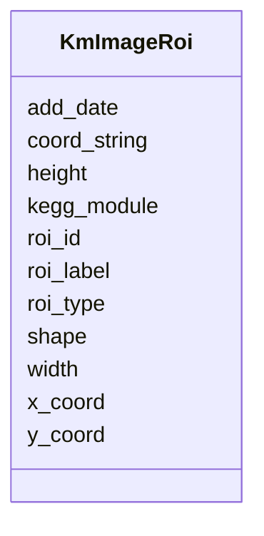

# Class: KmImageRoi 


URI: [img_sat_v450:KmImageRoi](https://w3id.org/jgi/img_sat_v450/KmImageRoi)





<!-- no inheritance hierarchy -->


## Slots

| Name | Cardinality and Range | Description | Inheritance |
| ---  | --- | --- | --- |
| [roi_id](roi_id.md) | 0..1 <br/> [Integer](Integer.md) |  | direct |
| [shape](shape.md) | 0..1 <br/> [String](String.md) |  | direct |
| [roi_type](roi_type.md) | 0..1 <br/> [String](String.md) |  | direct |
| [roi_label](roi_label.md) | 0..1 <br/> [String](String.md) |  | direct |
| [x_coord](x_coord.md) | 0..1 <br/> [Integer](Integer.md) |  | direct |
| [y_coord](y_coord.md) | 0..1 <br/> [Integer](Integer.md) |  | direct |
| [height](height.md) | 0..1 <br/> [Integer](Integer.md) |  | direct |
| [width](width.md) | 0..1 <br/> [Integer](Integer.md) |  | direct |
| [add_date](add_date.md) | 0..1 <br/> [Datetime](Datetime.md) |  | direct |
| [coord_string](coord_string.md) | 0..1 <br/> [String](String.md) |  | direct |
| [kegg_module](kegg_module.md) | 0..1 <br/> [String](String.md) |  | direct |


## Identifier and Mapping Information


### Schema Source


* from schema: https://w3id.org/jgi/img_sat_v450


## Mappings

| Mapping Type | Mapped Value |
| ---  | ---  |
| self | img_sat_v450:KmImageRoi |
| native | img_sat_v450:KmImageRoi |


## LinkML Source

<!-- TODO: investigate https://stackoverflow.com/questions/37606292/how-to-create-tabbed-code-blocks-in-mkdocs-or-sphinx -->

### Direct

<details>
```yaml
name: km_image_roi
from_schema: https://w3id.org/jgi/img_sat_v450
attributes:
  roi_id:
    name: roi_id
    from_schema: https://w3id.org/jgi/img_sat_v450
    domain_of:
    - image_roi
    - image_roi_compounds
    - image_roi_enzymes
    - image_roi_ko_terms
    - image_roi_reactions
    - km_image_roi
    - km_image_roi_ko_terms
    range: integer
    required: false
  shape:
    name: shape
    from_schema: https://w3id.org/jgi/img_sat_v450
    domain_of:
    - image_roi
    - km_image_roi
    range: string
    required: false
  roi_type:
    name: roi_type
    from_schema: https://w3id.org/jgi/img_sat_v450
    domain_of:
    - image_roi
    - km_image_roi
    range: string
    required: false
  roi_label:
    name: roi_label
    from_schema: https://w3id.org/jgi/img_sat_v450
    domain_of:
    - image_roi
    - km_image_roi
    range: string
    required: false
  x_coord:
    name: x_coord
    from_schema: https://w3id.org/jgi/img_sat_v450
    domain_of:
    - image_roi
    - km_image_roi
    range: integer
    required: false
  y_coord:
    name: y_coord
    from_schema: https://w3id.org/jgi/img_sat_v450
    domain_of:
    - image_roi
    - km_image_roi
    range: integer
    required: false
  height:
    name: height
    from_schema: https://w3id.org/jgi/img_sat_v450
    domain_of:
    - image_roi
    - km_image_roi
    range: integer
    required: false
  width:
    name: width
    from_schema: https://w3id.org/jgi/img_sat_v450
    domain_of:
    - image_roi
    - km_image_roi
    range: integer
    required: false
  add_date:
    name: add_date
    from_schema: https://w3id.org/jgi/img_sat_v450
    domain_of:
    - cog
    - cog_function
    - cog_species
    - compound
    - enzyme
    - enzyme_transferred
    - genome_property
    - go_graph_path
    - go_term
    - image_roi
    - kegg_pathway
    - km_image_roi
    - ko_term
    - kog
    - kog_function
    - mpw_pgl_pathway
    - pfam_clan
    - pfam_family
    - property_step
    - reaction
    - tigr_role
    - tigrfam
    range: datetime
    required: false
  coord_string:
    name: coord_string
    from_schema: https://w3id.org/jgi/img_sat_v450
    domain_of:
    - image_roi
    - km_image_roi
    range: string
    required: false
  kegg_module:
    name: kegg_module
    from_schema: https://w3id.org/jgi/img_sat_v450
    rank: 1000
    domain_of:
    - km_image_roi
    range: string
    required: false

```
</details>

### Induced

<details>
```yaml
name: km_image_roi
from_schema: https://w3id.org/jgi/img_sat_v450
attributes:
  roi_id:
    name: roi_id
    from_schema: https://w3id.org/jgi/img_sat_v450
    alias: roi_id
    owner: km_image_roi
    domain_of:
    - image_roi
    - image_roi_compounds
    - image_roi_enzymes
    - image_roi_ko_terms
    - image_roi_reactions
    - km_image_roi
    - km_image_roi_ko_terms
    range: integer
    required: false
  shape:
    name: shape
    from_schema: https://w3id.org/jgi/img_sat_v450
    alias: shape
    owner: km_image_roi
    domain_of:
    - image_roi
    - km_image_roi
    range: string
    required: false
  roi_type:
    name: roi_type
    from_schema: https://w3id.org/jgi/img_sat_v450
    alias: roi_type
    owner: km_image_roi
    domain_of:
    - image_roi
    - km_image_roi
    range: string
    required: false
  roi_label:
    name: roi_label
    from_schema: https://w3id.org/jgi/img_sat_v450
    alias: roi_label
    owner: km_image_roi
    domain_of:
    - image_roi
    - km_image_roi
    range: string
    required: false
  x_coord:
    name: x_coord
    from_schema: https://w3id.org/jgi/img_sat_v450
    alias: x_coord
    owner: km_image_roi
    domain_of:
    - image_roi
    - km_image_roi
    range: integer
    required: false
  y_coord:
    name: y_coord
    from_schema: https://w3id.org/jgi/img_sat_v450
    alias: y_coord
    owner: km_image_roi
    domain_of:
    - image_roi
    - km_image_roi
    range: integer
    required: false
  height:
    name: height
    from_schema: https://w3id.org/jgi/img_sat_v450
    alias: height
    owner: km_image_roi
    domain_of:
    - image_roi
    - km_image_roi
    range: integer
    required: false
  width:
    name: width
    from_schema: https://w3id.org/jgi/img_sat_v450
    alias: width
    owner: km_image_roi
    domain_of:
    - image_roi
    - km_image_roi
    range: integer
    required: false
  add_date:
    name: add_date
    from_schema: https://w3id.org/jgi/img_sat_v450
    alias: add_date
    owner: km_image_roi
    domain_of:
    - cog
    - cog_function
    - cog_species
    - compound
    - enzyme
    - enzyme_transferred
    - genome_property
    - go_graph_path
    - go_term
    - image_roi
    - kegg_pathway
    - km_image_roi
    - ko_term
    - kog
    - kog_function
    - mpw_pgl_pathway
    - pfam_clan
    - pfam_family
    - property_step
    - reaction
    - tigr_role
    - tigrfam
    range: datetime
    required: false
  coord_string:
    name: coord_string
    from_schema: https://w3id.org/jgi/img_sat_v450
    alias: coord_string
    owner: km_image_roi
    domain_of:
    - image_roi
    - km_image_roi
    range: string
    required: false
  kegg_module:
    name: kegg_module
    from_schema: https://w3id.org/jgi/img_sat_v450
    rank: 1000
    alias: kegg_module
    owner: km_image_roi
    domain_of:
    - km_image_roi
    range: string
    required: false

```
</details>