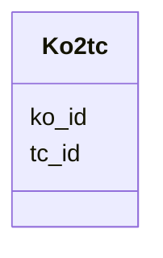

# Class: Ko2tc 


URI: [img_sat_v450:Ko2tc](https://w3id.org/jgi/img_sat_v450/Ko2tc)





<!-- no inheritance hierarchy -->


## Slots

| Name | Cardinality and Range | Description | Inheritance |
| ---  | --- | --- | --- |
| [ko_id](ko_id.md) | 0..1 <br/> [String](String.md) |  | direct |
| [tc_id](tc_id.md) | 0..1 <br/> [String](String.md) |  | direct |


## Identifier and Mapping Information


### Schema Source


* from schema: https://w3id.org/jgi/img_sat_v450


## Mappings

| Mapping Type | Mapped Value |
| ---  | ---  |
| self | img_sat_v450:Ko2tc |
| native | img_sat_v450:Ko2tc |


## LinkML Source

<!-- TODO: investigate https://stackoverflow.com/questions/37606292/how-to-create-tabbed-code-blocks-in-mkdocs-or-sphinx -->

### Direct

<details>
```yaml
name: ko2tc
from_schema: https://w3id.org/jgi/img_sat_v450
attributes:
  ko_id:
    name: ko_id
    from_schema: https://w3id.org/jgi/img_sat_v450
    domain_of:
    - dt_ko_ec_cog_pfam
    - ko2cog
    - ko2ec
    - ko2go
    - ko2module
    - ko2pathway
    - ko2reaction
    - ko2tc
    - ko_term
    - ko_term_classes
    - ko_term_cogs
    - ko_term_enzymes
    - ko_term_go_ids
    - ko_term_modules
    - ko_term_pathways
    - ko_term_reactions
    - ko_term_tc_families
    range: string
    required: false
  tc_id:
    name: tc_id
    from_schema: https://w3id.org/jgi/img_sat_v450
    rank: 1000
    domain_of:
    - ko2tc
    range: string
    required: false

```
</details>

### Induced

<details>
```yaml
name: ko2tc
from_schema: https://w3id.org/jgi/img_sat_v450
attributes:
  ko_id:
    name: ko_id
    from_schema: https://w3id.org/jgi/img_sat_v450
    alias: ko_id
    owner: ko2tc
    domain_of:
    - dt_ko_ec_cog_pfam
    - ko2cog
    - ko2ec
    - ko2go
    - ko2module
    - ko2pathway
    - ko2reaction
    - ko2tc
    - ko_term
    - ko_term_classes
    - ko_term_cogs
    - ko_term_enzymes
    - ko_term_go_ids
    - ko_term_modules
    - ko_term_pathways
    - ko_term_reactions
    - ko_term_tc_families
    range: string
    required: false
  tc_id:
    name: tc_id
    from_schema: https://w3id.org/jgi/img_sat_v450
    rank: 1000
    alias: tc_id
    owner: ko2tc
    domain_of:
    - ko2tc
    range: string
    required: false

```
</details>