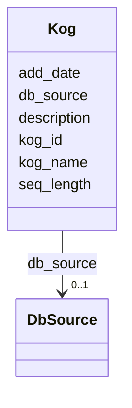

# Class: Kog 


URI: [img_sat_v450:Kog](https://w3id.org/jgi/img_sat_v450/Kog)





<!-- no inheritance hierarchy -->


## Slots

| Name | Cardinality and Range | Description | Inheritance |
| ---  | --- | --- | --- |
| [kog_id](kog_id.md) | 0..1 <br/> [String](String.md) |  | direct |
| [kog_name](kog_name.md) | 0..1 <br/> [String](String.md) |  | direct |
| [description](description.md) | 0..1 <br/> [String](String.md) |  | direct |
| [db_source](db_source.md) | 0..1 <br/> [DbSource](DbSource.md) | Foreign key to db_source | direct |
| [add_date](add_date.md) | 0..1 <br/> [Datetime](Datetime.md) |  | direct |
| [seq_length](seq_length.md) | 0..1 <br/> [Integer](Integer.md) |  | direct |


## Usages

| used by | used in | type | used |
| ---  | --- | --- | --- |
| [KogFamilies](KogFamilies.md) | [kog_id](kog_id.md) | range | [Kog](Kog.md) |
| [KogFunctions](KogFunctions.md) | [kog_id](kog_id.md) | range | [Kog](Kog.md) |
| [KogPathwayKogMembers](KogPathwayKogMembers.md) | [kog_members](kog_members.md) | range | [Kog](Kog.md) |


## Identifier and Mapping Information


### Schema Source


* from schema: https://w3id.org/jgi/img_sat_v450


## Mappings

| Mapping Type | Mapped Value |
| ---  | ---  |
| self | img_sat_v450:Kog |
| native | img_sat_v450:Kog |


## LinkML Source

<!-- TODO: investigate https://stackoverflow.com/questions/37606292/how-to-create-tabbed-code-blocks-in-mkdocs-or-sphinx -->

### Direct

<details>
```yaml
name: kog
from_schema: https://w3id.org/jgi/img_sat_v450
attributes:
  kog_id:
    name: kog_id
    from_schema: https://w3id.org/jgi/img_sat_v450
    rank: 1000
    domain_of:
    - kog
    - kog_families
    - kog_functions
    range: string
    required: false
  kog_name:
    name: kog_name
    from_schema: https://w3id.org/jgi/img_sat_v450
    rank: 1000
    domain_of:
    - kog
    range: string
    required: false
  description:
    name: description
    from_schema: https://w3id.org/jgi/img_sat_v450
    domain_of:
    - cog
    - genome_property
    - kegg_pathway
    - kog
    - pfam_clan
    - pfam_family
    - yesnocv
    range: string
    required: false
  db_source:
    name: db_source
    description: Foreign key to db_source
    from_schema: https://w3id.org/jgi/img_sat_v450
    domain_of:
    - biocyc_comp
    - cog
    - compound
    - go_term
    - kegg_pathway
    - kog
    - pfam_family
    range: db_source
    required: false
  add_date:
    name: add_date
    from_schema: https://w3id.org/jgi/img_sat_v450
    domain_of:
    - cog
    - cog_function
    - cog_species
    - compound
    - enzyme
    - enzyme_transferred
    - genome_property
    - go_graph_path
    - go_term
    - image_roi
    - kegg_pathway
    - km_image_roi
    - ko_term
    - kog
    - kog_function
    - mpw_pgl_pathway
    - pfam_clan
    - pfam_family
    - property_step
    - reaction
    - tigr_role
    - tigrfam
    range: datetime
    required: false
  seq_length:
    name: seq_length
    from_schema: https://w3id.org/jgi/img_sat_v450
    domain_of:
    - cog
    - kog
    - pfam_family
    range: integer
    required: false

```
</details>

### Induced

<details>
```yaml
name: kog
from_schema: https://w3id.org/jgi/img_sat_v450
attributes:
  kog_id:
    name: kog_id
    from_schema: https://w3id.org/jgi/img_sat_v450
    rank: 1000
    alias: kog_id
    owner: kog
    domain_of:
    - kog
    - kog_families
    - kog_functions
    range: string
    required: false
  kog_name:
    name: kog_name
    from_schema: https://w3id.org/jgi/img_sat_v450
    rank: 1000
    alias: kog_name
    owner: kog
    domain_of:
    - kog
    range: string
    required: false
  description:
    name: description
    from_schema: https://w3id.org/jgi/img_sat_v450
    alias: description
    owner: kog
    domain_of:
    - cog
    - genome_property
    - kegg_pathway
    - kog
    - pfam_clan
    - pfam_family
    - yesnocv
    range: string
    required: false
  db_source:
    name: db_source
    description: Foreign key to db_source
    from_schema: https://w3id.org/jgi/img_sat_v450
    alias: db_source
    owner: kog
    domain_of:
    - biocyc_comp
    - cog
    - compound
    - go_term
    - kegg_pathway
    - kog
    - pfam_family
    range: db_source
    required: false
  add_date:
    name: add_date
    from_schema: https://w3id.org/jgi/img_sat_v450
    alias: add_date
    owner: kog
    domain_of:
    - cog
    - cog_function
    - cog_species
    - compound
    - enzyme
    - enzyme_transferred
    - genome_property
    - go_graph_path
    - go_term
    - image_roi
    - kegg_pathway
    - km_image_roi
    - ko_term
    - kog
    - kog_function
    - mpw_pgl_pathway
    - pfam_clan
    - pfam_family
    - property_step
    - reaction
    - tigr_role
    - tigrfam
    range: datetime
    required: false
  seq_length:
    name: seq_length
    from_schema: https://w3id.org/jgi/img_sat_v450
    alias: seq_length
    owner: kog
    domain_of:
    - cog
    - kog
    - pfam_family
    range: integer
    required: false

```
</details>