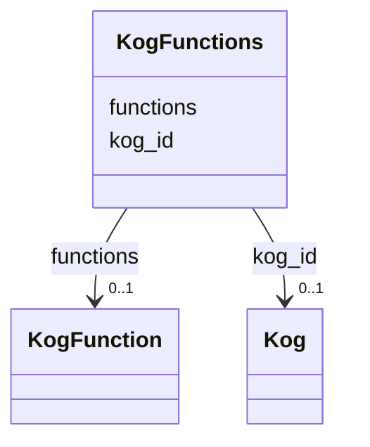

# Class: KogFunctions 


URI: [img_sat_v450:KogFunctions](https://w3id.org/jgi/img_sat_v450/KogFunctions)





<!-- no inheritance hierarchy -->


## Slots

| Name | Cardinality and Range | Description | Inheritance |
| ---  | --- | --- | --- |
| [kog_id](kog_id.md) | 0..1 <br/> [Kog](Kog.md) | Foreign key to kog | direct |
| [functions](functions.md) | 0..1 <br/> [KogFunction](KogFunction.md) | Foreign key to kog_function | direct |


## Identifier and Mapping Information


### Schema Source


* from schema: https://w3id.org/jgi/img_sat_v450


## Mappings

| Mapping Type | Mapped Value |
| ---  | ---  |
| self | img_sat_v450:KogFunctions |
| native | img_sat_v450:KogFunctions |


## LinkML Source

<!-- TODO: investigate https://stackoverflow.com/questions/37606292/how-to-create-tabbed-code-blocks-in-mkdocs-or-sphinx -->

### Direct

<details>
```yaml
name: kog_functions
from_schema: https://w3id.org/jgi/img_sat_v450
attributes:
  kog_id:
    name: kog_id
    description: Foreign key to kog
    from_schema: https://w3id.org/jgi/img_sat_v450
    domain_of:
    - kog
    - kog_families
    - kog_functions
    range: kog
    required: false
  functions:
    name: functions
    description: Foreign key to kog_function
    from_schema: https://w3id.org/jgi/img_sat_v450
    domain_of:
    - cog_functions
    - kog_functions
    - pfam_family_cogs
    range: kog_function
    required: false

```
</details>

### Induced

<details>
```yaml
name: kog_functions
from_schema: https://w3id.org/jgi/img_sat_v450
attributes:
  kog_id:
    name: kog_id
    description: Foreign key to kog
    from_schema: https://w3id.org/jgi/img_sat_v450
    alias: kog_id
    owner: kog_functions
    domain_of:
    - kog
    - kog_families
    - kog_functions
    range: kog
    required: false
  functions:
    name: functions
    description: Foreign key to kog_function
    from_schema: https://w3id.org/jgi/img_sat_v450
    alias: functions
    owner: kog_functions
    domain_of:
    - cog_functions
    - kog_functions
    - pfam_family_cogs
    range: kog_function
    required: false

```
</details>