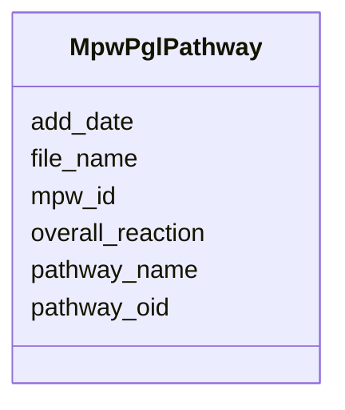

# Class: MpwPglPathway 


URI: [img_sat_v450:MpwPglPathway](https://w3id.org/jgi/img_sat_v450/MpwPglPathway)





<!-- no inheritance hierarchy -->


## Slots

| Name | Cardinality and Range | Description | Inheritance |
| ---  | --- | --- | --- |
| [pathway_oid](pathway_oid.md) | 0..1 <br/> [Integer](Integer.md) |  | direct |
| [pathway_name](pathway_name.md) | 0..1 <br/> [String](String.md) |  | direct |
| [file_name](file_name.md) | 0..1 <br/> [String](String.md) |  | direct |
| [add_date](add_date.md) | 0..1 <br/> [String](String.md) |  | direct |
| [mpw_id](mpw_id.md) | 0..1 <br/> [String](String.md) |  | direct |
| [overall_reaction](overall_reaction.md) | 0..1 <br/> [String](String.md) |  | direct |


## Identifier and Mapping Information


### Schema Source


* from schema: https://w3id.org/jgi/img_sat_v450


## Mappings

| Mapping Type | Mapped Value |
| ---  | ---  |
| self | img_sat_v450:MpwPglPathway |
| native | img_sat_v450:MpwPglPathway |


## LinkML Source

<!-- TODO: investigate https://stackoverflow.com/questions/37606292/how-to-create-tabbed-code-blocks-in-mkdocs-or-sphinx -->

### Direct

<details>
```yaml
name: mpw_pgl_pathway
from_schema: https://w3id.org/jgi/img_sat_v450
attributes:
  pathway_oid:
    name: pathway_oid
    from_schema: https://w3id.org/jgi/img_sat_v450
    domain_of:
    - kegg_pathway
    - kegg_pathway_modules
    - kegg_pathway_related_pathways
    - ko_term_pathways
    - mpw_pgl_pathway
    - mpw_pgl_pathway_reaction
    range: integer
    required: false
  pathway_name:
    name: pathway_name
    from_schema: https://w3id.org/jgi/img_sat_v450
    domain_of:
    - kegg_pathway
    - mpw_pgl_pathway
    range: string
    required: false
  file_name:
    name: file_name
    from_schema: https://w3id.org/jgi/img_sat_v450
    rank: 1000
    domain_of:
    - mpw_pgl_pathway
    range: string
    required: false
  add_date:
    name: add_date
    from_schema: https://w3id.org/jgi/img_sat_v450
    domain_of:
    - cog
    - cog_function
    - cog_species
    - compound
    - enzyme
    - enzyme_transferred
    - genome_property
    - go_graph_path
    - go_term
    - image_roi
    - kegg_pathway
    - km_image_roi
    - ko_term
    - kog
    - kog_function
    - mpw_pgl_pathway
    - pfam_clan
    - pfam_family
    - property_step
    - reaction
    - tigr_role
    - tigrfam
    range: string
    required: false
  mpw_id:
    name: mpw_id
    from_schema: https://w3id.org/jgi/img_sat_v450
    rank: 1000
    domain_of:
    - mpw_pgl_pathway
    range: string
    required: false
  overall_reaction:
    name: overall_reaction
    from_schema: https://w3id.org/jgi/img_sat_v450
    rank: 1000
    domain_of:
    - mpw_pgl_pathway
    range: string
    required: false

```
</details>

### Induced

<details>
```yaml
name: mpw_pgl_pathway
from_schema: https://w3id.org/jgi/img_sat_v450
attributes:
  pathway_oid:
    name: pathway_oid
    from_schema: https://w3id.org/jgi/img_sat_v450
    alias: pathway_oid
    owner: mpw_pgl_pathway
    domain_of:
    - kegg_pathway
    - kegg_pathway_modules
    - kegg_pathway_related_pathways
    - ko_term_pathways
    - mpw_pgl_pathway
    - mpw_pgl_pathway_reaction
    range: integer
    required: false
  pathway_name:
    name: pathway_name
    from_schema: https://w3id.org/jgi/img_sat_v450
    alias: pathway_name
    owner: mpw_pgl_pathway
    domain_of:
    - kegg_pathway
    - mpw_pgl_pathway
    range: string
    required: false
  file_name:
    name: file_name
    from_schema: https://w3id.org/jgi/img_sat_v450
    rank: 1000
    alias: file_name
    owner: mpw_pgl_pathway
    domain_of:
    - mpw_pgl_pathway
    range: string
    required: false
  add_date:
    name: add_date
    from_schema: https://w3id.org/jgi/img_sat_v450
    alias: add_date
    owner: mpw_pgl_pathway
    domain_of:
    - cog
    - cog_function
    - cog_species
    - compound
    - enzyme
    - enzyme_transferred
    - genome_property
    - go_graph_path
    - go_term
    - image_roi
    - kegg_pathway
    - km_image_roi
    - ko_term
    - kog
    - kog_function
    - mpw_pgl_pathway
    - pfam_clan
    - pfam_family
    - property_step
    - reaction
    - tigr_role
    - tigrfam
    range: string
    required: false
  mpw_id:
    name: mpw_id
    from_schema: https://w3id.org/jgi/img_sat_v450
    rank: 1000
    alias: mpw_id
    owner: mpw_pgl_pathway
    domain_of:
    - mpw_pgl_pathway
    range: string
    required: false
  overall_reaction:
    name: overall_reaction
    from_schema: https://w3id.org/jgi/img_sat_v450
    rank: 1000
    alias: overall_reaction
    owner: mpw_pgl_pathway
    domain_of:
    - mpw_pgl_pathway
    range: string
    required: false

```
</details>