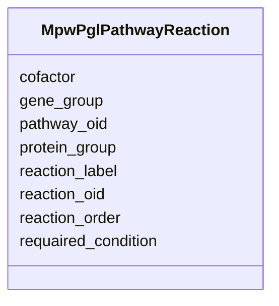

# Class: MpwPglPathwayReaction 


URI: [img_sat_v450:MpwPglPathwayReaction](https://w3id.org/jgi/img_sat_v450/MpwPglPathwayReaction)





<!-- no inheritance hierarchy -->


## Slots

| Name | Cardinality and Range | Description | Inheritance |
| ---  | --- | --- | --- |
| [pathway_oid](pathway_oid.md) | 0..1 <br/> [Integer](Integer.md) |  | direct |
| [reaction_oid](reaction_oid.md) | 0..1 <br/> [Integer](Integer.md) |  | direct |
| [reaction_order](reaction_order.md) | 0..1 <br/> [String](String.md) |  | direct |
| [reaction_label](reaction_label.md) | 0..1 <br/> [String](String.md) |  | direct |
| [cofactor](cofactor.md) | 0..1 <br/> [String](String.md) |  | direct |
| [requaired_condition](requaired_condition.md) | 0..1 <br/> [String](String.md) |  | direct |
| [protein_group](protein_group.md) | 0..1 <br/> [Integer](Integer.md) |  | direct |
| [gene_group](gene_group.md) | 0..1 <br/> [Integer](Integer.md) |  | direct |


## Identifier and Mapping Information


### Schema Source


* from schema: https://w3id.org/jgi/img_sat_v450


## Mappings

| Mapping Type | Mapped Value |
| ---  | ---  |
| self | img_sat_v450:MpwPglPathwayReaction |
| native | img_sat_v450:MpwPglPathwayReaction |


## LinkML Source

<!-- TODO: investigate https://stackoverflow.com/questions/37606292/how-to-create-tabbed-code-blocks-in-mkdocs-or-sphinx -->

### Direct

<details>
```yaml
name: mpw_pgl_pathway_reaction
from_schema: https://w3id.org/jgi/img_sat_v450
attributes:
  pathway_oid:
    name: pathway_oid
    from_schema: https://w3id.org/jgi/img_sat_v450
    domain_of:
    - kegg_pathway
    - kegg_pathway_modules
    - kegg_pathway_related_pathways
    - ko_term_pathways
    - mpw_pgl_pathway
    - mpw_pgl_pathway_reaction
    range: integer
    required: false
  reaction_oid:
    name: reaction_oid
    from_schema: https://w3id.org/jgi/img_sat_v450
    rank: 1000
    domain_of:
    - mpw_pgl_pathway_reaction
    - mpw_pgl_reaction
    - mpw_pgl_reaction_compounds
    range: integer
    required: false
  reaction_order:
    name: reaction_order
    from_schema: https://w3id.org/jgi/img_sat_v450
    rank: 1000
    domain_of:
    - mpw_pgl_pathway_reaction
    range: string
    required: false
  reaction_label:
    name: reaction_label
    from_schema: https://w3id.org/jgi/img_sat_v450
    rank: 1000
    domain_of:
    - mpw_pgl_pathway_reaction
    range: string
    required: false
  cofactor:
    name: cofactor
    from_schema: https://w3id.org/jgi/img_sat_v450
    rank: 1000
    domain_of:
    - mpw_pgl_pathway_reaction
    range: string
    required: false
  requaired_condition:
    name: requaired_condition
    from_schema: https://w3id.org/jgi/img_sat_v450
    rank: 1000
    domain_of:
    - mpw_pgl_pathway_reaction
    range: string
    required: false
  protein_group:
    name: protein_group
    from_schema: https://w3id.org/jgi/img_sat_v450
    rank: 1000
    domain_of:
    - mpw_pgl_pathway_reaction
    range: integer
    required: false
  gene_group:
    name: gene_group
    from_schema: https://w3id.org/jgi/img_sat_v450
    rank: 1000
    domain_of:
    - mpw_pgl_pathway_reaction
    range: integer
    required: false

```
</details>

### Induced

<details>
```yaml
name: mpw_pgl_pathway_reaction
from_schema: https://w3id.org/jgi/img_sat_v450
attributes:
  pathway_oid:
    name: pathway_oid
    from_schema: https://w3id.org/jgi/img_sat_v450
    alias: pathway_oid
    owner: mpw_pgl_pathway_reaction
    domain_of:
    - kegg_pathway
    - kegg_pathway_modules
    - kegg_pathway_related_pathways
    - ko_term_pathways
    - mpw_pgl_pathway
    - mpw_pgl_pathway_reaction
    range: integer
    required: false
  reaction_oid:
    name: reaction_oid
    from_schema: https://w3id.org/jgi/img_sat_v450
    rank: 1000
    alias: reaction_oid
    owner: mpw_pgl_pathway_reaction
    domain_of:
    - mpw_pgl_pathway_reaction
    - mpw_pgl_reaction
    - mpw_pgl_reaction_compounds
    range: integer
    required: false
  reaction_order:
    name: reaction_order
    from_schema: https://w3id.org/jgi/img_sat_v450
    rank: 1000
    alias: reaction_order
    owner: mpw_pgl_pathway_reaction
    domain_of:
    - mpw_pgl_pathway_reaction
    range: string
    required: false
  reaction_label:
    name: reaction_label
    from_schema: https://w3id.org/jgi/img_sat_v450
    rank: 1000
    alias: reaction_label
    owner: mpw_pgl_pathway_reaction
    domain_of:
    - mpw_pgl_pathway_reaction
    range: string
    required: false
  cofactor:
    name: cofactor
    from_schema: https://w3id.org/jgi/img_sat_v450
    rank: 1000
    alias: cofactor
    owner: mpw_pgl_pathway_reaction
    domain_of:
    - mpw_pgl_pathway_reaction
    range: string
    required: false
  requaired_condition:
    name: requaired_condition
    from_schema: https://w3id.org/jgi/img_sat_v450
    rank: 1000
    alias: requaired_condition
    owner: mpw_pgl_pathway_reaction
    domain_of:
    - mpw_pgl_pathway_reaction
    range: string
    required: false
  protein_group:
    name: protein_group
    from_schema: https://w3id.org/jgi/img_sat_v450
    rank: 1000
    alias: protein_group
    owner: mpw_pgl_pathway_reaction
    domain_of:
    - mpw_pgl_pathway_reaction
    range: integer
    required: false
  gene_group:
    name: gene_group
    from_schema: https://w3id.org/jgi/img_sat_v450
    rank: 1000
    alias: gene_group
    owner: mpw_pgl_pathway_reaction
    domain_of:
    - mpw_pgl_pathway_reaction
    range: integer
    required: false

```
</details>