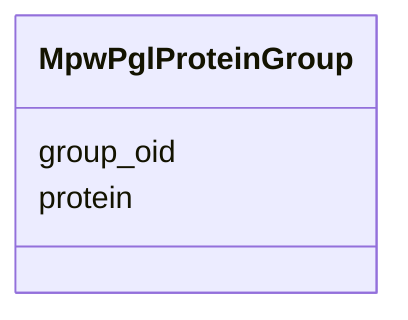

# Class: MpwPglProteinGroup 


URI: [img_sat_v450:MpwPglProteinGroup](https://w3id.org/jgi/img_sat_v450/MpwPglProteinGroup)





<!-- no inheritance hierarchy -->


## Slots

| Name | Cardinality and Range | Description | Inheritance |
| ---  | --- | --- | --- |
| [group_oid](group_oid.md) | 0..1 <br/> [Integer](Integer.md) |  | direct |
| [protein](protein.md) | 0..1 <br/> [String](String.md) |  | direct |


## Identifier and Mapping Information


### Schema Source


* from schema: https://w3id.org/jgi/img_sat_v450


## Mappings

| Mapping Type | Mapped Value |
| ---  | ---  |
| self | img_sat_v450:MpwPglProteinGroup |
| native | img_sat_v450:MpwPglProteinGroup |


## LinkML Source

<!-- TODO: investigate https://stackoverflow.com/questions/37606292/how-to-create-tabbed-code-blocks-in-mkdocs-or-sphinx -->

### Direct

<details>
```yaml
name: mpw_pgl_protein_group
from_schema: https://w3id.org/jgi/img_sat_v450
attributes:
  group_oid:
    name: group_oid
    from_schema: https://w3id.org/jgi/img_sat_v450
    domain_of:
    - mpw_pgl_gene_group
    - mpw_pgl_protein_group
    range: integer
    required: false
  protein:
    name: protein
    from_schema: https://w3id.org/jgi/img_sat_v450
    rank: 1000
    domain_of:
    - mpw_pgl_protein_group
    range: string
    required: false

```
</details>

### Induced

<details>
```yaml
name: mpw_pgl_protein_group
from_schema: https://w3id.org/jgi/img_sat_v450
attributes:
  group_oid:
    name: group_oid
    from_schema: https://w3id.org/jgi/img_sat_v450
    alias: group_oid
    owner: mpw_pgl_protein_group
    domain_of:
    - mpw_pgl_gene_group
    - mpw_pgl_protein_group
    range: integer
    required: false
  protein:
    name: protein
    from_schema: https://w3id.org/jgi/img_sat_v450
    rank: 1000
    alias: protein
    owner: mpw_pgl_protein_group
    domain_of:
    - mpw_pgl_protein_group
    range: string
    required: false

```
</details>