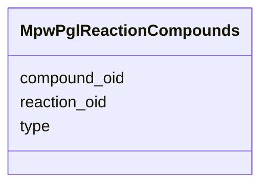

# Class: MpwPglReactionCompounds 


URI: [img_sat_v450:MpwPglReactionCompounds](https://w3id.org/jgi/img_sat_v450/MpwPglReactionCompounds)





<!-- no inheritance hierarchy -->


## Slots

| Name | Cardinality and Range | Description | Inheritance |
| ---  | --- | --- | --- |
| [reaction_oid](reaction_oid.md) | 0..1 <br/> [Integer](Integer.md) |  | direct |
| [compound_oid](compound_oid.md) | 0..1 <br/> [Integer](Integer.md) |  | direct |
| [type](type.md) | 0..1 <br/> [String](String.md) |  | direct |


## Identifier and Mapping Information


### Schema Source


* from schema: https://w3id.org/jgi/img_sat_v450


## Mappings

| Mapping Type | Mapped Value |
| ---  | ---  |
| self | img_sat_v450:MpwPglReactionCompounds |
| native | img_sat_v450:MpwPglReactionCompounds |


## LinkML Source

<!-- TODO: investigate https://stackoverflow.com/questions/37606292/how-to-create-tabbed-code-blocks-in-mkdocs-or-sphinx -->

### Direct

<details>
```yaml
name: mpw_pgl_reaction_compounds
from_schema: https://w3id.org/jgi/img_sat_v450
attributes:
  reaction_oid:
    name: reaction_oid
    from_schema: https://w3id.org/jgi/img_sat_v450
    domain_of:
    - mpw_pgl_pathway_reaction
    - mpw_pgl_reaction
    - mpw_pgl_reaction_compounds
    range: integer
    required: false
  compound_oid:
    name: compound_oid
    from_schema: https://w3id.org/jgi/img_sat_v450
    domain_of:
    - mpw_pgl_compound
    - mpw_pgl_reaction_compounds
    range: integer
    required: false
  type:
    name: type
    from_schema: https://w3id.org/jgi/img_sat_v450
    domain_of:
    - eggnog_hierarchy
    - eggnog_md52id2ont
    - genome_property
    - interpro
    - mpw_pgl_reaction_compounds
    - pfam_family
    range: string
    required: false

```
</details>

### Induced

<details>
```yaml
name: mpw_pgl_reaction_compounds
from_schema: https://w3id.org/jgi/img_sat_v450
attributes:
  reaction_oid:
    name: reaction_oid
    from_schema: https://w3id.org/jgi/img_sat_v450
    alias: reaction_oid
    owner: mpw_pgl_reaction_compounds
    domain_of:
    - mpw_pgl_pathway_reaction
    - mpw_pgl_reaction
    - mpw_pgl_reaction_compounds
    range: integer
    required: false
  compound_oid:
    name: compound_oid
    from_schema: https://w3id.org/jgi/img_sat_v450
    alias: compound_oid
    owner: mpw_pgl_reaction_compounds
    domain_of:
    - mpw_pgl_compound
    - mpw_pgl_reaction_compounds
    range: integer
    required: false
  type:
    name: type
    from_schema: https://w3id.org/jgi/img_sat_v450
    alias: type
    owner: mpw_pgl_reaction_compounds
    domain_of:
    - eggnog_hierarchy
    - eggnog_md52id2ont
    - genome_property
    - interpro
    - mpw_pgl_reaction_compounds
    - pfam_family
    range: string
    required: false

```
</details>