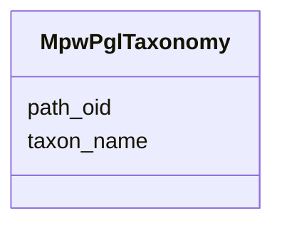

# Class: MpwPglTaxonomy 


URI: [img_sat_v450:MpwPglTaxonomy](https://w3id.org/jgi/img_sat_v450/MpwPglTaxonomy)





<!-- no inheritance hierarchy -->


## Slots

| Name | Cardinality and Range | Description | Inheritance |
| ---  | --- | --- | --- |
| [path_oid](path_oid.md) | 0..1 <br/> [Integer](Integer.md) |  | direct |
| [taxon_name](taxon_name.md) | 0..1 <br/> [String](String.md) |  | direct |


## Identifier and Mapping Information


### Schema Source


* from schema: https://w3id.org/jgi/img_sat_v450


## Mappings

| Mapping Type | Mapped Value |
| ---  | ---  |
| self | img_sat_v450:MpwPglTaxonomy |
| native | img_sat_v450:MpwPglTaxonomy |


## LinkML Source

<!-- TODO: investigate https://stackoverflow.com/questions/37606292/how-to-create-tabbed-code-blocks-in-mkdocs-or-sphinx -->

### Direct

<details>
```yaml
name: mpw_pgl_taxonomy
from_schema: https://w3id.org/jgi/img_sat_v450
attributes:
  path_oid:
    name: path_oid
    from_schema: https://w3id.org/jgi/img_sat_v450
    rank: 1000
    domain_of:
    - mpw_pgl_taxonomy
    range: integer
    required: false
  taxon_name:
    name: taxon_name
    from_schema: https://w3id.org/jgi/img_sat_v450
    rank: 1000
    domain_of:
    - mpw_pgl_taxonomy
    range: string
    required: false

```
</details>

### Induced

<details>
```yaml
name: mpw_pgl_taxonomy
from_schema: https://w3id.org/jgi/img_sat_v450
attributes:
  path_oid:
    name: path_oid
    from_schema: https://w3id.org/jgi/img_sat_v450
    rank: 1000
    alias: path_oid
    owner: mpw_pgl_taxonomy
    domain_of:
    - mpw_pgl_taxonomy
    range: integer
    required: false
  taxon_name:
    name: taxon_name
    from_schema: https://w3id.org/jgi/img_sat_v450
    rank: 1000
    alias: taxon_name
    owner: mpw_pgl_taxonomy
    domain_of:
    - mpw_pgl_taxonomy
    range: string
    required: false

```
</details>